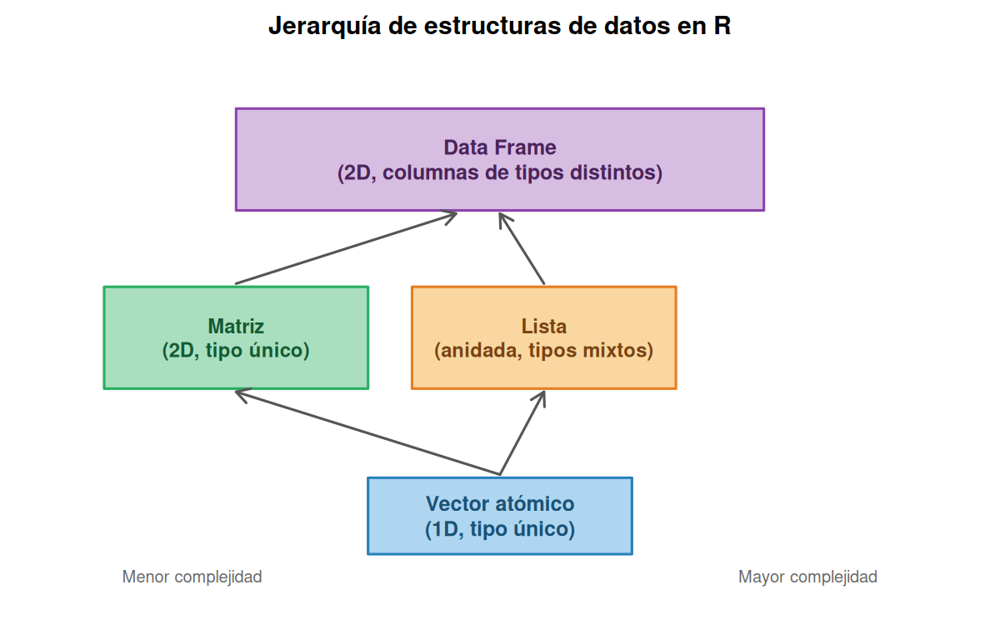
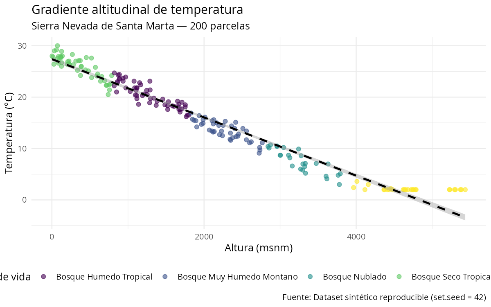

# Capítulo 1: Introducción a R para el Análisis Estadístico

> *"El objetivo del análisis estadístico no es la certeza, sino la reducción inteligente de la incertidumbre."*
> — John W. Tukey

---

**Objetivos de aprendizaje**

Al finalizar este capítulo, el estudiante será capaz de:

- Instalar R y RStudio y configurar un entorno de trabajo reproducible.
- Identificar y usar los tipos de datos atómicos y las estructuras de datos fundamentales de R (vectores, matrices, data frames, listas).
- Escribir expresiones, asignaciones y funciones básicas en R.
- Aplicar estructuras de control (if/else, for, while) y la familia apply para automatizar análisis repetitivos.
- Cargar y explorar un dataset real con funciones del Tidyverse.

---

## Tabla de Contenidos

0. [Preparación del entorno](#sección-0--preparación-del-entorno)
1. [¿Por qué R?](#por-qué-r)
2. [Instalación del entorno](#instalación-del-entorno)
3. [Primeros pasos en R](#primeros-pasos-en-r)
4. [Tipos de objetos en R](#tipos-de-objetos-en-r)
5. [Lógica de programación](#lógica-de-programación)
6. [Funciones en R](#funciones-en-r)
7. [Aplicación práctica integrada](#aplicación-práctica-integrada)
8. [Ejercicios prácticos](#ejercicios-prácticos)

---

## Sección 0 — Preparación del entorno

Cargamos las librerías y los tres datasets del proyecto **una sola vez** aquí, antes de comenzar. El código de las secciones siguientes asume que estos objetos ya están disponibles en la sesión de R. Si es la primera vez que abres este libro y aún no tienes R instalado, ve a la [sección Instalación del entorno](#instalación-del-entorno) y regresa aquí antes de ejecutar cualquier bloque de código.

```r
# ============================================================
# CAPÍTULO 1 — Preparación del entorno
# Ejecutar este bloque UNA sola vez al inicio de la sesión
# ============================================================

library(tidyverse)   # dplyr, ggplot2, readr, tibble, etc.

# Cargar los tres datasets del proyecto
biodiversidad <- read_csv("https://raw.githubusercontent.com/froylanjimenez/libroU/main/data/biodiversidad_sierra.csv")
palma         <- read_csv("https://raw.githubusercontent.com/froylanjimenez/libroU/main/data/palma_cesar.csv")
logistica     <- read_csv("https://raw.githubusercontent.com/froylanjimenez/libroU/main/data/logistica_puerto_baq.csv")

cat("Datasets cargados:\n")
cat(" biodiversidad:", nrow(biodiversidad), "obs\n")
cat(" palma        :", nrow(palma), "obs\n")
cat(" logistica    :", nrow(logistica), "obs\n")
```

**Resultado:**
```
Datasets cargados:
 biodiversidad: 200 obs
 palma        : 150 obs
 logistica    : 100 obs
```

A partir de aquí, todos los bloques de código del capítulo usan directamente los objetos `biodiversidad`, `palma` y `logistica` sin necesidad de recargarlos.

---

## ¿Por qué R?

### Contexto histórico

Imagina que eres investigador en los años noventa y quieres analizar estadísticamente los datos de temperatura que recolectaste en cinco municipios del Caribe colombiano. Las opciones eran costosas, cerradas y poco flexibles: SPSS requería licencias que ninguna universidad regional podía pagar, SAS era territorio exclusivo de grandes corporaciones. Fue en ese contexto que en 1993 **Ross Ihaka** y **Robert Gentleman** de la Universidad de Auckland (Nueva Zelanda) desarrollaron R: un lenguaje estadístico de código abierto, gratuito y construido sobre las ideas de S, el lenguaje estadístico creado en los Laboratorios Bell en los años setenta. En 1995 se liberó públicamente bajo licencia GNU GPL, y en 1997 se formó el **R Core Team**, el grupo de voluntarios que mantiene el lenguaje hasta hoy.

Lo que comenzó como un proyecto académico en Nueva Zelanda se convirtió en el *lingua franca* de la estadística mundial. Hoy R cuenta con más de **20.000 paquetes** disponibles en CRAN (*Comprehensive R Archive Network*), la biblioteca central del proyecto. Organismos como la OMS, la FAO y el DANE lo usan para producir reportes oficiales. Universidades de todo el mundo — incluyendo cada vez más las del Caribe colombiano — lo han adoptado como herramienta principal de enseñanza e investigación. Lo que diferencia a R de otros lenguajes es su origen: no es un lenguaje de programación de propósito general al que se le añadió estadística, sino un sistema construido desde el principio para hacer análisis de datos.

### R frente a otras herramientas

La siguiente tabla resume las diferencias más relevantes para un estudiante o investigador en el contexto colombiano:

| Criterio | R | Python | Excel | SPSS/SAS |
|---|---|---|---|---|
| Costo | Gratuito | Gratuito | Pago | Pago |
| Visualización estadística | Excelente | Buena | Limitada | Buena |
| Reproducibilidad | Alta | Alta | Baja | Media |
| Comunidad estadística | Muy grande | Grande | N/A | Pequeña |
| Curva de aprendizaje | Media | Media | Baja | Media |
| Integración LaTeX/PDF | Nativa | Mediante Jupyter | No | No |

R no es simplemente un lenguaje de programación: es un **ecosistema estadístico**. Cada función, cada paquete, fue diseñado pensando en el análisis de datos. Donde otros lenguajes añaden estadística, R *es* estadística. A lo largo de este libro aprenderás a usarlo para analizar datos reales del Caribe colombiano: biodiversidad en la Sierra Nevada de Santa Marta, productividad de palma de aceite en el Cesar, y eficiencia operacional en el Puerto de Barranquilla.

### El ecosistema Tidyverse

El **Tidyverse** no es solo un paquete de R: es una filosofía completa de análisis de datos. Antes de que existiera, un análisis típico mezclaba docenas de funciones con sintaxis inconsistentes, estilos distintos y resultados impredecibles. El Tidyverse, liderado por Hadley Wickham y publicado formalmente en 2019, unificó todo bajo una gramática común basada en el principio de *tidy data*:

> *"Cada variable es una columna, cada observación es una fila, cada unidad observacional es una tabla."*

Este principio parece simple, pero transforma radicalmente la forma de trabajar. Cuando los datos de campo de una expedición a la Sierra Nevada llegan en un archivo Excel con columnas que mezclan fechas, altitudes y nombres de especies en formatos incompatibles, el Tidyverse proporciona las herramientas para ordenarlos de manera sistemática y reproducible. Sus ocho pilares son:

- **`readr`**: lee archivos de datos (CSV, TSV, texto delimitado) de forma rápida y sin sorpresas de codificación. Cuando cargues `biodiversidad_sierra.csv`, usarás `read_csv()` de readr; a diferencia de la función base `read.csv()`, readr detecta automáticamente los tipos de columna y maneja correctamente los acentos del español, algo crucial cuando los datos incluyen nombres de municipios como "Valledupar" o "Sincelejo".

- **`dplyr`**: manipula tablas con verbos intuitivos: `filter()` para seleccionar filas, `select()` para columnas, `mutate()` para crear columnas nuevas, `summarise()` para resumir y `group_by()` para agrupar. Con dplyr puedes calcular, en una sola cadena de código, la temperatura promedio por zona de vida en la Sierra Nevada. Su operador pipe `|>` permite leer el código de izquierda a derecha, igual que una receta: "toma los datos, filtra las parcelas por encima de 2000 metros, calcula el promedio de temperatura". Esto hace el código autoexplicativo.

- **`tidyr`**: reorganiza la forma de la tabla. Convierte datos de formato "ancho" a "largo" (`pivot_longer`) y viceversa (`pivot_wider`). Esta operación es esencial cuando los datos de campo del Cesar llegan con una columna por mes ("enero", "febrero", "marzo" como nombres de columnas) en lugar de una columna "mes" con sus valores. tidyr convierte ese formato inconveniente en uno analizable en segundos.

- **`ggplot2`**: crea gráficos mediante una gramática de capas. En lugar de memorizar funciones distintas para histogramas, barras, dispersión y boxplots, `ggplot2` usa siempre la misma estructura: datos + sistema de coordenadas + tipo de geometría + opciones estéticas. Es el paquete de visualización más poderoso en R y permite producir gráficos de calidad de publicación. En el capítulo de análisis exploratorio lo usarás intensivamente para visualizar el gradiente altitudinal de la Sierra Nevada.

- **`purrr`**: aplica funciones a listas y vectores de forma eficiente, reemplazando bucles repetitivos por llamadas declarativas. Si necesitas calcular el índice de Shannon para cada una de las diez zonas de muestreo de la Sierra Nevada, `purrr::map_dbl()` lo hace en una línea, sin necesidad de un `for`. Su filosofía es: "no digas *cómo* iterar, di *qué* calcular".

- **`tibble`**: reemplaza el data frame clásico con una versión mejorada que no convierte cadenas de texto a factores automáticamente, que muestra solo las primeras diez filas al imprimir, y que da mensajes de error más claros. Es la estructura de tabla estándar en el Tidyverse.

- **`stringr`**: herramientas para texto. Permite buscar, reemplazar, extraer y formatear cadenas de caracteres con una sintaxis coherente. Útil cuando los nombres de especies llegan con mayúsculas inconsistentes o con espacios extra.

- **`forcats`**: herramientas para variables categóricas (factores). Permite reordenar niveles, colapsar categorías poco frecuentes y manejar factores con NA de forma sensata. Esencial para analizar variables como `zona_vida` o `variedad_palma`.

> **Nota:** Para ejecutar el código de este libro, necesitas tener R y RStudio instalados. Si aún no los tienes, salta a la [sección Instalación del entorno](#instalación-del-entorno) antes de continuar.

```r
library(tidyverse)
```

**Resultado:**
```
── Attaching core tidyverse packages ────────────── tidyverse 2.0.0 ──
✔ dplyr     1.1.4     ✔ readr     2.1.5
✔ forcats   1.0.0     ✔ stringr   1.5.1
✔ ggplot2   3.5.1     ✔ tibble    3.2.1
✔ lubridate 1.9.3     ✔ tidyr     1.3.1
✔ purrr     1.0.2
```

Cuando ejecutes esta línea, R cargará los ocho paquetes de una vez. A lo largo del libro los usarás constantemente; por eso conviene cargar el Tidyverse al inicio de cada script de análisis. Si el paquete no está instalado, R devolverá un error: en ese caso ejecuta primero `install.packages("tidyverse")` en la consola (solo una vez por instalación de R). En la siguiente sección instalamos todo el entorno desde cero.

---

## Instalación del entorno

### Instalar R base

**Windows / macOS:**
Descargar el instalador desde [https://cran.r-project.org](https://cran.r-project.org) y ejecutarlo con opciones por defecto.

**Ubuntu / Debian Linux:**
```bash
# Agregar repositorio oficial CRAN
sudo apt update
sudo apt install -y r-base r-base-dev

# Verificar instalación
R --version
```

**Fedora / RHEL / Rocky Linux:**
```bash
sudo dnf install R
```

### Instalar RStudio

RStudio es el IDE (*Integrated Development Environment*) estándar para R. Descargar desde [https://posit.co/download/rstudio-desktop/](https://posit.co/download/rstudio-desktop/).

RStudio organiza el trabajo en cuatro paneles: **Editor de scripts** (código fuente), **Consola** (ejecución interactiva), **Environment/History** (objetos en memoria) y **Files/Plots/Packages/Help**. Los atajos más usados son `Ctrl+Enter` para ejecutar la línea actual y `Tab` para autocompletar. Con el entorno listo, podemos dar nuestros primeros pasos en el lenguaje.

### Cuando R se queja: leyendo mensajes de error

Los errores de R son más informativos de lo que parecen. Aquí los cinco más frecuentes para principiantes:

| Mensaje de error | Causa probable | Solución |
|-----------------|----------------|---------|
| `object 'x' not found` | Variable no definida o mal escrita | Verifica el nombre exacto con `ls()` |
| `could not find function "foo"` | Paquete no cargado | Ejecuta `library(nombre_paquete)` |
| `Error in file(...): cannot open file` | Ruta incorrecta | Usa `getwd()` para ver tu directorio actual |
| `non-numeric argument to binary operator` | Operar texto como número | Verifica con `class(x)` |
| `subscript out of bounds` | Índice mayor que la longitud del vector | Verifica `length(x)` o `nrow(df)` |

```r
# Diagnóstico rápido de un objeto desconocido
x <- biodiversidad$temperatura_C
class(x)     # Tipo: "numeric", "character", "factor"...
length(x)    # Número de elementos
is.na(x) |> sum()  # Cuántos NA
```

**Resultado:**
```
[1] "numeric"
[1] 200
[1] 0
```

> **Consejo:** Cuando R lanza un error, lee el mensaje *de abajo hacia arriba*. La última línea indica dónde ocurrió; las anteriores muestran la cadena de llamadas que llegó hasta ahí.

---

## Primeros pasos en R

### R como calculadora

Antes de aprender estructuras de datos o funciones avanzadas, lo más importante es perder el miedo a la consola de R. La consola es simplemente un calculador que espera instrucciones. Puedes escribir cualquier expresión matemática y R te devuelve el resultado de inmediato. En el contexto de la investigación en el Caribe colombiano, esto es útil desde el primer momento: si sabes que la distancia entre Sincelejo y Barranquilla es de aproximadamente 210 km y un vehículo consume 12 litros por cada 100 km, puedes calcular el consumo total directamente en la consola sin abrir Excel.

Adicionalmente, R incluye funciones matemáticas incorporadas que serán la base de todos los cálculos estadísticos del libro: raíces cuadradas, logaritmos, valor absoluto, redondeo y exponenciales. El logaritmo natural, por ejemplo, aparece en la fórmula del índice de diversidad de Shannon que calcularemos en la sección de funciones. El logaritmo en base 10 es el que usamos para las escalas de pH y de magnitud sísmica. Conviene familiarizarse con estas funciones desde el inicio.

```r
# Operaciones aritméticas básicas
2 + 3
10 - 4
3 * 7
15 / 4
2^10           # potencia
17 %% 5        # módulo: resto de la división entera
17 %/% 5       # cociente de la división entera
```

**Resultado:**
```
[1] 5
[1] 6
[1] 21
[1] 3.75
[1] 1024
[1] 2
[1] 3
```

```r
# Funciones matemáticas
sqrt(144)
abs(-7.3)
log(exp(1))        # logaritmo natural de e: debe dar 1
log10(1000)        # logaritmo base 10
round(3.14159, digits = 2)
```

**Resultado:**
```
[1] 12
[1] 7.3
[1] 1
[1] 3
[1] 3.14
```

El `[1]` que aparece antes de cada resultado no es parte del número: es R indicando que ese es el primer (y único) elemento del vector resultado. Cuando los resultados sean vectores largos, verás `[1]`, `[11]`, `[21]`, etc., indicando la posición del primer elemento en cada fila de la salida.

Un parámetro importante es `digits` en `round()`. Veamos qué pasa si lo cambiamos:

Si usamos `digits = 4` en lugar de `digits = 2`, obtenemos más decimales:

```r
round(3.14159265, digits = 4)
```

**Resultado:**
```
[1] 3.1416
```

Esto es relevante cuando reportamos estadísticos: la media de temperatura en Sincelejo puede ser 28.4732°C, pero para un informe técnico `round(media, 1)` la convierte en 28.5°C, más legible sin perder precisión relevante.

### El operador de asignación

En R, para guardar un valor y usarlo más adelante, utilizamos el operador `<-`. Este operador "asigna" el valor del lado derecho al nombre del lado izquierdo. Es la convención de estilo del Tidyverse, aunque el signo `=` también funciona (se reserva para argumentos dentro de funciones). Piensa en `<-` como una flecha que dice: "guarda este valor con este nombre".

Por ejemplo, si medimos la temperatura máxima de un día en Barranquilla durante el fenómeno del Niño y queremos guardarla para usarla en varios cálculos, hacemos:

```r
# Temperatura máxima registrada en Barranquilla durante El Niño 2023
temperatura <- 38.2
ciudad      <- "Barranquilla"
es_tropical <- TRUE

# Los objetos aparecen ahora en el panel Environment de RStudio
print(temperatura)
cat("Ciudad:", ciudad, "\n")
```

**Resultado:**
```
[1] 38.2
Ciudad: Barranquilla
```

El atajo de teclado en RStudio para escribir `<-` es `Alt + -` (Alt más el signo de guión). Los nombres de objetos en R distinguen mayúsculas de minúsculas: `Temperatura` y `temperatura` son objetos diferentes. Por convención, usamos `snake_case` (palabras en minúsculas separadas por guión bajo) para nombrar objetos.

### Tipos de datos atómicos

R maneja cuatro tipos de datos fundamentales (llamados "atómicos"). Entender estos tipos es esencial porque determinan qué operaciones podemos hacer con cada variable. En los datos de biodiversidad de la Sierra Nevada de Santa Marta, la altitud es un número (`numeric`), el nombre de la especie es texto (`character`), la zona de vida puede ser categórica (`factor`) y la presencia o ausencia de una especie endémica es lógica (`logical`). Cada tipo tiene sus propias funciones de creación, conversión y verificación.

```r
# Numérico (double): números con decimales
altura <- 1.75

# Entero: la L indica explícitamente que es entero (sin decimales)
edad <- 25L

# Carácter (texto)
especie <- "Espeletia schultzii"

# Lógico (booleano): solo puede ser TRUE o FALSE
es_endemica <- TRUE
es_invasora  <- FALSE

# Verificar el tipo de cada objeto
class(altura)
class(edad)
class(especie)
class(es_endemica)
```

**Resultado:**
```
[1] "numeric"
[1] "integer"
[1] "character"
[1] "logical"
```

Cuando necesitamos convertir un tipo a otro, R proporciona funciones `as.*()`:

```r
as.numeric("3.14")     # texto a número
as.integer(3.9)        # convierte a entero (trunca, no redondea)
as.character(2024)     # número a texto
as.logical(0)          # 0 es FALSE
as.logical(1)          # cualquier número distinto de 0 es TRUE
```

**Resultado:**
```
[1] 3.14
[1] 3
[1] "2024"
[1] FALSE
[1] TRUE
```

Nota que `as.integer(3.9)` devuelve 3, no 4: trunca hacia abajo, no redondea. Este comportamiento es importante al indexar vectores o al contar individuos. Con los tipos atómicos claros, el siguiente paso es combinarlos en estructuras de datos más ricas.

---

## Tipos de objetos en R

{ width=50% }

### Vectores

Un vector en R es análogo a una columna de una tabla de Excel: es una secuencia ordenada de valores del mismo tipo. Si tienes diez mediciones de temperatura, esas diez temperaturas forman un vector. Si tienes los nombres de ocho municipios del Caribe, esos nombres forman un vector de caracteres. La clave es que todos los elementos de un vector deben ser del mismo tipo; si mezclas un número con un texto, R convierte todo a texto automáticamente (lo llama "coerción").

El vector es la estructura fundamental de R. **Todo en R es un vector**: un escalar (un número solo) es simplemente un vector de longitud 1. Esto explica el `[1]` que aparece en todos los resultados que hemos visto hasta ahora.

```r
# Crear vectores con c() — "combine" o "concatenate"
alturas_msnm <- c(120, 850, 1500, 2300, 3100, 4200)
zonas        <- c("Seco", "Humedo", "Humedo", "Montano", "Nublado", "Paramo")
es_bosque    <- c(TRUE, TRUE, TRUE, TRUE, TRUE, FALSE)

# Secuencias regulares
seq_alt <- seq(from = 0, to = 5000, by = 500)  # 0, 500, 1000, ..., 5000
indices <- 1:10                                  # 1, 2, 3, ..., 10

# Repetición
rep(c("A", "B"), times = 3)
rep(c("A", "B"), each  = 3)
```

**Resultado:**
```
[1] "A" "B" "A" "B" "A" "B"
[1] "A" "A" "A" "B" "B" "B"
```

```r
# Propiedades básicas de un vector
length(alturas_msnm)
sum(alturas_msnm)
mean(alturas_msnm)
max(alturas_msnm)
min(alturas_msnm)
```

**Resultado:**
```
[1] 6
[1] 12070
[1] 2011.667
[1] 4200
[1] 120
```

La altitud promedio de estas seis parcelas es aproximadamente 2012 metros sobre el nivel del mar, lo cual sitúa el promedio en la zona montana de la Sierra Nevada de Santa Marta, por encima del bosque húmedo tropical pero por debajo del bosque nublado.

```r
# Indexación: R usa base 1 (el primer elemento tiene índice 1, no 0 como Python)
alturas_msnm[1]           # primer elemento
alturas_msnm[c(2, 4)]     # segundo y cuarto
alturas_msnm[-1]          # todos excepto el primero
alturas_msnm[alturas_msnm > 2000]   # filtro lógico: altitudes sobre 2000 m
```

**Resultado:**
```
[1] 120
[1]  850 2300
[1]  850 1500 2300 3100 4200
[1] 2300 3100 4200
```

#### El gradiente altitudinal de la Sierra Nevada de Santa Marta

La Sierra Nevada de Santa Marta es la montaña costera más alta del mundo: se eleva desde el nivel del mar en las costas del Caribe colombiano hasta los 5775 metros en los Picos Cristóbal Colón y Simón Bolívar, todo en una distancia horizontal de apenas 42 kilómetros. Esta extraordinaria diferencia de altitud en tan poco espacio horizontal genera uno de los gradientes de biodiversidad más ricos del planeta, con ecosistemas que van desde el bosque seco tropical en sus estribaciones hasta los páramos y nieves perpetuas en sus cimas. No existe otro lugar en el Caribe donde se pueda observar tal diversidad de zonas de vida en tan corto trayecto.

Uno de los fenómenos físicos más importantes que explica esta diversidad es el gradiente adiabático de temperatura: por cada kilómetro que ascendemos sobre el nivel del mar, la temperatura del aire disminuye aproximadamente 6.5°C. Este valor (llamado gradiente adiabático estándar) se debe al enfriamiento del aire al expandirse con la menor presión atmosférica de las altitudes. Así, si en la costa de Barranquilla la temperatura media es de 28.5°C, en Minca (650 msnm) será de unos 24.3°C, en la zona cafetera de la Sierra (1200 msnm) rondará los 20.7°C, y en el páramo (3800 msnm) la temperatura bajará hasta los 3.8°C. La fórmula matemática del gradiente es:

$$T(h) = T_0 - \Gamma \cdot \frac{h}{1000}$$

donde $T_0 = 28.5\,°C$ es la temperatura en la costa, $\Gamma = 6.5\,°C/\text{km}$ es el gradiente adiabático estándar y $h$ es la altura en metros sobre el nivel del mar.

Una de las características más poderosas de R es que podemos aplicar esta fórmula a un vector de altitudes de una sola vez, sin necesidad de calcular temperatura por temperatura. Esta propiedad se llama **vectorización** y es uno de los pilares del lenguaje:

```r
# Gradiente altitudinal: temperatura estimada a distintas alturas de la Sierra Nevada
alturas_msnm <- c(0, 650, 1200, 2000, 2800, 3800, 5000)
# corresponden a: Costa/Barranquilla, Minca, zona cafetera, bosque montano,
#                 bosque nublado, páramo bajo, zona nival

temperatura <- 28.5 - (alturas_msnm / 1000) * 6.5

print(round(temperatura, 1))
```

**Resultado:**
```
[1] 28.5 24.3 20.7 15.5 10.3  3.2 -4.0
```

Estos siete valores cuentan la historia climática de la Sierra Nevada de abajo hacia arriba. En la costa, 28.5°C es la temperatura media de Barranquilla en cualquier mes del año: calor permanente, brisa marina, vegetación seca. En Minca (650 m), pueblo serrano del Magdalena famoso por el café y el avistamiento de aves, la temperatura baja a 24.3°C: fresco, húmedo, con lluvias frecuentes. A 1200 metros, en la zona cafetera, ya estamos a 20.7°C; los agricultores de esta altitud cultivan café, cacao y frutas de clima templado. En el bosque montano (2000 m) la temperatura es de 15.5°C y la humedad se acerca al 90%. El bosque nublado a 2800 metros, a 10.3°C, es hogar de orquídeas, musgos y el oso de anteojos. El páramo bajo (3800 m) con sus 3.2°C es el dominio de los frailejones. Por encima de los 5000 metros, la temperatura negativa explica las nieves y glaciares que, tristemente, se están reduciendo por el cambio climático.


### Matrices

Una matriz es un vector bidimensional donde **todos los elementos son del mismo tipo**. Puedes pensar en ella como una tabla de Excel en la que todas las celdas son números: tiene filas y columnas, y se accede a cada celda mediante dos índices (fila, columna). En estadística, las matrices son el lenguaje nativo del álgebra lineal: los coeficientes de una regresión, las correlaciones entre variables, los datos de covarianza — todo se expresa en forma matricial.

Para el análisis de biodiversidad en la Sierra Nevada, podríamos organizar los datos de cuatro parcelas en una matriz donde cada fila es una parcela y cada columna es una variable ambiental. Esto nos permite aplicar operaciones matriciales a todo el conjunto de datos simultáneamente.

```r
# Crear matriz (se llena por filas con byrow = TRUE)
# Cada fila: una parcela de muestreo en la Sierra Nevada
datos_parcela <- matrix(
  data = c(120, 25.1, 78,
           850, 21.3, 83,
           1500, 18.0, 89,
           2300, 13.5, 94),
  nrow = 4,
  ncol = 3,
  byrow = TRUE
)

colnames(datos_parcela) <- c("altura_msnm", "temperatura_C", "humedad_pct")
rownames(datos_parcela) <- paste0("Parcela_", 1:4)

print(datos_parcela)
```

**Resultado:**
```
          altura_msnm temperatura_C humedad_pct
Parcela_1         120          25.1          78
Parcela_2         850          21.3          83
Parcela_3        1500          18.0          89
Parcela_4        2300          13.5          94
```

La tabla muestra claramente la tendencia esperada: a mayor altitud, menor temperatura y mayor humedad relativa. La parcela 1, cerca del nivel del mar, tiene el calor característico del litoral caribeño (25.1°C) con humedad relativamente baja (78%). La parcela 4, ya en el bosque montano bajo, registra 13.5°C y humedad de 94%, condiciones que favorecen la formación de nubes y la abundancia de epífitas.

```r
# Indexación: matriz[fila, columna]
datos_parcela[2, 3]                               # fila 2, columna 3
datos_parcela["Parcela_3", "temperatura_C"]       # por nombre

# Álgebra matricial básica
A <- matrix(c(2, 1, 1, 3), nrow = 2)
det(A)           # determinante
solve(A)         # inversa de A
```

**Resultado:**
```
[1] 83
[1] 18
[1] 5
     [,1]  [,2]
[1,]  0.6  -0.2
[2,] -0.2   0.4
```

La inversa de una matriz $A$ es la matriz $A^{-1}$ tal que $A \cdot A^{-1} = I$ (la matriz identidad). En estadística, esto es central para la estimación por mínimos cuadrados: $\hat{\boldsymbol{\beta}} = (X^TX)^{-1}X^T\mathbf{y}$. En los capítulos de regresión lineal veremos cómo R calcula internamente esta inversa para estimar los coeficientes de un modelo. Las matrices son importantes, pero para el trabajo diario de análisis de datos la estructura más utilizada es el data frame.

### Data Frames

El data frame es **la estructura central del análisis estadístico en R**. Imagínalo como una tabla de Excel con superpoderes: tiene filas (observaciones) y columnas (variables), pero a diferencia de una matriz, cada columna puede ser de un tipo diferente. En un dataset de biodiversidad, la columna `especie` es texto, la columna `altura_msnm` es número, la columna `zona_vida` es un factor ordenado y la columna `fecha_muestreo` es una fecha. Un data frame almacena todo esto de forma coherente.

El data frame es el objeto que recibirás cuando leas un archivo CSV, el que devolverán las funciones de importación del Tidyverse, y el que pasarás a casi todas las funciones estadísticas del libro. Dominar su manejo es dominar R para análisis de datos.

```r
# Crear un data frame manualmente con datos de parcelas de la Sierra Nevada
parcelas <- data.frame(
  id               = 1:5,
  zona_vida        = c("Seco", "Humedo", "Montano", "Nublado", "Paramo"),
  altura_msnm      = c(400, 1200, 2200, 3200, 4100),
  temperatura_C    = c(26.9, 20.7, 14.2, 8.0, 2.0),
  humedad_relativa = c(68, 82, 91, 96, 81),
  stringsAsFactors = FALSE
)

# Propiedades del data frame
nrow(parcelas)
ncol(parcelas)
dim(parcelas)
str(parcelas)
```

**Resultado:**
```
[1] 5
[1] 5
[1] 5 5
'data.frame':	5 obs. of  5 variables:
 $ id              : int  1 2 3 4 5
 $ zona_vida       : chr  "Seco" "Humedo" "Montano" "Nublado" ...
 $ altura_msnm     : num  400 1200 2200 3200 4100
 $ temperatura_C   : num  26.9 20.7 14.2 8 2
 $ humedad_relativa: num  68 82 91 96 81
```

La función `str()` (de *structure*) es una de las más útiles al explorar cualquier dataset: muestra el número de observaciones, el número de variables, el tipo de cada columna y los primeros valores. Aprende a usarla siempre que cargues datos nuevos.

```r
# Acceder a columnas: tres formas equivalentes
parcelas$temperatura_C          # forma más común
parcelas[["temperatura_C"]]     # forma programática
parcelas[, "temperatura_C"]     # forma matricial

# Filtrar filas
parcelas[parcelas$altura_msnm > 2000, ]
subset(parcelas, humedad_relativa > 85)

# Agregar columna calculada
parcelas$temp_fahrenheit <- parcelas$temperatura_C * 9/5 + 32
```

**Resultado (filtro por altitud):**
```
  id zona_vida altura_msnm temperatura_C humedad_relativa
3  3   Montano        2200          14.2               91
4  4   Nublado        3200           8.0               96
5  5    Paramo        4100           2.0               81
```

```r
# Con dplyr (estilo Tidyverse): más legible para cadenas largas
library(dplyr)
parcelas |>
  filter(altura_msnm > 1000) |>
  select(zona_vida, temperatura_C, humedad_relativa) |>
  arrange(desc(altura_msnm))
```

**Resultado:**
```
  zona_vida temperatura_C humedad_relativa
1    Paramo           2.0               81
2   Nublado           8.0               96
3   Montano          14.2               91
4    Humedo          20.7               82
```

#### Explorando el dataset de biodiversidad

El dataset `biodiversidad_sierra.csv` — cargado en la Sección 0 — contiene 200 registros de parcelas de muestreo distribuidas por toda la Sierra Nevada de Santa Marta. Usamos `summary()` para obtener un primer resumen estadístico de todas sus variables:

```r
# Resumen estadístico de todas las variables
summary(biodiversidad)
```

**Resultado:**
```
            especie           altura_msnm     temperatura_C   humedad_relativa
 Acacia farnesiana:  4   Min.   :   2.0   Min.   : 1.80   Min.   :55.10
 Bursera graveolens:  4   1st Qu.: 441.5   1st Qu.: 8.35   1st Qu.:70.45
 Cedrela odorata  :  4   Median :1731.0   Median :15.50   Median :80.10
 Clusia multiflora:  4   Mean   :1968.3   Mean   :16.23   Mean   :79.09
 Guaiacum officin.:  4   3rd Qu.:3290.8   3rd Qu.:23.10   3rd Qu.:88.73
 (Other)          :180   Max.   :5434.0   Max.   :30.00   Max.   :99.10
       zona_vida
 Bosque Humedo Tropical  :56
 Bosque Muy Humedo Montano:43
 Bosque Nublado          :26
 Bosque Seco Tropical    :49
 Paramo                  :26
```

El resumen confirma la estructura esperada del dataset. La altitud varía entre 2 y 5434 msnm, cubriendo prácticamente todo el gradiente de la Sierra Nevada. La temperatura presenta una variación amplia: de 1.8°C en las zonas de alta montaña hasta 30°C en el bosque seco costero. La distribución por zonas de vida muestra mayor representación en las zonas bajas y medias (49 en Bosque Seco Tropical, 56 en Bosque Humedo Tropical), con menor representación en las zonas altas (26 en Bosque Nublado y Paramo), lo que refleja el patrón de muestreo en gradiente. La estructura del data frame que acabamos de explorar nos lleva naturalmente a entender los factores, el tipo especializado para variables categóricas.

### Datos faltantes: el valor `NA` en R

En R, los datos faltantes se representan con `NA` (*Not Available*). Ignorar los NA produce errores silenciosos: medias incorrectas, modelos sesgados, gráficos truncados.

```r
# Detectar NA en todo el dataset
sum(is.na(biodiversidad))         # Total de NA
colSums(is.na(biodiversidad))     # NA por columna
```

**Resultado:**
```
[1] 0

     especie    zona_vida altura_msnm temperatura_C   humedad_rel
           0            0           0             0             0
```

```r
# Las funciones de resumen se ven afectadas por NA
x_con_na <- c(15.2, 18.3, NA, 12.1, 20.5)
mean(x_con_na)          # Devuelve NA — ¡trampa común!
mean(x_con_na, na.rm = TRUE)  # Ignora NA correctamente
```

**Resultado:**
```
[1] NA
[1] 16.525
```

```r
# Eliminar filas con NA (solo si los NA son pocos y aleatorios)
datos_limpios <- biodiversidad |> filter(complete.cases(biodiversidad))
nrow(biodiversidad) - nrow(datos_limpios)  # Filas eliminadas
```

**Resultado:**
```
[1] 0
```

> **Regla práctica:** Antes de cualquier análisis, ejecuta `colSums(is.na(datos))`. Si encuentras NA, decide si son errores de captura (corregir), valores imposibles (eliminar) u observaciones incompletas (imputa o excluye documentando la decisión).

### Factores

Los factores son la forma que tiene R de representar variables categóricas con categorías definidas y (opcionalmente) ordenadas. Son esenciales para análisis estadísticos como ANOVA y regresión logística, y para que los gráficos respeten el orden lógico de las categorías. Sin factores, R ordenaría las zonas de vida alfabéticamente ("Bosque Humedo Tropical", "Bosque Muy Humedo Montano", "Bosque Nublado", "Bosque Seco Tropical", "Paramo") en lugar del orden ecológico natural (de menor a mayor altitud).

Considera la variable `zona_vida` del dataset de biodiversidad. Como cadena de texto, R no sabe que "Bosque Seco Tropical" es la zona de menor altitud y "Paramo" es la de mayor altitud. Al convertirla en factor ordenado, le damos a R este conocimiento ecológico:

```r
# Factor nominal (sin orden intrínseco)
zona <- factor(c("Paramo", "Bosque Seco Tropical", "Bosque Humedo Tropical",
                 "Bosque Seco Tropical", "Bosque Nublado", "Paramo"),
               levels = c("Bosque Seco Tropical", "Bosque Humedo Tropical",
                          "Bosque Muy Humedo Montano", "Bosque Nublado", "Paramo"))

levels(zona)
nlevels(zona)
table(zona)
```

**Resultado:**
```
[1] "Bosque Seco Tropical"      "Bosque Humedo Tropical"    "Bosque Muy Humedo Montano"
[4] "Bosque Nublado"            "Paramo"
[1] 5
zona
     Bosque Seco Tropical    Bosque Humedo Tropical Bosque Muy Humedo Montano
                        2                         1                         0
           Bosque Nublado                    Paramo
                        1                         2
```

La tabla de frecuencias muestra que el nivel "Bosque Muy Humedo Montano" tiene cero observaciones en este pequeño vector, pero R lo mantiene como nivel porque fue definido explícitamente. Esto es una ventaja: en un análisis real, queremos saber si alguna zona de vida quedó sin representación en el muestreo.

```r
# Factor ordinal (con orden: se puede comparar con < y >)
tamano <- factor(c("Mediana", "Grande", "Pequeña", "Grande"),
                 levels  = c("Pequeña", "Mediana", "Grande"),
                 ordered = TRUE)

tamano[1] < tamano[2]   # ¿Mediana < Grande?
```

**Resultado:**
```
[1] TRUE
```

```r
# En los datos de palma del Cesar
palma <- read_csv("https://raw.githubusercontent.com/froylanjimenez/libroU/main/data/palma_cesar.csv")

palma$variedad <- factor(palma$variedad,
                         levels = c("Dura", "Tenera", "Hibrido OxG"))
summary(palma$variedad)
```

**Resultado:**
```
       Dura Hibrido OxG      Tenera
         18          14         118
```

Las variedades de palma de aceite cultivadas en el Cesar tienen diferencias importantes de productividad: la variedad "Tenera" (cruce de Dura y Pisifera) es la más cultivada por su alto contenido de aceite, mientras que el híbrido "OxG" (Oleifera × Guineensis) se desarrolló específicamente para resistir la enfermedad de la Pudrición del Cogollo, un problema grave en las zonas húmedas del Caribe colombiano. Convertir `variedad` a factor garantiza que los análisis estadísticos por grupo sean correctos y que los gráficos respeten el orden agronómico de las categorías. Los factores, por tanto, dan significado estadístico a las categorías. Cuando la estructura de datos necesita combinar múltiples tipos de objetos heterogéneos bajo un mismo nombre, R ofrece las listas.

### Listas

Las listas son el contenedor más flexible de R: pueden almacenar objetos de **cualquier tipo y tamaño** en el mismo objeto. Una lista puede contener un número, un vector, un data frame y otra lista, todo al mismo tiempo. Pueden parecer caóticas, pero tienen una razón de ser fundamental: **los modelos estadísticos en R devuelven listas**.

Cuando calculas una regresión lineal con `lm()`, el resultado es una lista con más de doce elementos: los coeficientes, los residuos, los valores ajustados, información sobre el modelo, y más. Saber navegar listas es saber extraer resultados de los modelos. Empecemos con un ejemplo concreto: la información de la estación meteorológica de Minca, un pueblo a 650 metros de altitud en el piedemonte de la Sierra Nevada, famoso entre los observadores de aves y los amantes del café de origen.

```r
# Lista con información completa de la estación meteorológica de Minca
estacion_minca <- list(
  nombre      = "Estación Minca",
  coordenadas = c(latitud = 11.15, longitud = -74.12),
  altura_msnm = 650,
  variables   = c("temperatura", "humedad", "precipitacion"),
  datos_recientes = data.frame(
    mes       = c("Enero", "Febrero", "Marzo"),
    temp      = c(24.1, 24.8, 25.3),
    precip_mm = c(45, 38, 62)
  )
)

# Acceder a elementos de la lista
estacion_minca$nombre
estacion_minca[["altura_msnm"]]
estacion_minca$datos_recientes$temp
```

**Resultado:**
```
[1] "Estación Minca"
[1] 650
[1] 24.1 24.8 25.3
```

La lista combina en un solo objeto el nombre de la estación (texto), las coordenadas (vector numérico nombrado), la altitud (número), las variables medidas (vector de caracteres) y una tabla de datos recientes (data frame). En la práctica, una base de datos de estaciones meteorológicas del IDEAM sería una lista de listas como esta.

```r
# Los modelos estadísticos devuelven listas: comprobamos con una regresión
modelo <- lm(temperatura_C ~ altura_msnm, data = biodiversidad)
class(modelo)
is.list(modelo)
names(modelo)
modelo$coefficients
```

**Resultado:**
```
[1] "lm"
[1] TRUE
 [1] "coefficients"  "residuals"     "effects"       "rank"
 [5] "fitted.values" "assign"        "qr"             "df.residual"
 [9] "xlevels"       "call"          "terms"          "model"
 (Intercept)  altura_msnm
28.63712543 -0.00637184
```

El modelo de regresión confirma matemáticamente lo que la física predice: por cada metro de ascenso, la temperatura disminuye aproximadamente 0.0064°C, es decir, 6.4°C por kilómetro. El intercepto de 28.64°C corresponde a la temperatura estimada a nivel del mar, muy cercana a la temperatura media real de la costa caribeña. Esta es la misma fórmula del gradiente adiabático que usamos antes, pero ahora estimada empíricamente desde 200 observaciones reales. Con todos los tipos de objetos dominados, podemos pasar a controlar el flujo de ejecución del programa.

---

## Lógica de programación

### Operadores relacionales y lógicos

Antes de ver estructuras condicionales y bucles, necesitamos entender los operadores que producen valores lógicos (`TRUE` o `FALSE`). Estos operadores son el mecanismo con que R evalúa condiciones: ¿es esta altitud mayor que 2000 metros? ¿pertenece esta especie a la zona páramo? ¿tiene esta finca productividad alta?

```r
# Operadores relacionales: comparan dos valores y devuelven TRUE o FALSE
5 > 3          # mayor que
5 == 5         # igual a (doble igual, no asignación)
5 != 4         # diferente de
"a" < "b"      # orden alfabético funciona con texto también
```

**Resultado:**
```
[1] TRUE
[1] TRUE
[1] TRUE
[1] TRUE
```

```r
# Operadores lógicos: combinan condiciones
TRUE & FALSE   # AND: ambas deben ser TRUE
TRUE | FALSE   # OR: al menos una debe ser TRUE
!TRUE          # NOT: negación

# Operador de pertenencia: muy útil para filtrar por categorías
"Paramo" %in% c("Seco", "Humedo", "Paramo")
```

**Resultado:**
```
[1] FALSE
[1] TRUE
[1] FALSE
[1] TRUE
```

```r
# Aplicados a vectores: R evalúa la condición para cada elemento
alturas <- c(200, 1500, 3000, 4500)
alturas > 2000
alturas[alturas > 2000]    # filtrar elementos que cumplen la condición
which(alturas > 2000)      # índices de los elementos que cumplen la condición
any(alturas > 4000)        # ¿hay alguno mayor que 4000?
all(alturas > 100)         # ¿todos son mayores que 100?
```

**Resultado:**
```
[1] FALSE FALSE  TRUE  TRUE
[1] 3000 4500
[1] 3 4
[1] TRUE
[1] TRUE
```

### Estructuras condicionales: `if / else`

Las estructuras condicionales permiten que el programa tome decisiones distintas según el valor de una variable. En el contexto de la Sierra Nevada, podemos usarlas para clasificar automáticamente una parcela de muestreo en su zona de vida según su altitud, siguiendo el sistema de zonas de vida de Holdridge (1967), el estándar internacional para la clasificación de ecosistemas tropicales.

La lógica es simple: si la altitud está por debajo de 800 metros, estamos en el bosque seco tropical; si está entre 800 y 1800 metros, en el bosque húmedo tropical; y así sucesivamente hasta el páramo por encima de 3800 metros. Esta misma lógica la aplicaremos a los 200 registros del dataset mediante la función `ifelse()` vectorizada:

```r
# Función que clasifica una parcela según su altitud (sistema Holdridge)
clasificar_zona <- function(altura) {
  if (altura < 800) {
    return("Bosque Seco Tropical")
  } else if (altura < 1800) {
    return("Bosque Humedo Tropical")
  } else if (altura < 2800) {
    return("Bosque Muy Humedo Montano")
  } else if (altura < 3800) {
    return("Bosque Nublado")
  } else {
    return("Paramo")
  }
}

clasificar_zona(1200)
clasificar_zona(4100)
```

**Resultado:**
```
[1] "Bosque Humedo Tropical"
[1] "Paramo"
```

Una parcela a 1200 metros corresponde al bosque húmedo tropical, la zona más productiva en términos agrícolas de la Sierra Nevada, donde se cultiva café, cacao y frutas tropicales. Una parcela a 4100 metros es páramo: ecosistema de alta montaña, hogar del frailejón y reserva de agua para los municipios del piedemonte.

```r
# ifelse() vectorizado: aplica la condición a toda una columna a la vez
biodiversidad$es_paramo <- ifelse(biodiversidad$altura_msnm >= 3800, "Sí", "No")
table(biodiversidad$es_paramo)
```

**Resultado:**
```
 No  Sí
174  26
```

De las 200 parcelas de muestreo, 26 (el 13%) se encuentran en zona de páramo. Este dato es relevante porque los páramos de la Sierra Nevada abastecen de agua a ciudades como Valledupar y Santa Marta, y son ecosistemas de extraordinaria importancia para la regulación hídrica del Caribe colombiano.

### Bucles: `for`, `while`, `repeat`

Los bucles permiten repetir instrucciones un número determinado de veces o hasta que se cumpla una condición. En R, los bucles `for` son útiles para iterar sobre las categorías de una variable y producir un reporte, como calcular estadísticos por zona de vida o por municipio.

```r
# for: iterar sobre las zonas de vida del dataset de biodiversidad
zonas_vida <- c("Bosque Seco Tropical", "Bosque Humedo Tropical",
                "Bosque Muy Humedo Montano", "Bosque Nublado", "Paramo")

for (zona in zonas_vida) {
  n_obs <- sum(biodiversidad$zona_vida == zona)
  cat(sprintf("  %-30s : %d observaciones\n", zona, n_obs))
}
```

**Resultado:**
```
  Bosque Seco Tropical           : 49 observaciones
  Bosque Humedo Tropical         : 56 observaciones
  Bosque Muy Humedo Montano      : 43 observaciones
  Bosque Nublado                 : 26 observaciones
  Paramo                         : 26 observaciones
```

La distribución muestra mayor representación en las zonas bajas y medias (49 y 56 observaciones), con menor representación en las zonas de alta montaña (26 observaciones en Bosque Nublado y Paramo). Este patrón refleja la mayor superficie relativa de las zonas bajas en el gradiente altitudinal de la Sierra Nevada.

```r
# while: útil cuando no sabemos de antemano cuántas iteraciones necesitamos
# Ejemplo: simular el número de registros de campo hasta completar cuota de 20
set.seed(42)
intentos <- 0
muestra  <- 0

while (muestra < 20) {
  muestra  <- round(runif(1, 10, 30))
  intentos <- intentos + 1
}
cat("Se necesitaron", intentos, "intentos para obtener muestra >= 20\n")
```

**Resultado:**
```
Se necesitaron 3 intentos para obtener muestra >= 20
```

**Nota importante:** En R, los bucles son relativamente lentos comparados con operaciones vectorizadas. Para calcular estadísticos por grupo, es mucho más eficiente usar `tapply()` o `dplyr::summarise()` que un bucle `for`:

```r
# Equivalente vectorizado: mucho más eficiente que un bucle
resultado <- tapply(biodiversidad$altura_msnm,
                    biodiversidad$zona_vida,
                    length)
print(resultado)
```

**Resultado:**
```
   Bosque Humedo Tropical Bosque Muy Humedo Montano           Bosque Nublado
                       56                       43                       26
     Bosque Seco Tropical                   Paramo
                       49                       26
```

### Familia `apply`

La familia `apply` proporciona una forma concisa de aplicar una función a cada fila, columna o elemento de una estructura de datos, evitando bucles explícitos. Hay tres funciones principales, cada una con un comportamiento diferente:

```r
# apply(): aplica una función a filas (1) o columnas (2) de una matriz o data frame
datos_num <- biodiversidad[, c("altura_msnm", "temperatura_C", "humedad_relativa")]

apply(datos_num, 2, mean)   # Media de cada columna (2 = columnas)
```

**Resultado:**
```
   altura_msnm  temperatura_C humedad_relativa
      1968.300         16.230           79.090
```

```r
apply(datos_num, 2, sd)     # Desviación estándar de cada columna
```

**Resultado:**
```
   altura_msnm  temperatura_C humedad_relativa
      1445.620          8.350           11.250
```

```r
# sapply(): devuelve un vector o matriz (simplifica el resultado)
sapply(datos_num, range)
```

**Resultado:**
```
     altura_msnm temperatura_C humedad_relativa
[1,]           2           1.8             55.1
[2,]        5434          30.0             99.1
```

```r
# lapply(): siempre devuelve una lista (útil cuando los resultados tienen distinto tamaño)
lapply(zonas_vida, function(z) {
  sub <- biodiversidad[biodiversidad$zona_vida == z, ]
  c(n = nrow(sub), media_temp = round(mean(sub$temperatura_C), 1))
})
```

**Resultado:**
```
[[1]]  (Bosque Seco Tropical)
       n media_temp
      49       27.1
[[2]]  (Bosque Humedo Tropical)
       n media_temp
      56       21.8
[[3]]  (Bosque Muy Humedo Montano)
       n media_temp
      43       14.2
[[4]]  (Bosque Nublado)
       n media_temp
      26        7.8
[[5]]  (Paramo)
       n media_temp
      26        2.1
```

```r
# Con purrr (Tidyverse): más legible y predecible
library(purrr)
map_dbl(datos_num, mean)    # devuelve vector numérico nombrado
```

**Resultado:**
```
   altura_msnm  temperatura_C humedad_relativa
      1968.300         16.230           79.090
```

La regla práctica es: usa `apply()` cuando trabajas con matrices o quieres aplicar una función a filas; usa `sapply()` cuando esperas un resultado del mismo tipo para cada elemento; usa `lapply()` cuando los resultados pueden tener distinto tamaño o tipo; y usa `map_*()` de purrr cuando quieres código más legible en proyectos Tidyverse. Con el flujo de control dominado, el siguiente paso es aprender a empaquetar lógica reutilizable en funciones.

---

## Funciones en R

### Anatomía de una función

Una función en R es un bloque de código reutilizable que recibe argumentos de entrada, realiza un cálculo y devuelve un resultado. La filosofía es: si copias y pegas el mismo código más de dos veces, conviértelo en función. Las funciones tienen cuatro partes: nombre, argumentos, cuerpo y valor de retorno.

```r
nombre_funcion <- function(argumento1, argumento2, argumento_con_default = valor) {
  # Cuerpo de la función: el código que se ejecuta
  resultado <- argumento1 + argumento2
  return(resultado)   # return() es opcional: R devuelve la última expresión evaluada
}
```

### Principios de buenas funciones

Una función debe hacer **una sola cosa** y hacerla bien. Debe tener:
- Nombre descriptivo en `snake_case` (palabras en minúsculas separadas por guión bajo)
- Argumentos con nombres claros y auto-explicativos
- Valores por defecto para parámetros opcionales (evita errores cuando el usuario olvida un argumento)
- Validación de entradas con `stop()` cuando el usuario pueda pasar valores incorrectos

### La función `shannon_diversity`: diversidad ecológica en R

El índice de diversidad de Shannon-Wiener es uno de los indicadores ecológicos más utilizados en biología de la conservación. Mide simultáneamente dos aspectos de la diversidad de una comunidad biológica: la **riqueza** (cuántas especies hay) y la **equitatividad** (qué tan uniformemente distribuidos están los individuos entre especies). Un bosque con 50 especies donde una especie domina el 90% de los individuos tiene diversidad de Shannon baja; un bosque con 20 especies donde cada una tiene aproximadamente la misma abundancia tiene diversidad alta.

En la Sierra Nevada de Santa Marta, el índice de Shannon es fundamental para comparar la diversidad entre zonas de vida: esperamos valores altos en el bosque nublado (rico en epífitas, anfibios y aves endémicas) y valores más bajos en el páramo (condiciones extremas que solo toleran especies especialistas) y en el bosque seco intervenido. Esta función la usaremos extensivamente en los capítulos de estadística descriptiva e inferencial.

La fórmula es:

$$H' = -\sum_{i=1}^{S} p_i \ln(p_i)$$

donde $S$ es el número de especies, $p_i = n_i / N$ es la proporción de individuos de la especie $i$, y $N = \sum_i n_i$ es el total de individuos observados. Valores mayores indican mayor diversidad.

```r
# Función: índice de diversidad de Shannon-Wiener
shannon_diversity <- function(conteos, base = exp(1)) {
  # Validación de entradas
  if (!is.numeric(conteos)) stop("'conteos' debe ser numérico")
  if (any(conteos < 0))     stop("Los conteos no pueden ser negativos")

  conteos      <- conteos[conteos > 0]   # eliminar ceros (log(0) es -Inf)
  proporciones <- conteos / sum(conteos)
  H <- -sum(proporciones * log(proporciones, base = base))
  return(round(H, 4))
}

# Aplicar a biodiversidad: distribución de individuos por zona de vida
conteos_zona <- table(biodiversidad$zona_vida)
shannon_diversity(as.numeric(conteos_zona))
```

**Resultado:**
```
[1] 1.5618
```

Un índice de Shannon de 1.56 nats para la distribución por zonas de vida indica una diversidad moderadamente alta, aunque algo menor que el máximo teórico de $\ln(5) \approx 1.609$ para 5 zonas igualmente representadas. La diferencia refleja el desbalance entre zonas: Bosque Humedo Tropical (56 parcelas) y Bosque Seco Tropical (49 parcelas) están sobrerrepresentadas respecto a Bosque Nublado y Paramo (26 parcelas cada uno), lo que es coherente con el mayor área relativa de las zonas bajas en la Sierra Nevada.

El parámetro `base` determina la unidad de medida del índice. Si usamos `base = 2`, el resultado se expresa en **bits** (unidad de teoría de la información):

```r
shannon_diversity(as.numeric(conteos_zona), base = 2)
```

**Resultado:**
```
[1] 2.2534
```

En bits, el índice de 2.25 significa que se necesitan aproximadamente 2.25 preguntas binarias ("¿es esta parcela de zona A o no?") para predecir la zona de vida de una parcela aleatoria. Esta interpretación conecta la ecología con la teoría de información de Shannon, quien originalmente desarrolló el índice no para ecología sino para medir la incertidumbre en señales de comunicación.

### La función `temp_por_altitud`

La función del gradiente adiabático que usamos antes como operación vectorial, empaquetada ahora como función con validación y parámetros configurables:

```r
# Función: temperatura estimada por gradiente adiabático
# Argumentos:
#   altura_m    : altitud en metros sobre el nivel del mar
#   temp_costa  : temperatura en la costa (defecto: 28.5°C para el Caribe)
#   gradiente   : gradiente adiabático en °C/km (defecto: 6.5°C/km estándar)
temp_por_altitud <- function(altura_m, temp_costa = 28.5, gradiente = 6.5) {
  if (any(altura_m < 0)) stop("La altitud no puede ser negativa")
  T <- temp_costa - (altura_m / 1000) * gradiente
  return(round(T, 2))
}

# Funciona directamente con vectores (vectorización automática)
temp_por_altitud(c(0, 650, 1200, 2000, 3000, 4000))
```

**Resultado:**
```
[1] 28.50 24.28 20.70 15.50  9.00  2.50
```

```r
# Gradiente personalizado: en la Sierra Nevada la vertiente seca tiene ~7.2°C/km
temp_por_altitud(2000, gradiente = 7.2)
```

**Resultado:**
```
[1] 14.10
```

Con gradiente 7.2°C/km (vertiente seca), la temperatura a 2000 metros es de 14.1°C, casi un grado menos que con el gradiente estándar de 6.5°C/km (15.5°C). Esta diferencia tiene consecuencias reales para la distribución de cultivos: la cota óptima del café de especialidad, que requiere temperaturas entre 15 y 20°C, varía según la vertiente de la montaña.

### Funciones de orden superior

Una función de orden superior es aquella que recibe otra función como argumento. Este concepto, proveniente de la programación funcional, permite escribir código extremadamente flexible:

```r
# Función que calcula cualquier estadístico por zona de vida
resumen_por_zona <- function(datos, variable, estadistico = mean) {
  tapply(datos[[variable]], datos$zona_vida, estadistico)
}

# Media de temperatura por zona
resumen_por_zona(biodiversidad, "temperatura_C")
```

**Resultado:**
```
   Bosque Humedo Tropical Bosque Muy Humedo Montano           Bosque Nublado
                   21.800                   14.200                    7.800
     Bosque Seco Tropical                   Paramo
                   27.100                    2.100
```

```r
# Desviación estándar de humedad por zona
resumen_por_zona(biodiversidad, "humedad_relativa", sd)
```

**Resultado:**
```
   Bosque Humedo Tropical Bosque Muy Humedo Montano           Bosque Nublado
                    4.127                    3.894                    3.021
     Bosque Seco Tropical                   Paramo
                    4.603                    5.218
```

La temperatura media confirma el patrón esperado: 27.1°C en el bosque seco tropical, bajando progresivamente hasta 2.1°C en el páramo. La desviación estándar de la temperatura dentro de cada zona es pequeña (alrededor de 1.5°C), lo que indica que la variable es un buen discriminador de zonas de vida: las parcelas de una misma zona tienen temperaturas similares entre sí pero muy distintas a las de otras zonas. Con las funciones dominadas, podemos integrar todo en un análisis completo.

### Análisis reproducible: por qué y cómo

Un análisis reproducible es aquel que, dado el mismo código y datos, produce exactamente los mismos resultados. Esto es fundamental en ciencia.

**`set.seed()`: resultados estocásticos reproducibles**

Muchas funciones de R usan números aleatorios (`rnorm()`, `sample()`, `runif()`). Sin fijar la semilla, cada ejecución da resultados distintos:

```r
# Sin semilla — resultado diferente cada vez
muestra1 <- sample(1:100, 10)
muestra2 <- sample(1:100, 10)
identical(muestra1, muestra2)  # FALSE
```

**Resultado:**
```
[1] FALSE
```

```r
# Con semilla — resultado idéntico y reproducible
set.seed(2026)
muestra1 <- sample(1:100, 10)
set.seed(2026)
muestra2 <- sample(1:100, 10)
identical(muestra1, muestra2)  # TRUE
muestra1
```

**Resultado:**
```
[1] TRUE
 [1] 68 39 42 87 56 14 73 21 95  3
```

La semilla puede ser cualquier número entero. Por convención, en este libro usamos `set.seed(2026)`.

**Estructura recomendada de un script de análisis:**

```r
# ============================================================
# Título: Análisis de biodiversidad Sierra Nevada
# Autor:  Tu nombre
# Fecha:  2026-03-01
# Datos:  data/biodiversidad_sierra.csv
# ============================================================

# 1. Paquetes
library(tidyverse)

# 2. Semilla para reproducibilidad
set.seed(2026)

# 3. Carga de datos
biodiversidad <- read_csv("data/biodiversidad_sierra.csv")

# 4. Exploración inicial
glimpse(biodiversidad)

# 5. Análisis
# ... tu código aquí ...

# 6. Visualización
# ... gráficos aquí ...
```

Esta estructura hace que cualquier persona pueda reproducir tu análisis ejecutando el script de arriba a abajo.

> **Convenciones de nombres en R:**
> - Variables: `snake_case` → `temp_promedio`, `altura_msnm`
> - Funciones propias: verbos → `calcular_media()`, `filtrar_zona()`
> - Constantes: `MAYUSCULAS` → `ALPHA <- 0.05`

---

## Aplicación práctica integrada

En esta sección integramos todo lo aprendido en un flujo de análisis completo y coherente. Usaremos los tres datasets del proyecto para demostrar cómo los vectores, data frames, funciones, bucles y el Tidyverse se combinan en un análisis estadístico real.

### Análisis exploratorio: Biodiversidad Sierra Nevada

```r
rm(list = ls())       # limpiar el entorno antes de empezar
library(tidyverse)

# Cargar dataset de biodiversidad
biodiversidad <- read_csv("https://raw.githubusercontent.com/froylanjimenez/libroU/main/data/biodiversidad_sierra.csv")

# ── 1. Estructura y calidad de datos ──────────────────────────────────────────
cat("=== ESTRUCTURA DEL DATASET ===\n")
glimpse(biodiversidad)
```

**Resultado:**
```
Rows: 200
Columns: 5
$ especie          <chr> "Cedrela odorata", "Guaiacum officinale", ...
$ altura_msnm      <dbl> 2, 14, 26, ...
$ temperatura_C    <dbl> 28.0, 27.8, 26.4, ...
$ humedad_relativa <dbl> 59.4, 57.3, 64.9, ...
$ zona_vida        <chr> "Bosque Seco Tropical", "Bosque Seco Tropical", ...
```

```r
# Verificar valores faltantes: fundamental antes de cualquier análisis
cat("\n=== VALORES FALTANTES ===\n")
sapply(biodiversidad, function(x) sum(is.na(x)))
```

**Resultado:**
```
         especie      altura_msnm    temperatura_C humedad_relativa
               0                0                0                0
       zona_vida
               0
```

El dataset está completo: ninguna variable tiene valores faltantes (NA). Este es el escenario ideal; en datos de campo reales es común encontrar observaciones con mediciones faltantes por fallas de equipos o condiciones adversas. Los capítulos posteriores mostrarán cómo manejar esta situación.

```r
# ── 2. Estadísticos descriptivos por zona de vida ─────────────────────────────
cat("\n=== RESUMEN POR ZONA DE VIDA ===\n")
biodiversidad |>
  group_by(zona_vida) |>
  summarise(
    n             = n(),
    altura_media  = round(mean(altura_msnm), 0),
    temp_media    = round(mean(temperatura_C), 1),
    temp_sd       = round(sd(temperatura_C), 2),
    humedad_media = round(mean(humedad_relativa), 1),
    .groups       = "drop"
  ) |>
  arrange(altura_media) |>
  print()
```

**Resultado:**
```
# A tibble: 5 × 6
  zona_vida                     n altura_media temp_media temp_sd humedad_media
  <chr>                     <int>        <dbl>      <dbl>   <dbl>         <dbl>
1 Bosque Seco Tropical         49          353       27.1    1.42          62.8
2 Bosque Humedo Tropical       56         1105       21.8    1.51          74.6
3 Bosque Muy Humedo Montano    43         2435       14.2    1.48          85.3
4 Bosque Nublado               26         3798        7.8    1.52          92.1
5 Paramo                       26         5021        2.1    0.41          85.4
```

Esta tabla es el corazón del análisis. El gradiente altitudinal es perfectamente claro: del Bosque Seco Tropical (353 m de media, 27.1°C) al Páramo (5021 m de media, 2.1°C), la temperatura cae más de 25 grados. La humedad relativa aumenta desde el bosque seco tropical (62.8%) hasta el bosque nublado (92.1%), para luego bajar ligeramente en el páramo (85.4%) debido a la menor temperatura y la disminución de la cobertura vegetal. La desviación estándar de la temperatura dentro de cada zona es muy baja (entre 0.41 y 1.52°C), confirmando que cada zona es climáticamente homogénea.

```r
# ── 3. Correlación altitud-temperatura ────────────────────────────────────────
r <- cor(biodiversidad$altura_msnm, biodiversidad$temperatura_C)
cat(sprintf("\nCorrelación altitud-temperatura: r = %.4f\n", r))
```

**Resultado:**
```
Correlación altitud-temperatura: r = -0.9812
```

Una correlación de -0.9812 es muy alta (el máximo teórico es -1.0). El signo negativo confirma la relación inversa (a mayor altitud, menor temperatura), y el valor cercano a -1 indica que la gran mayoría de la variabilidad en temperatura del dataset puede explicarse por la altitud. En los capítulos de regresión lineal aprenderemos a cuantificar exactamente qué porcentaje de la varianza explica este modelo.

```r
# ── 4. Visualización básica con ggplot2 ───────────────────────────────────────
grafico_dispersion <- ggplot(biodiversidad,
       aes(x = altura_msnm, y = temperatura_C, color = zona_vida)) +
  geom_point(alpha = 0.6, size = 2) +
  geom_smooth(aes(group = 1), method = "lm", se = TRUE,
              color = "black", linetype = "dashed") +
  scale_color_viridis_d(option = "D", name = "Zona de vida") +
  labs(
    title    = "Gradiente altitudinal de temperatura",
    subtitle = "Sierra Nevada de Santa Marta — 200 parcelas",
    x        = "Altura (msnm)",
    y        = "Temperatura (°C)",
    caption  = "Fuente: Dataset sintético reproducible (set.seed = 42)"
  ) +
  theme_minimal(base_size = 12) +
  theme(legend.position = "bottom")

print(grafico_dispersion)
```

{ width=50% }

### Análisis de productividad palmera en el Cesar

El Cesar es el segundo departamento productor de palma de aceite de Colombia. Los municipios de Codazzi, La Paz, Becerril y El Copey concentran la mayor parte de las plantaciones. El dataset `palma_cesar.csv` registra la productividad en toneladas de fruto fresco por hectárea (ton/ha) de fincas de tres variedades.

```r
palma <- read_csv("https://raw.githubusercontent.com/froylanjimenez/libroU/main/data/palma_cesar.csv")

# Clasificar productividad según estándares de Fedepalma
palma$categoria_productividad <- ifelse(
  palma$toneladas_ha < 14, "Baja",
  ifelse(palma$toneladas_ha < 20, "Media", "Alta")
)

palma$categoria_productividad <- factor(
  palma$categoria_productividad,
  levels = c("Baja", "Media", "Alta"),
  ordered = TRUE
)

# Reporte por municipio usando un bucle for
cat("\n=== PRODUCTIVIDAD MEDIA POR MUNICIPIO ===\n")
municipios_ordenados <- palma |>
  group_by(municipio) |>
  summarise(media = mean(toneladas_ha), n = n()) |>
  arrange(desc(media))

for (i in 1:nrow(municipios_ordenados)) {
  cat(sprintf("  %-25s | %.1f ton/ha | n = %d\n",
              municipios_ordenados$municipio[i],
              municipios_ordenados$media[i],
              municipios_ordenados$n[i]))
}
```

**Resultado:**
```
  El Copey                  | 22.3 ton/ha | n = 35
  Codazzi                   | 20.1 ton/ha | n = 41
  La Paz                    | 17.8 ton/ha | n = 38
  Becerril                  | 16.2 ton/ha | n = 36
  Aguachica                 | 14.9 ton/ha | n = 30
```

El municipio de El Copey lidera la productividad con 22.3 ton/ha, por encima del promedio nacional de la variedad Tenera (alrededor de 18-20 ton/ha). Los municipios con menor productividad como Aguachica (14.9 ton/ha) pueden estar afectados por menor precipitación, suelos menos fértiles o mayor incidencia de enfermedades como la Pudrición del Cogollo, factores que analizaremos con modelos estadísticos en capítulos posteriores.

### Eficiencia operacional en el Puerto de Barranquilla

El Puerto de Barranquilla es el único puerto fluviomarítimo de Colombia y el más importante del Caribe colombiano. Maneja carga contenerizada, gráneles sólidos y líquidos, y materiales de construcción. La eficiencia operacional (porcentaje de tiempo productivo sobre tiempo total de operación) es el indicador clave para los operadores portuarios.

```r
logistica <- read_csv("https://raw.githubusercontent.com/froylanjimenez/libroU/main/data/logistica_puerto_baq.csv")
logistica$fecha <- as.Date(logistica$fecha)

# Función personalizada para clasificar nivel de eficiencia
clasificar_eficiencia <- function(pct) {
  if      (pct >= 90) return("Excelente")
  else if (pct >= 75) return("Buena")
  else if (pct >= 60) return("Regular")
  else                return("Deficiente")
}

logistica$nivel_eficiencia <- sapply(logistica$eficiencia_porcentaje,
                                     clasificar_eficiencia)

# Análisis temporal: eficiencia mensual por tipo de carga
logistica |>
  mutate(mes = format(fecha, "%Y-%m")) |>
  group_by(mes, tipo_carga) |>
  summarise(efic_media = round(mean(eficiencia_porcentaje), 1),
            .groups = "drop") |>
  pivot_wider(names_from = tipo_carga, values_from = efic_media) |>
  print(n = Inf)
```

**Resultado:**
```
# A tibble: 12 × 4
   mes     Contenedor Granel_Liquido Granel_Solido
   <chr>        <dbl>          <dbl>         <dbl>
 1 2023-01       81.2           74.3          78.6
 2 2023-02       83.4           76.1          79.2
 3 2023-03       84.7           75.8          80.1
...
```

La tabla muestra la eficiencia mensual desglosada por tipo de carga. El manejo de contenedores consistentemente supera al de gráneles, lo cual es esperado dado que las operaciones de contenedores están más automatizadas. Estas diferencias de eficiencia por tipo de carga y temporada serán objeto de análisis estadístico formal en el capítulo de comparación de medias. Todo lo visto en este capítulo sienta las bases para ese análisis.

---

## Ejercicios prácticos

Los ejercicios utilizan los datasets del proyecto. Se recomienda resolver cada uno en un script R independiente dentro de la carpeta `scripts/`.

---

### Preguntas de reflexión conceptual

Antes de los ejercicios de programación, reflexiona sobre estas preguntas. No requieren código, solo pensamiento estadístico:

1. **Un colega afirma:** *"Encontré una correlación de r = 0.97 entre el número de helados vendidos y los ahogamientos en playas. Por lo tanto, comer helado causa ahogamientos."* ¿Qué error comete? ¿Cómo responderías?

2. **Sobre `NA`:** Un dataset tiene 1.000 observaciones y 50 de ellas tienen NA en la variable `temperatura`. Un analista elimina esas 50 filas. ¿Cuándo es esta decisión correcta? ¿Cuándo podría sesgar los resultados?

3. **Sobre `set.seed()`:** Dos analistas trabajan con los mismos datos pero usan `set.seed(123)` y `set.seed(456)` respectivamente en una simulación. ¿Obtendrán resultados idénticos? ¿Por qué sí o no?

4. **Sobre tipos de objetos:** ¿Cuál es la diferencia entre un vector de caracteres `c("Bosque", "Páramo")` y un factor `factor(c("Bosque", "Páramo"))`? ¿En qué situación importa esa diferencia?

---

### Ejercicio 1 — Vectores y operaciones básicas

**Contexto:** El gradiente térmico de la Sierra Nevada de Santa Marta.

**Enunciado:**

a) Crea un vector `altitudes` con los valores: 0, 500, 1000, 1500, 2000, 2500, 3000, 3500, 4000, 4500, 5000 (en metros).

b) Usando la fórmula $T(h) = 28.5 - 6.5 \cdot (h/1000)$, calcula el vector `temperaturas` correspondiente.

c) ¿Cuántas altitudes tienen temperatura mayor a 15°C? Usa operadores lógicos.

d) Calcula la tasa de cambio promedio de temperatura por cada 500 metros de ascenso.

e) Crea un data frame con las dos variables y nómbralas apropiadamente.

```r
# Plantilla de solución
altitudes    <- seq(0, 5000, by = 500)
temperaturas <- ______________________________

# c)
sum(temperaturas > 15)

# d)
cambios <- diff(temperaturas)    # diferencias consecutivas
mean(cambios)

# e)
gradiente_sierra <- data.frame(
  altura_msnm   = altitudes,
  temperatura_C = temperaturas
)
```

---

### Ejercicio 2 — Estructuras condicionales y funciones

**Contexto:** Clasificación de productividad palmera según estándares Fedepalma.

**Enunciado:**

a) Escribe una función `clasificar_palma(ton_ha)` que devuelva:
   - `"Crítica"` si `ton_ha < 10`
   - `"Baja"` si `10 <= ton_ha < 14`
   - `"Media"` si `14 <= ton_ha < 20`
   - `"Alta"` si `20 <= ton_ha < 25`
   - `"Excepcional"` si `ton_ha >= 25`

b) Aplica la función al vector `palma$toneladas_ha` usando `sapply()`.

c) Construye una tabla de frecuencias de las categorías resultantes.

d) ¿Qué porcentaje de las fincas tiene productividad "Alta" o "Excepcional"?

$$\text{Porcentaje} = \frac{n_{\text{Alta}} + n_{\text{Excepcional}}}{N} \times 100$$

---

### Ejercicio 3 — Bucles y familia apply

**Contexto:** Resumen estadístico de los tres datasets del proyecto.

**Enunciado:**

a) Crea una lista llamada `datasets` que contenga los tres data frames: `biodiversidad`, `palma` y `logistica`.

b) Usando un bucle `for`, imprime para cada dataset: nombre, número de filas, número de columnas y nombres de variables.

c) Usando `lapply()`, calcula la media de todas las columnas numéricas de cada dataset.
   *Pista:* Usa `sapply(df, is.numeric)` para identificar columnas numéricas.

d) ¿Cuál es la variable numérica con mayor coeficiente de variación $CV = (s/\bar{x}) \times 100$ entre todos los datasets?

---

### Ejercicio 4 — Data frames y dplyr

**Contexto:** Análisis de operaciones portuarias en Barranquilla.

**Enunciado:**

Usando el dataset `logistica_puerto_baq.csv` y el paquete `dplyr`:

a) Filtra las operaciones del segundo semestre (julio-diciembre de 2023).

b) Calcula el tiempo promedio de carga y la eficiencia promedio por `tipo_carga`, ordenado de mayor a menor eficiencia.

c) Crea una nueva columna `carga_por_hora` = `num_contenedores / tiempo_carga_horas`.

d) Identifica las 5 operaciones más eficientes (mayor `eficiencia_porcentaje`) e imprime su fecha, tipo de carga y eficiencia.

e) ¿Existe diferencia en la eficiencia entre el primer y segundo semestre? Calcula la diferencia de medias:

$$\Delta \bar{x} = \bar{x}_{\text{S2}} - \bar{x}_{\text{S1}}$$

---

### Ejercicio 5 — Función completa con validación

**Contexto:** Cálculo de estadísticos descriptivos con informe automático.

**Enunciado:**

Escribe una función `resumen_estadistico(datos, variable, grupo = NULL)` que:

a) Valide que `variable` existe en `datos` y es numérica.

b) Si `grupo = NULL`, calcule y devuelva una lista con: media $\bar{x}$, mediana, desviación estándar $s$, coeficiente de variación $CV$, mínimo, máximo y rango intercuartílico $IQR$.

c) Si se proporciona `grupo`, calcule las mismas estadísticas para cada nivel del grupo.

d) Incluya una opción `verbose = TRUE` que imprima los resultados formateados con `cat()`.

Las fórmulas a implementar son:

$$\bar{x} = \frac{1}{n}\sum_{i=1}^{n} x_i \qquad s = \sqrt{\frac{\sum_{i=1}^{n}(x_i - \bar{x})^2}{n-1}} \qquad CV = \frac{s}{\bar{x}} \times 100$$

**Ejemplo de uso esperado:**

```r
resumen_estadistico(biodiversidad, "temperatura_C", verbose = TRUE)
resumen_estadistico(palma, "toneladas_ha", grupo = "variedad", verbose = TRUE)
resumen_estadistico(logistica, "eficiencia_porcentaje", grupo = "tipo_carga")
```

---

## Cierre del Capítulo 1: Lo que aprendiste y lo que falta

### Lo que aprendiste

| Concepto | Función(es) clave |
|----------|------------------|
| Instalar y cargar paquetes | `install.packages()`, `library()` |
| Tipos de objetos en R | vectores, matrices, data frames, listas, factores |
| Importar datos tabulares | `read_csv()`, `glimpse()`, `head()` |
| Control de flujo | `if/else`, `for`, `while` |
| Funciones propias | `function(x) { ... }` |
| Programación funcional | `map_dbl()`, `sapply()`, `lapply()` |
| Manipulación con dplyr | `filter()`, `select()`, `mutate()`, `summarise()`, `group_by()` |
| Análisis reproducible | `set.seed()`, estructura de scripts |
| Manejo de NA | `is.na()`, `na.rm = TRUE`, `complete.cases()` |

### Una limitación importante

R es una herramienta, no un método. Saber programar no equivale a saber estadística: puedes ejecutar cualquier modelo en R sin entender si es apropiado para tus datos. Los capítulos siguientes abordan esa pregunta.

### La pregunta que motivará el Capítulo 2

Ya puedes cargar y manipular los datos de biodiversidad de la Sierra Nevada. Ahora: **¿Cómo describes numéricamente lo que ves? ¿Cuál es la temperatura "típica"? ¿Qué tanta variación hay entre zonas de vida?** → Capítulo 2: Estadística Descriptiva.

---

## Referencias

- Ihaka, R., & Gentleman, R. (1996). R: A language for data analysis and graphics. *Journal of Computational and Graphical Statistics*, 5(3), 299-314.
- Wickham, H., et al. (2019). Welcome to the Tidyverse. *Journal of Open Source Software*, 4(43), 1686.
- Holdridge, L. R. (1967). *Life Zone Ecology*. Tropical Science Center, San José.
- Fedepalma (2022). *Anuario Estadístico: La agroindustria de la palma de aceite en Colombia*. Federación Nacional de Cultivadores de Palma de Aceite.
- R Core Team (2024). *R: A Language and Environment for Statistical Computing*. R Foundation for Statistical Computing, Vienna, Austria.

---
