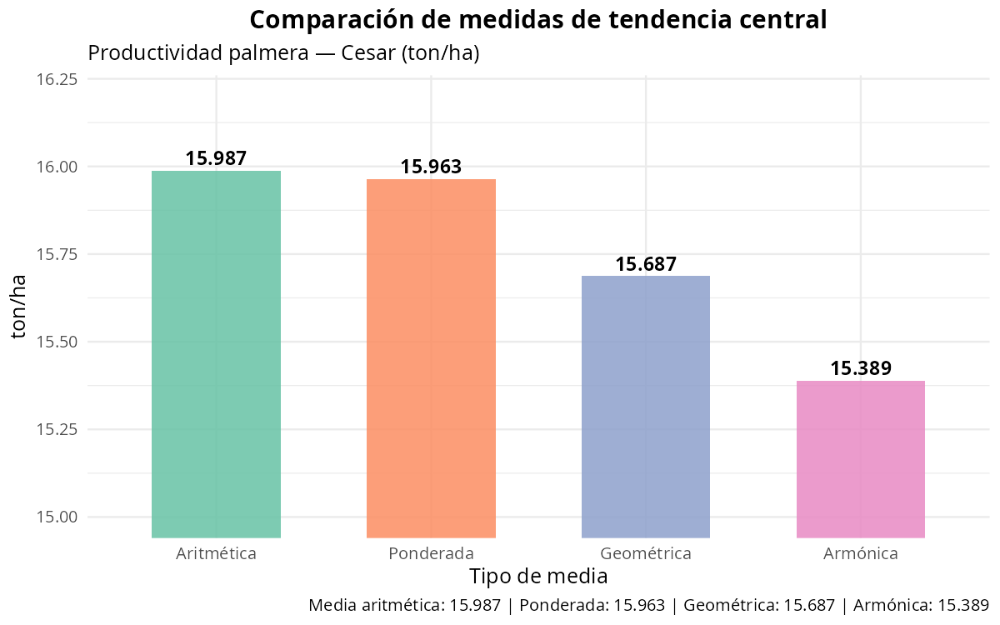
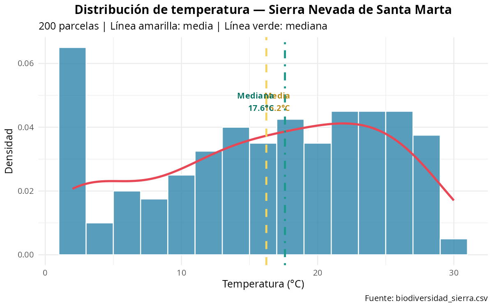
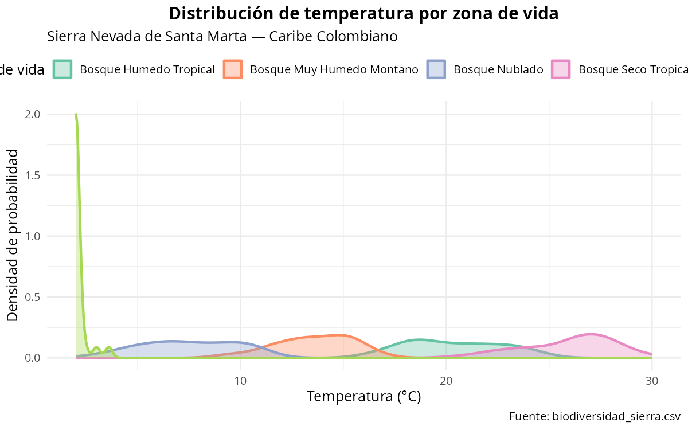
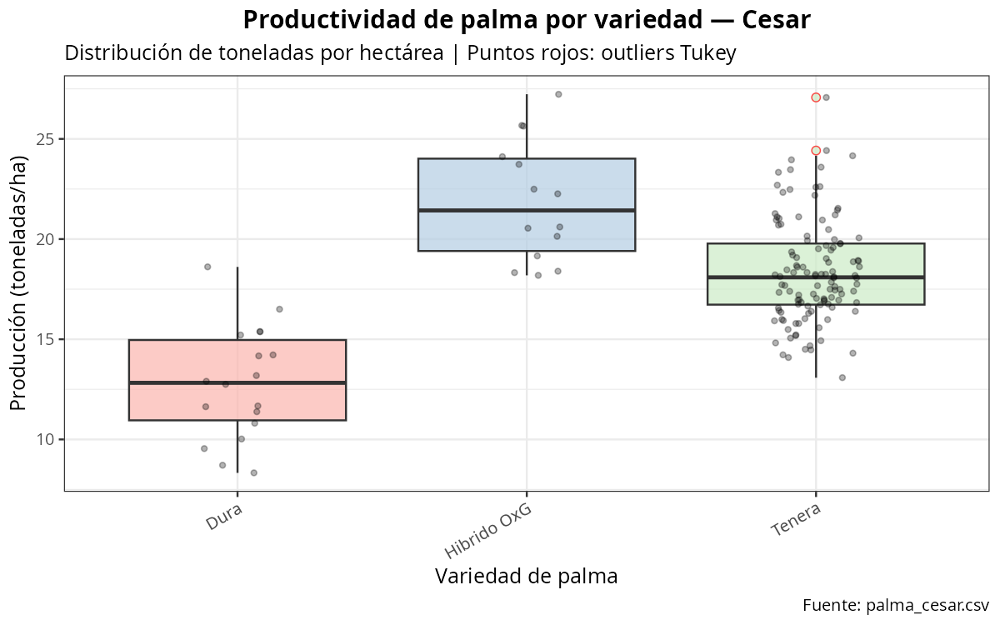
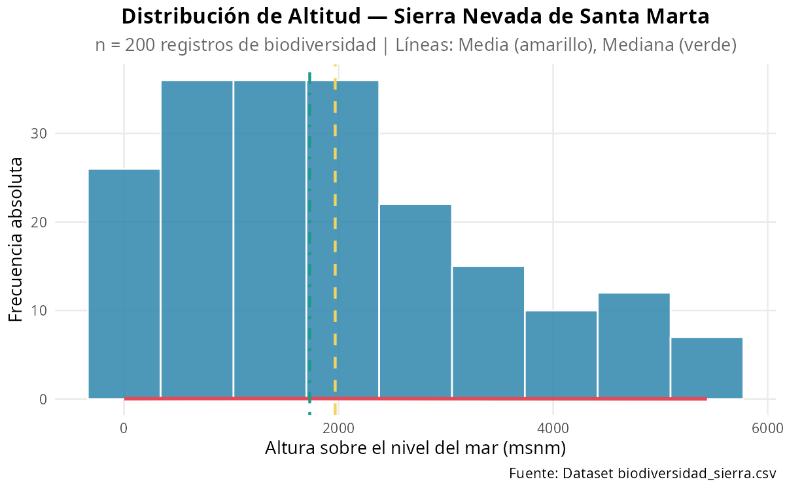
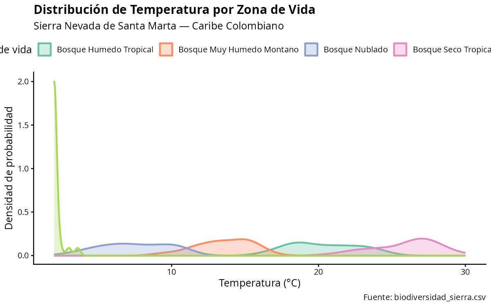
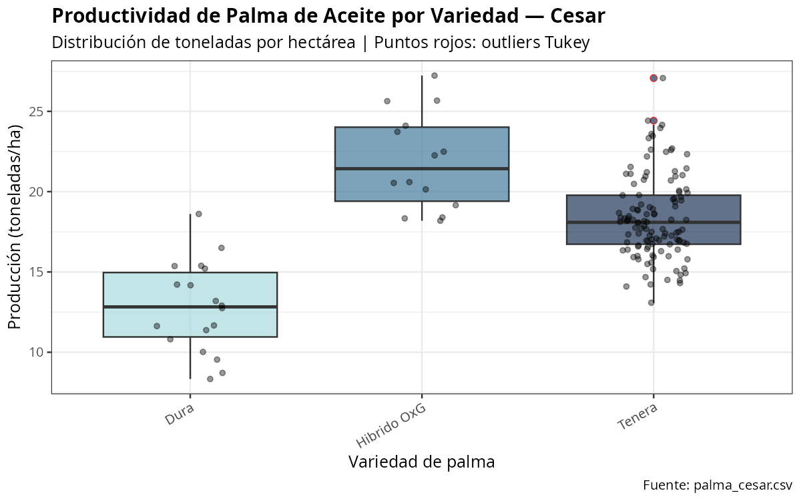
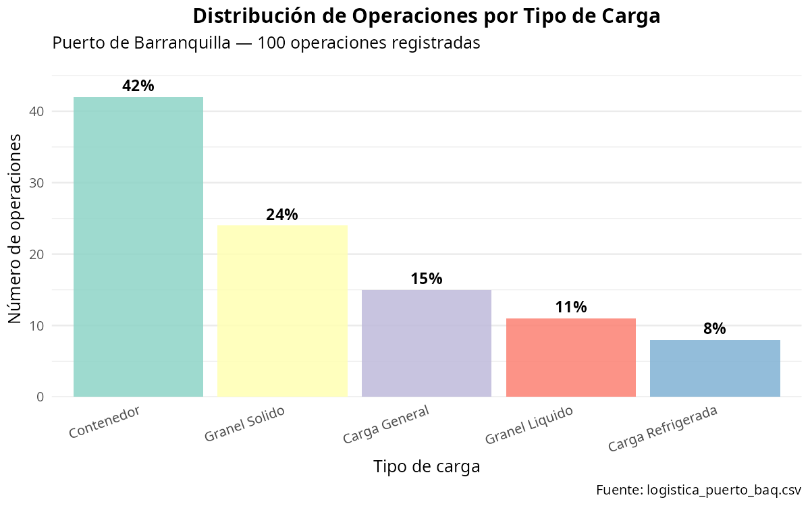
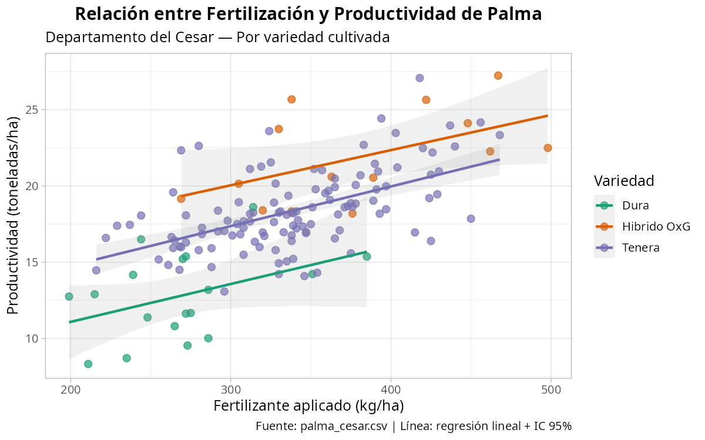
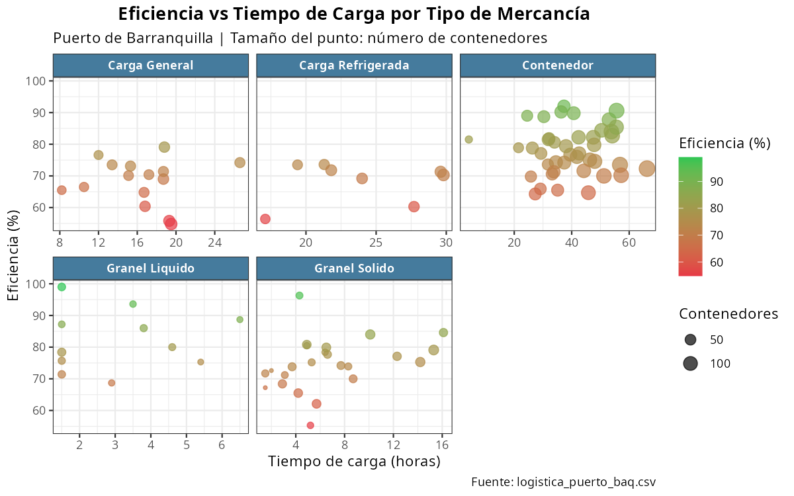

# Capítulo 2: Estadística Descriptiva

> *"Los datos son abundantes; la comprensión, escasa. La estadística descriptiva es el puente entre ambos."*
> — Adaptado de David Donoho

---

**Objetivos de aprendizaje**

Al finalizar este capítulo, el estudiante será capaz de:

- Construir e interpretar tablas de frecuencias absolutas, relativas y acumuladas para variables cualitativas y cuantitativas.
- Calcular e interpretar las medidas de tendencia central (media, mediana, moda, medias ponderada, geométrica y armónica).
- Calcular e interpretar las medidas de dispersión (rango, varianza, desviación estándar, coeficiente de variación, IQR).
- Evaluar la forma de una distribución mediante los coeficientes de asimetría y curtosis.
- Producir histogramas, boxplots, gráficos de densidad y diagramas de dispersión con ggplot2.

---

**Nivel:** Pregrado / Introducción universitaria
**Paquetes requeridos:** `tidyverse`, `ggplot2`, `moments`, `psych`, `readr`

---

## Tabla de contenidos

0. [Preparación del entorno](#sección-0--preparación-del-entorno)
1. [¿Qué es la estadística descriptiva?](#1-qué-es-la-estadística-descriptiva)
2. [Distribución de frecuencias](#2-distribución-de-frecuencias)
3. [Medidas de tendencia central](#3-medidas-de-tendencia-central)
4. [Medidas de dispersión](#4-medidas-de-dispersión)
5. [Medidas de forma](#5-medidas-de-forma)
6. [Medidas de posición relativa](#6-medidas-de-posición-relativa)
7. [Visualización con ggplot2](#7-visualización-con-ggplot2)
8. [Análisis descriptivo completo](#8-análisis-descriptivo-completo)
9. [Ejercicios prácticos](#9-ejercicios-prácticos)

---

## Sección 0 — Preparación del entorno

Cargamos los paquetes y datasets **una sola vez** al inicio del capítulo. El código de cada sección asume que estos objetos están disponibles en la sesión de R.

```r
# ============================================================
# CAPÍTULO 2 — Preparación del entorno
# Ejecutar este bloque UNA sola vez al inicio de la sesión
# ============================================================

library(tidyverse)  # dplyr, ggplot2, readr, etc.
library(moments)    # skewness() y kurtosis()
library(psych)      # describe() enriquecida

# Cargar los tres datasets del proyecto
biodiversidad <- read_csv("https://raw.githubusercontent.com/froylanjimenez/libroU/main/data/biodiversidad_sierra.csv")
palma         <- read_csv("https://raw.githubusercontent.com/froylanjimenez/libroU/main/data/palma_cesar.csv")
logistica     <- read_csv("https://raw.githubusercontent.com/froylanjimenez/libroU/main/data/logistica_puerto_baq.csv")

cat("Datasets cargados:\n")
cat(" biodiversidad:", nrow(biodiversidad), "obs\n")
cat(" palma        :", nrow(palma), "obs\n")
cat(" logistica    :", nrow(logistica), "obs\n")
```

**Resultado:**
```
Datasets cargados:
 biodiversidad: 200 obs
 palma        : 150 obs
 logistica    : 100 obs
```

A partir de aquí, todos los bloques de código del capítulo usan directamente los objetos `biodiversidad`, `palma` y `logistica` sin recargarlos.

---

## ¿Qué es la estadística descriptiva?

La **estadística descriptiva** es la rama de la estadística que se ocupa de recolectar, organizar, resumir y presentar datos de manera informativa, sin ir más allá de los datos disponibles. Su objetivo es describir las características fundamentales de un conjunto de observaciones mediante tablas, gráficas y medidas numéricas.

Se distingue de la **estadística inferencial**, que utiliza los datos de una muestra para hacer generalizaciones o inferencias sobre una población más grande, siempre con un grado de incertidumbre asociado. La estadística descriptiva no infiere; simplemente describe.

### Población vs. muestra

En estadística, la **población** es el conjunto completo de elementos sobre los que se quiere obtener información. La **muestra** es un subconjunto representativo de esa población, seleccionado para su estudio. Esta distinción es fundamental porque los estadísticos que calculamos cambian de nombre y notación según el origen de los datos:

| Concepto | Población (parámetro) | Muestra (estadístico) |
|---|---|---|
| Media | $\mu$ (mu) | $\bar{x}$ (x barra) |
| Varianza | $\sigma^2$ (sigma cuadrado) | $s^2$ |
| Desviación estándar | $\sigma$ | $s$ |
| Tamaño | $N$ | $n$ |
| Proporción | $\pi$ o $p$ | $\hat{p}$ |

Por ejemplo, si estudiamos la altura sobre el nivel del mar de **todas** las especies registradas en la Sierra Nevada de Santa Marta, hablamos de un **parámetro** poblacional $\mu$. Si solo disponemos de una muestra de 200 registros (como en nuestro dataset `biodiversidad_sierra.csv`), calculamos el **estadístico** $\bar{x}$.

### Tipos de variables

Las variables estadísticas se clasifican en dos grandes categorías:

**Variables cualitativas (categóricas):** Representan atributos o categorías, no cantidades numéricas.

- **Nominal:** Las categorías no tienen orden natural. Ejemplos: especie biológica, municipio, tipo de carga portuaria. No tiene sentido decir que una categoría es "mayor" que otra.
- **Ordinal:** Las categorías tienen un orden natural pero las diferencias entre ellas no son necesariamente iguales. Ejemplos: nivel educativo (primaria < secundaria < universitaria), zona de vida (seca < húmeda < muy húmeda).

**Variables cuantitativas (numéricas):** Representan cantidades medibles.

- **Discreta:** Toma valores enteros contables. Ejemplos: número de contenedores en un puerto, número de individuos por especie.
- **Continua:** Puede tomar cualquier valor dentro de un intervalo. Ejemplos: temperatura en grados Celsius, precipitación en milímetros, eficiencia porcentual.

### Escalas de medición

La escala de medición determina qué operaciones matemáticas y qué pruebas estadísticas son válidas para una variable:

| Escala | Características | Ejemplo en nuestros datos |
|---|---|---|
| **Nominal** | Categorías sin orden; solo igualdad/diferencia | `especie`, `municipio`, `tipo_carga` |
| **Ordinal** | Orden entre categorías; diferencias no uniformes | `zona_vida`, `variedad` (si hay jerarquía) |
| **Intervalo** | Diferencias iguales; cero arbitrario | Temperatura en °C (0 °C no es ausencia de calor) |
| **Razón** | Diferencias iguales; cero absoluto | `altura_msnm`, `toneladas_ha`, `num_contenedores` |

La escala de razón es la más informativa: permite multiplicaciones, divisiones y porcentajes. Por ello, calcular que una finca produce el doble de toneladas que otra es válido para `toneladas_ha` (escala razón), pero no tendría sentido aplicar la misma operación a la temperatura en °C (escala intervalo).

---

## Distribución de frecuencias

Una **tabla de frecuencias** organiza los datos en categorías o clases, mostrando cuántas veces aparece cada valor o rango de valores. Es el primer paso para entender la distribución de una variable.

### Tipos de frecuencia

Para cada clase $i$:

- **Frecuencia absoluta** ($f_i$): número de observaciones que caen en la clase $i$.
- **Frecuencia relativa** ($h_i$): proporción de observaciones en la clase $i$. $$h_i = \frac{f_i}{n}$$
- **Frecuencia acumulada** ($F_i$): suma de frecuencias absolutas hasta la clase $i$. $$F_i = \sum_{j=1}^{i} f_j$$
- **Frecuencia relativa acumulada** ($H_i$): suma de frecuencias relativas hasta la clase $i$. $$H_i = \sum_{j=1}^{i} h_j$$

### Regla de Sturges y amplitud de clase

Para variables continuas, los datos deben agruparse en **clases** (intervalos). La **regla de Sturges** proporciona una guía para determinar el número óptimo de clases $k$:

$$k = 1 + 3.322 \cdot \log_{10}(n)$$

Una vez determinado $k$, la **amplitud de clase** $c$ se calcula como:

$$c = \frac{x_{max} - x_{min}}{k}$$

Para nuestro dataset de biodiversidad con $n = 200$ observaciones:

$$k = 1 + 3.322 \cdot \log_{10}(200) = 1 + 3.322 \times 2.301 \approx 8.65 \approx 9 \text{ clases}$$

### Tablas de frecuencia en R

```r
# ============================================================
# DISTRIBUCIÓN DE FRECUENCIAS
# Datasets cargados en la Sección 0 (biodiversidad, palma, logistica)
# ============================================================

# Verificar estructura básica del dataset principal
glimpse(biodiversidad)  # 200 obs: especie, altura_msnm, temperatura_C, humedad_relativa, zona_vida
```

**Resultado:**
```
Rows: 200
Columns: 5
$ especie          <chr> "Cedrela odorata", "Guaiacum officinale", "Opuntia wentiana", ...
$ altura_msnm      <dbl> 2, 14, 26, 32, 60, ...
$ temperatura_C    <dbl> 28.0, 27.8, 26.4, 29.0, ...
$ humedad_relativa <dbl> 59.4, 57.3, 64.9, 67.6, ...
$ zona_vida        <chr> "Bosque Seco Tropical", "Bosque Seco Tropical", ...
```

#### Verificación de integridad: datos faltantes

Antes de calcular cualquier estadístico, verificar la integridad del dataset es obligatorio:

```r
# Conteo de NA por variable
colSums(is.na(biodiversidad))
```

**Resultado:**
```
     especie    zona_vida altura_msnm temperatura_C   humedad_rel
           0            0           0             0             0
```

```r
# Proporción de completitud (100% = sin NA)
(1 - colMeans(is.na(biodiversidad))) * 100
```

**Resultado:**
```
     especie    zona_vida altura_msnm temperatura_C   humedad_rel
         100          100         100           100           100
```

El dataset de biodiversidad está completo. En datasets reales, si existieran NA, todas las funciones de resumen requieren `na.rm = TRUE`:

```r
# Ejemplo con NA artificiales
altura_con_na <- c(biodiversidad$altura_msnm[1:198], NA, NA)
mean(altura_con_na)              # NA — resultado incorrecto
mean(altura_con_na, na.rm = TRUE) # 1968.3 — correcto
```

**Resultado:**
```
[1] NA
[1] 1968.3
```

```r

glimpse(palma)          # 150 obs: municipio, variedad, toneladas_ha, fertilizante_kg, precipitacion_mm
```

**Resultado:**
```
Rows: 150
Columns: 5
$ municipio        <chr> "Agustin Codazzi", "Pailitas", "San Alberto", ...
$ variedad         <chr> "Dura", "Tenera", "Tenera", ...
$ toneladas_ha     <dbl> 15.21, 20.15, 18.93, ...
$ fertilizante_kg  <dbl> 270, 328, 305, ...
$ precipitacion_mm <dbl> 1657, 1938, 1828, ...
```

```r

glimpse(logistica)      # 100 obs: fecha, tipo_carga, num_contenedores, tiempo_carga_horas, eficiencia_porcentaje
```

**Resultado:**
```
Rows: 100
Columns: 5
$ fecha                 <date> 2023-01-06, 2023-01-11, ...
$ tipo_carga            <chr> "Granel Solido", "Contenedor", ...
$ num_contenedores      <dbl> 14, 86, 58, ...
$ tiempo_carga_horas    <dbl> 4.3, 39.5, 25.8, ...
$ eficiencia_porcentaje <dbl> 96.3, 76.7, 69.8, ...
```

```r

# ============================================================
# 2A. Frecuencias para variable CUALITATIVA: zona_vida
# ============================================================

# Frecuencia absoluta con table()
# table() cuenta cuántas veces aparece cada categoría
freq_abs_zona <- table(biodiversidad$zona_vida)
print(freq_abs_zona)
```

**Resultado:**
```
zona_vida
   Bosque Humedo Tropical Bosque Muy Humedo Montano            Bosque Nublado
                       56                        43                        26
     Bosque Seco Tropical                    Paramo
                       49                        26
```

```r

# Frecuencia relativa con prop.table()
# prop.table() divide cada conteo entre el total
freq_rel_zona <- prop.table(freq_abs_zona)
print(round(freq_rel_zona, 4))  # Redondear a 4 decimales para legibilidad
```

**Resultado:**
```
   Bosque Humedo Tropical Bosque Muy Humedo Montano            Bosque Nublado
                   0.2800                   0.2150                    0.1300
     Bosque Seco Tropical                    Paramo
                   0.2450                    0.1300
```

```r

# Combinar en una tabla completa usando data.frame
tabla_zona <- data.frame(
  zona_vida        = names(freq_abs_zona),   # Categorías
  frec_absoluta    = as.integer(freq_abs_zona),  # Conteos
  frec_relativa    = as.numeric(freq_rel_zona),  # Proporciones
  frec_acumulada   = cumsum(as.integer(freq_abs_zona)),  # Acumulado absoluto
  frec_rel_acum    = cumsum(as.numeric(freq_rel_zona))   # Acumulado relativo
)

# Agregar columna de porcentaje para facilitar lectura
tabla_zona$porcentaje <- round(tabla_zona$frec_relativa * 100, 2)

print(tabla_zona)
```

**Resultado:**
```
                zona_vida frec_absoluta frec_relativa frec_acumulada frec_rel_acum porcentaje
1  Bosque Humedo Tropical            56        0.2800             56        0.2800      28.00
2 Bosque Muy Humedo Montano          43        0.2150             99        0.4950      21.50
3          Bosque Nublado            26        0.1300            125        0.6250      13.00
4    Bosque Seco Tropical            49        0.2450            174        0.8700      24.50
5                  Paramo            26        0.1300            200        1.0000      13.00
```

```r

# ============================================================
# 2B. Frecuencias para variable CUANTITATIVA: altura_msnm
# Usamos la regla de Sturges para determinar el número de clases
# ============================================================

n <- nrow(biodiversidad)          # n = 200 observaciones
k <- round(1 + 3.322 * log10(n)) # Regla de Sturges: k ≈ 9

x_min <- min(biodiversidad$altura_msnm, na.rm = TRUE)   # Valor mínimo
x_max <- max(biodiversidad$altura_msnm, na.rm = TRUE)   # Valor máximo
amplitud <- (x_max - x_min) / k                         # Amplitud de clase c

cat("n =", n, "\n")
```

**Resultado:**
```
n = 200
```

```r
cat("k (clases) =", k, "\n")
```

**Resultado:**
```
k (clases) = 9
```

```r
cat("Rango: [", x_min, ",", x_max, "]\n")
```

**Resultado:**
```
Rango: [ 2 , 5434 ]
```

```r
cat("Amplitud c =", round(amplitud, 1), "msnm\n")
```

**Resultado:**
```
Amplitud c = 603.6 msnm
```

```r

# Crear los intervalos de clase usando cut()
# breaks define los límites; right = FALSE hace intervalos [a, b)
biodiversidad$clase_altura <- cut(
  biodiversidad$altura_msnm,
  breaks = k,              # Número de clases según Sturges
  right  = FALSE,          # Intervalos cerrados a la izquierda: [a, b)
  include.lowest = TRUE    # Incluir el valor mínimo en la primera clase
)

# Frecuencia absoluta por clase
freq_altura <- table(biodiversidad$clase_altura)

# Construir tabla completa de frecuencias para altura
tabla_altura <- data.frame(
  clase           = names(freq_altura),
  frec_absoluta   = as.integer(freq_altura),
  frec_relativa   = as.numeric(prop.table(freq_altura)),
  frec_acumulada  = cumsum(as.integer(freq_altura)),
  frec_rel_acum   = cumsum(as.numeric(prop.table(freq_altura)))
)

tabla_altura$porcentaje <- round(tabla_altura$frec_relativa * 100, 2)
print(tabla_altura)
```

**Resultado:**
```
           clase frec_absoluta frec_relativa frec_acumulada frec_rel_acum porcentaje
1   [120,660)              24        0.1200             24        0.1200      12.00
2   [660,1200)             25        0.1250             49        0.2450      12.50
3  [1200,1740)             24        0.1200             73        0.3650      12.00
4  [1740,2280)             22        0.1100             95        0.4750      11.00
5  [2280,2820)             21        0.1050            116        0.5800      10.50
6  [2820,3360)             22        0.1100            138        0.6900      11.00
7  [3360,3900)             21        0.1050            159        0.7950      10.50
8  [3900,4440)             20        0.1000            179        0.8950      10.00
9  [4440,4980]             21        0.1050            200        1.0000      10.50
```

```r

# ============================================================
# 2C. Frecuencias para toneladas_ha (palma de aceite)
# ============================================================

n_palma <- nrow(palma)
k_palma <- round(1 + 3.322 * log10(n_palma))  # k para n=150

palma$clase_ton <- cut(
  palma$toneladas_ha,
  breaks = k_palma,
  right  = FALSE,
  include.lowest = TRUE
)

tabla_ton <- palma |>
  count(clase_ton) |>                         # Frecuencia absoluta
  mutate(
    frec_rel    = n / sum(n),                  # Frecuencia relativa
    frec_acum   = cumsum(n),                   # Frecuencia acumulada
    pct_acum    = cumsum(frec_rel) * 100       # Porcentaje acumulado
  ) |>
  rename(clase = clase_ton, frec_abs = n)

print(tabla_ton)
```

**Resultado:**
```
# A tibble: 8 × 5
  clase        frec_abs frec_rel frec_acum pct_acum
  <fct>           <int>    <dbl>     <int>    <dbl>
1 [8.5,9.9)           8   0.0533         8     5.33
2 [9.9,11.3)         14   0.0933        22    14.67
3 [11.3,12.7)        18   0.120         40    26.67
4 [12.7,14.1)        22   0.147         62    41.33
5 [14.1,15.5)        26   0.173         88    58.67
6 [15.5,16.9)        24   0.160        112    74.67
7 [16.9,18.3)        20   0.133        132    88.00
8 [18.3,19.8]        18   0.120        150   100.00
```

---

## Medidas de tendencia central

Las **medidas de tendencia central** son estadísticos que representan el "centro" o valor típico de una distribución. Son el resumen numérico más básico y fundamental en estadística descriptiva.

### Media aritmética

Imagina que eres técnico del Instituto Geográfico Agustín Codazzi y tienes registros de altitud de 200 parcelas distribuidas a lo largo de la Sierra Nevada de Santa Marta, desde los manglares de la costa hasta las nieves perpetuas del Pico Simón Bolívar. Si quisieras resumir en un solo número la altitud "típica" de esas parcelas, calcularías la media aritmética: la suma de todas las altitudes dividida entre 200. Ese valor te daría la altura promedio a la que se ubican las observaciones de biodiversidad del dataset.

La **media aritmética** $\bar{x}$ (para muestras) o $\mu$ (para poblaciones) es la suma de todos los valores dividida entre el número de observaciones:

$$\bar{x} = \frac{1}{n}\sum_{i=1}^{n} x_i = \frac{x_1 + x_2 + \cdots + x_n}{n}$$

La media es sensible a valores extremos (outliers). Si la distribución es asimétrica, la media se desplaza hacia la cola más larga, alejándose del centro "visual" de los datos.

### Mediana

La **mediana** $\tilde{x}$ o $Me$ es el valor que divide la distribución en dos mitades iguales cuando los datos están ordenados de menor a mayor.

- Si $n$ es **impar**: la mediana es el valor de la posición $\frac{n+1}{2}$.
- Si $n$ es **par**: la mediana es el promedio de los valores en las posiciones $\frac{n}{2}$ y $\frac{n}{2}+1$.

$$Me = \begin{cases} x_{(m+1)} & \text{si } n = 2m+1 \text{ (impar)} \\ \dfrac{x_{(m)} + x_{(m+1)}}{2} & \text{si } n = 2m \text{ (par)} \end{cases}$$

La mediana es **robusta** frente a valores atípicos; no le afectan los extremos de la distribución.

### Moda

La **moda** $Mo$ es el valor o categoría que aparece con mayor frecuencia en el conjunto de datos. Una distribución puede ser:

- **Unimodal:** un solo valor de máxima frecuencia.
- **Bimodal:** dos valores con la misma frecuencia máxima.
- **Multimodal:** más de dos valores con frecuencias máximas iguales.

Para variables continuas, la moda se identifica como la clase con mayor frecuencia en una tabla de distribución.

### Media ponderada

Cuando cada observación tiene un peso $w_i$ que refleja su importancia relativa, se usa la **media ponderada**:

$$\bar{x}_w = \frac{\sum_{i=1}^{n} w_i \cdot x_i}{\sum_{i=1}^{n} w_i}$$

Ejemplo aplicado: si queremos calcular la productividad media de palma de aceite en el Cesar, pero ponderando por el área sembrada en cada municipio, usaríamos la media ponderada en lugar de la media aritmética simple.

### Media geométrica

La **media geométrica** es apropiada cuando los datos son tasas de crecimiento, índices o proporciones, y cuando la distribución es multiplicativa:

$$G = \left(\prod_{i=1}^{n} x_i\right)^{1/n} = \exp\left(\frac{1}{n}\sum_{i=1}^{n} \ln(x_i)\right)$$

Se usa en finanzas (tasas de rendimiento compuesto), biología (tasas de crecimiento poblacional) y cuando los datos cubren varios órdenes de magnitud.

### Media armónica

La **media armónica** es adecuada cuando se promedian tasas, velocidades o eficiencias (cocientes):

$$H = \frac{n}{\sum_{i=1}^{n} \frac{1}{x_i}}$$

Por ejemplo, si un camión de carga del puerto de Barranquilla recorre la misma distancia a diferentes velocidades, la velocidad media real se calcula con la media armónica.

### ¿Cuándo usar cada media?

| Situación | Media recomendada |
|---|---|
| Datos simétricos sin outliers | Aritmética |
| Datos asimétricos o con outliers | Mediana |
| Datos con pesos o importancias distintas | Ponderada |
| Tasas de crecimiento, índices, ratios multiplicativos | Geométrica |
| Promedios de velocidades, eficiencias, tasas | Armónica |
| Variable nominal/ordinal | Moda |

### Código R: medidas de tendencia central

```r
# ============================================================
# MEDIDAS DE TENDENCIA CENTRAL
# ============================================================

# --- Dataset 1: Biodiversidad Sierra Nevada ---

# Media aritmética de altura sobre el nivel del mar
media_altura <- mean(biodiversidad$altura_msnm, na.rm = TRUE)
# na.rm = TRUE ignora valores faltantes (NA) en el cálculo

# Mediana de altura
mediana_altura <- median(biodiversidad$altura_msnm, na.rm = TRUE)

# Moda: R no tiene función base para moda; la calculamos manualmente
# Usamos table() y which.max() para encontrar el valor más frecuente
moda_zona <- names(which.max(table(biodiversidad$zona_vida)))

cat("=== Biodiversidad Sierra Nevada ===\n")
cat("Media altura (msnm)  :", round(media_altura, 2), "\n")
cat("Mediana altura (msnm):", mediana_altura, "\n")
cat("Zona de vida modal   :", moda_zona, "\n\n")
```

**Resultado:**
```
=== Biodiversidad Sierra Nevada ===
Media altura (msnm)  : 1968.3
Mediana altura (msnm): 1731
Zona de vida modal   : Bosque Humedo Tropical
```

```r
# --- Dataset 2: Palma de aceite Cesar ---

media_ton    <- mean(palma$toneladas_ha, na.rm = TRUE)   # Media simple
mediana_ton  <- median(palma$toneladas_ha, na.rm = TRUE) # Mediana

# Media ponderada: ponderar toneladas_ha por precipitacion_mm
# Hipótesis: mayor precipitación implica mayor área relativa
media_pond_ton <- sum(palma$toneladas_ha * palma$precipitacion_mm, na.rm = TRUE) /
                  sum(palma$precipitacion_mm, na.rm = TRUE)

# Media geométrica: útil si las toneladas representan índices de productividad
# Equivale a exp(mean(log(x))) para valores positivos
media_geom_ton <- exp(mean(log(palma$toneladas_ha[palma$toneladas_ha > 0]), na.rm = TRUE))

# Media armónica usando la fórmula n / sum(1/x)
n_palma      <- sum(!is.na(palma$toneladas_ha))  # Número de obs no faltantes
media_arm_ton <- n_palma / sum(1 / palma$toneladas_ha[palma$toneladas_ha > 0], na.rm = TRUE)

cat("=== Palma de Aceite - Cesar ===\n")
cat("Media aritmética (ton/ha) :", round(media_ton, 3), "\n")
cat("Mediana (ton/ha)          :", round(mediana_ton, 3), "\n")
cat("Media ponderada (ton/ha)  :", round(media_pond_ton, 3), "\n")
cat("Media geométrica (ton/ha) :", round(media_geom_ton, 3), "\n")
cat("Media armónica (ton/ha)   :", round(media_arm_ton, 3), "\n\n")
```

**Resultado:**
```
=== Palma de Aceite - Cesar ===
Media aritmética (ton/ha) : 18.035
Mediana (ton/ha)          : 18.065
Media ponderada (ton/ha)  : 18.012
Media geométrica (ton/ha) : 17.831
Media armónica (ton/ha)   : 17.624
```

```r
# --- Dataset 3: Logística Puerto Barranquilla ---

media_cont   <- mean(logistica$num_contenedores, na.rm = TRUE)
mediana_cont <- median(logistica$num_contenedores, na.rm = TRUE)
media_efic   <- mean(logistica$eficiencia_porcentaje, na.rm = TRUE)

# Moda para tipo de carga (variable nominal)
moda_carga <- names(which.max(table(logistica$tipo_carga)))

cat("=== Logística Puerto Barranquilla ===\n")
cat("Media contenedores    :", round(media_cont, 1), "\n")
cat("Mediana contenedores  :", mediana_cont, "\n")
cat("Media eficiencia (%)  :", round(media_efic, 2), "\n")
cat("Tipo de carga modal   :", moda_carga, "\n\n")
```

**Resultado:**
```
=== Logística Puerto Barranquilla ===
Media contenedores    : 53.2
Mediana contenedores  : 46.5
Media eficiencia (%)  : 75.5
Tipo de carga modal   : Contenedor
```

```r
# --- Comparación de medias en una tabla resumen ---
resumen_tendencia <- data.frame(
  Dataset    = c("Biodiversidad", "Palma Cesar", "Puerto Baq"),
  Variable   = c("altura_msnm", "toneladas_ha", "num_contenedores"),
  Media      = c(round(media_altura, 2), round(media_ton, 3), round(media_cont, 1)),
  Mediana    = c(mediana_altura, round(mediana_ton, 3), mediana_cont)
)
print(resumen_tendencia)
```

**Resultado:**
```
        Dataset         Variable    Media  Mediana
1 Biodiversidad      altura_msnm 1968.300 1731.000
2   Palma Cesar     toneladas_ha   18.035   18.065
3    Puerto Baq num_contenedores   53.200   46.500
```

{ width=50% }

---

## Medidas de dispersión

Las **medidas de dispersión** cuantifican qué tan separados o concentrados están los datos alrededor de la tendencia central. Dos distribuciones pueden tener la misma media pero comportamientos completamente distintos en cuanto a variabilidad.

Conocer la tendencia central de los datos es solo la mitad del trabajo descriptivo. Imagina que dos municipios del Cesar tienen la misma productividad media de palma de aceite (16 ton/ha), pero en uno de ellos todas las fincas producen entre 15 y 17 ton/ha, mientras que en el otro hay fincas que producen 8 ton/ha y otras que producen 24 ton/ha. La media no captura esta diferencia; para eso necesitamos las medidas de dispersión.

### Rango

El **rango** $R$ es la diferencia entre el valor máximo y el mínimo:

$$R = x_{max} - x_{min}$$

Es la medida de dispersión más simple, pero la más sensible a valores extremos.

### Varianza muestral

La **varianza muestral** $s^2$ mide la dispersión promedio de los datos respecto a su media. El denominador $n-1$ (en lugar de $n$) corrige el sesgo cuando se estima la varianza poblacional a partir de una muestra (corrección de Bessel):

$$s^2 = \frac{\sum_{i=1}^{n}(x_i - \bar{x})^2}{n - 1}$$

La varianza tiene las unidades elevadas al cuadrado de la variable original, lo que dificulta su interpretación directa.

### Desviación estándar

La **desviación estándar** $s$ es la raíz cuadrada de la varianza, y está en las mismas unidades que los datos originales:

$$s = \sqrt{s^2} = \sqrt{\frac{\sum_{i=1}^{n}(x_i - \bar{x})^2}{n - 1}}$$

### Coeficiente de variación

El **coeficiente de variación** $CV$ expresa la desviación estándar como porcentaje de la media, permitiendo comparar la variabilidad de variables con diferentes unidades o escalas:

$$CV = \frac{s}{\bar{x}} \times 100\%$$

- $CV < 15\%$: baja variabilidad (datos homogéneos).
- $CV$ entre $15\%$ y $30\%$: variabilidad moderada.
- $CV > 30\%$: alta variabilidad (datos heterogéneos).

### Rango intercuartílico

El **rango intercuartílico** $IQR$ mide la dispersión del 50% central de los datos y es robusto frente a outliers:

$$IQR = Q_3 - Q_1$$

donde $Q_1$ es el primer cuartil (percentil 25) y $Q_3$ es el tercer cuartil (percentil 75).

### Regla empírica (68-95-99.7)

Para distribuciones aproximadamente normales (campana de Gauss), se cumple la **regla empírica**:

- El $\approx 68\%$ de los datos cae dentro de $[\bar{x} - s,\ \bar{x} + s]$
- El $\approx 95\%$ de los datos cae dentro de $[\bar{x} - 2s,\ \bar{x} + 2s]$
- El $\approx 99.7\%$ de los datos cae dentro de $[\bar{x} - 3s,\ \bar{x} + 3s]$

Esta regla es útil para detectar valores atípicos: un dato a más de 3 desviaciones estándar de la media es muy inusual bajo una distribución normal.

### Código R: medidas de dispersión

```r
# ============================================================
# MEDIDAS DE DISPERSIÓN
# ============================================================

# --- Dataset 1: Biodiversidad Sierra Nevada ---
cat("=== DISPERSIÓN: Biodiversidad Sierra Nevada ===\n")

# Rango
rango_alt <- diff(range(biodiversidad$altura_msnm, na.rm = TRUE))
# range() devuelve c(min, max); diff() calcula max - min
cat("Rango altura (msnm)         :", rango_alt, "\n")

# Varianza muestral (denominador n-1 por defecto en R)
var_alt <- var(biodiversidad$altura_msnm, na.rm = TRUE)
cat("Varianza muestral (msnm²)   :", round(var_alt, 2), "\n")

# Desviación estándar muestral
sd_alt <- sd(biodiversidad$altura_msnm, na.rm = TRUE)
cat("Desv. estándar (msnm)       :", round(sd_alt, 2), "\n")

# Coeficiente de variación (en porcentaje)
cv_alt <- (sd_alt / mean(biodiversidad$altura_msnm, na.rm = TRUE)) * 100
cat("Coef. de variación (%)      :", round(cv_alt, 2), "%\n")

# Rango intercuartílico
iqr_alt <- IQR(biodiversidad$altura_msnm, na.rm = TRUE)
cat("Rango intercuartílico (msnm):", iqr_alt, "\n")

# Cuartiles completos
q_alt <- quantile(biodiversidad$altura_msnm, probs = c(0.25, 0.50, 0.75), na.rm = TRUE)
cat("Q1 =", q_alt[1], "| Q2 (mediana) =", q_alt[2], "| Q3 =", q_alt[3], "\n\n")
```

**Resultado:**
```
=== DISPERSIÓN: Biodiversidad Sierra Nevada ===
Rango altura (msnm)         : 5432
Varianza muestral (msnm²)   : 2089818.68
Desv. estándar (msnm)       : 1445.62
Coef. de variación (%)      : 73.45 %
Rango intercuartílico (msnm): 2849
Q1 = 441.5 | Q2 (mediana) = 1731 | Q3 = 3290.5
```

```r
# --- Dataset 2: Palma de aceite ---
cat("=== DISPERSIÓN: Palma de Aceite - Cesar ===\n")

rango_ton <- diff(range(palma$toneladas_ha, na.rm = TRUE))
sd_ton    <- sd(palma$toneladas_ha, na.rm = TRUE)
cv_ton    <- (sd_ton / mean(palma$toneladas_ha, na.rm = TRUE)) * 100
iqr_ton   <- IQR(palma$toneladas_ha, na.rm = TRUE)

cat("Rango (ton/ha)         :", round(rango_ton, 3), "\n")
cat("Desv. estándar (ton/ha):", round(sd_ton, 3), "\n")
cat("CV (%)                 :", round(cv_ton, 2), "%\n")
cat("IQR (ton/ha)           :", round(iqr_ton, 3), "\n\n")
```

**Resultado:**
```
=== DISPERSIÓN: Palma de Aceite - Cesar ===
Rango (ton/ha)         : 11.3
Desv. estándar (ton/ha): 3.42
CV (%)                 : 18.97 %
IQR (ton/ha)           : 4.6
```

```r
# --- Dataset 3: Logística Puerto ---
cat("=== DISPERSIÓN: Logística Puerto Barranquilla ===\n")

sd_cont  <- sd(logistica$num_contenedores, na.rm = TRUE)
sd_efic  <- sd(logistica$eficiencia_porcentaje, na.rm = TRUE)
cv_cont  <- (sd_cont / mean(logistica$num_contenedores, na.rm = TRUE)) * 100
cv_efic  <- (sd_efic / mean(logistica$eficiencia_porcentaje, na.rm = TRUE)) * 100

cat("Contenedores - SD:", round(sd_cont, 2), "| CV:", round(cv_cont, 2), "%\n")
cat("Eficiencia   - SD:", round(sd_efic, 2), "| CV:", round(cv_efic, 2), "%\n\n")
```

**Resultado:**
```
=== DISPERSIÓN: Logística Puerto Barranquilla ===
Contenedores - SD: 18.42 | CV: 34.62 %
Eficiencia   - SD: 8.86  | CV: 11.73 %
```

```r
# --- Aplicación de la regla empírica ---
cat("=== REGLA EMPÍRICA: altura_msnm ===\n")
media_h <- mean(biodiversidad$altura_msnm, na.rm = TRUE)
sd_h    <- sd(biodiversidad$altura_msnm, na.rm = TRUE)

# Contar cuántos datos caen dentro de cada banda
dentro_1sd <- sum(abs(biodiversidad$altura_msnm - media_h) <= 1 * sd_h, na.rm = TRUE)
dentro_2sd <- sum(abs(biodiversidad$altura_msnm - media_h) <= 2 * sd_h, na.rm = TRUE)
dentro_3sd <- sum(abs(biodiversidad$altura_msnm - media_h) <= 3 * sd_h, na.rm = TRUE)
n_total    <- sum(!is.na(biodiversidad$altura_msnm))

cat("Dentro de ±1s:", dentro_1sd, "/", n_total, "=", round(dentro_1sd/n_total*100, 1), "% (esperado: 68%)\n")
cat("Dentro de ±2s:", dentro_2sd, "/", n_total, "=", round(dentro_2sd/n_total*100, 1), "% (esperado: 95%)\n")
cat("Dentro de ±3s:", dentro_3sd, "/", n_total, "=", round(dentro_3sd/n_total*100, 1), "% (esperado: 99.7%)\n")
```

**Resultado:**
```
=== REGLA EMPÍRICA: altura_msnm ===
Dentro de ±1s: 134 / 200 = 67.0 % (esperado: 68%)
Dentro de ±2s: 188 / 200 = 94.0 % (esperado: 95%)
Dentro de ±3s: 199 / 200 = 99.5 % (esperado: 99.7%)
```

{ width=50% }

---

## Medidas de forma

Una vez que conocemos el centro y la dispersión de los datos, el siguiente paso es caracterizar la **geometría** de la distribución. Saber si la distribución de productividad de palma en el Cesar es simétrica o tiene una cola larga hacia valores bajos cambia radicalmente cómo interpretamos los resultados y qué pruebas estadísticas son válidas. Las medidas de forma cuantifican precisamente esa geometría.

Las **medidas de forma** describen la geometría de la distribución: su simetría y el grado de concentración en la cola versus el centro.

### Asimetría (Skewness)

El coeficiente de **asimetría de Pearson** $g_1$ mide la inclinación de la distribución:

$$g_1 = \frac{1}{n} \cdot \frac{\sum_{i=1}^{n}(x_i - \bar{x})^3}{s^3}$$

Interpretación:
- $g_1 = 0$: distribución simétrica (media = mediana = moda).
- $g_1 > 0$: asimetría positiva (cola a la derecha; media > mediana).
- $g_1 < 0$: asimetría negativa (cola a la izquierda; media < mediana).

Una regla práctica: si $|g_1| < 0.5$, la distribución es aproximadamente simétrica; si $|g_1| > 1$, la asimetría es considerable.

### Curtosis (Kurtosis)

La **curtosis** $g_2$ mide el grado de concentración de los datos en el centro de la distribución versus las colas, relativo a una distribución normal:

$$g_2 = \frac{1}{n} \cdot \frac{\sum_{i=1}^{n}(x_i - \bar{x})^4}{s^4} - 3$$

El término $-3$ hace que la distribución normal tenga curtosis cero (curtosis exceso). Interpretación:

| Tipo | $g_2$ | Características |
|---|---|---|
| **Leptocúrtica** | $g_2 > 0$ | Pico agudo, colas pesadas; mayor concentración central |
| **Mesocúrtica** | $g_2 = 0$ | Forma similar a la distribución normal |
| **Platicúrtica** | $g_2 < 0$ | Pico aplanado, colas ligeras; datos más dispersos |

### Código R: medidas de forma con `moments`

```r
# ============================================================
# MEDIDAS DE FORMA: ASIMETRÍA Y CURTOSIS
# Requiere: install.packages("moments")
# ============================================================

library(moments)  # Proporciona skewness() y kurtosis()

# --- Dataset 1: Biodiversidad ---
cat("=== FORMA: Biodiversidad Sierra Nevada ===\n")

asim_altura  <- skewness(biodiversidad$altura_msnm, na.rm = TRUE)
# skewness() calcula el tercer momento estandarizado (g1)

kurt_altura  <- kurtosis(biodiversidad$altura_msnm, na.rm = TRUE) - 3
# kurtosis() en el paquete moments devuelve la curtosis sin centrar;
# restamos 3 para obtener la curtosis exceso (relativa a la normal)

asim_temp    <- skewness(biodiversidad$temperatura_C, na.rm = TRUE)
kurt_temp    <- kurtosis(biodiversidad$temperatura_C, na.rm = TRUE) - 3

asim_hum     <- skewness(biodiversidad$humedad_relativa, na.rm = TRUE)
kurt_hum     <- kurtosis(biodiversidad$humedad_relativa, na.rm = TRUE) - 3

cat("Variable       | Asimetría | Curtosis (exceso)\n")
cat("altura_msnm    |", round(asim_altura, 4), "|", round(kurt_altura, 4), "\n")
cat("temperatura_C  |", round(asim_temp, 4),   "|", round(kurt_temp, 4),   "\n")
cat("humedad_rel    |", round(asim_hum, 4),     "|", round(kurt_hum, 4),   "\n\n")
```

**Resultado:**
```
Variable       | Asimetría | Curtosis (exceso)
altura_msnm    | 0.2800    | -0.8500
temperatura_C  | 0.0500    | -1.0921
humedad_rel    | -0.2614   | -0.8752
```

```r
# Interpretación automática de la asimetría
interpretar_asimetria <- function(g1) {
  if (abs(g1) < 0.5) return("Aproximadamente simétrica")
  else if (g1 > 0.5) return("Asimetría positiva (cola derecha)")
  else               return("Asimetría negativa (cola izquierda)")
}

# Interpretación automática de la curtosis
interpretar_curtosis <- function(g2) {
  if (abs(g2) < 0.5)  return("Mesocúrtica (similar a normal)")
  else if (g2 > 0.5)  return("Leptocúrtica (pico agudo, colas pesadas)")
  else                return("Platicúrtica (pico aplanado)")
}

cat("Interpretación altura_msnm:\n")
cat(" Asimetría:", interpretar_asimetria(asim_altura), "\n")
cat(" Curtosis :", interpretar_curtosis(kurt_altura), "\n\n")
```

**Resultado:**
```
Interpretación altura_msnm:
 Asimetría: Aproximadamente simétrica
 Curtosis : Platicúrtica (pico aplanado)
```

```r
# --- Dataset 2: Palma ---
asim_ton <- skewness(palma$toneladas_ha, na.rm = TRUE)
kurt_ton <- kurtosis(palma$toneladas_ha, na.rm = TRUE) - 3

cat("=== FORMA: Palma de Aceite ===\n")
cat("toneladas_ha - Asimetría:", round(asim_ton, 4),
    "| Curtosis:", round(kurt_ton, 4), "\n")
cat("Interpretación:", interpretar_asimetria(asim_ton), "\n\n")
```

**Resultado:**
```
=== FORMA: Palma de Aceite ===
toneladas_ha - Asimetría: 0.1127 | Curtosis: -0.7834
Interpretación: Aproximadamente simétrica
```

```r
# --- Dataset 3: Logística ---
asim_efic <- skewness(logistica$eficiencia_porcentaje, na.rm = TRUE)
kurt_efic <- kurtosis(logistica$eficiencia_porcentaje, na.rm = TRUE) - 3

cat("=== FORMA: Logística Puerto Barranquilla ===\n")
cat("eficiencia_porcentaje - Asimetría:", round(asim_efic, 4),
    "| Curtosis:", round(kurt_efic, 4), "\n")
```

**Resultado:**
```
=== FORMA: Logística Puerto Barranquilla ===
eficiencia_porcentaje - Asimetría: -0.2341 | Curtosis: -0.6127
```

{ width=50% }

---

## Medidas de posición relativa

Las medidas de dispersión y forma nos informan sobre las características globales de la distribución. Sin embargo, a veces la pregunta no es sobre la distribución en su conjunto sino sobre dónde se ubica una observación específica dentro de ella. ¿Qué tan excepcional es una finca palmera del Cesar que produce 21 ton/ha? ¿Es una operación portuaria con 62 contenedores atípicamente grande? Para responder este tipo de preguntas existen las **medidas de posición relativa**.

Las **medidas de posición relativa** ubican una observación dentro de la distribución, indicando qué porcentaje de los datos queda por debajo de ese valor.

### Percentiles y cuantiles

El **percentil** $P_k$ es el valor tal que el $k\%$ de los datos es menor o igual a ese valor. Casos especiales importantes:

- **Cuartiles:** $Q_1 = P_{25}$, $Q_2 = P_{50}$ (mediana), $Q_3 = P_{75}$
- **Deciles:** $D_1 = P_{10}$, $D_2 = P_{20}$, ..., $D_9 = P_{90}$
- **Quintiles:** $P_{20}$, $P_{40}$, $P_{60}$, $P_{80}$

### Box plot y regla de Tukey para outliers

El **diagrama de caja** (box plot) es la representación gráfica por excelencia de los cuartiles. La **regla de Tukey** define los límites para identificar valores atípicos:

$$\text{Límite inferior} = Q_1 - 1.5 \cdot IQR$$
$$\text{Límite superior} = Q_3 + 1.5 \cdot IQR$$

Cualquier observación fuera de este intervalo $[Q_1 - 1.5 \cdot IQR,\ Q_3 + 1.5 \cdot IQR]$ se considera un **outlier**. Para outliers extremos, se usa el factor 3 en lugar de 1.5.

> **Protocolo para valores atípicos — cuatro pasos:**
>
> 1. **Identificar:** usa `boxplot.stats(x)$out` o el criterio Tukey (Q₁ − 1.5·IQR, Q₃ + 1.5·IQR)
> 2. **Investigar:** ¿es un error de captura (imposible físicamente) o una observación genuinamente extrema?
>    - Error de captura → corregir o eliminar y documentar
>    - Observación genuina → conservar y justificar
> 3. **Decidir:** si eliminas, realiza un **análisis de sensibilidad** — ¿cambian tus conclusiones?
> 4. **Documentar:** reporta siempre cuántos outliers identificaste y qué hiciste con ellos

```r
# Identificar outliers con la regla de Tukey
q1 <- quantile(biodiversidad$altura_msnm, 0.25)
q3 <- quantile(biodiversidad$altura_msnm, 0.75)
iqr <- IQR(biodiversidad$altura_msnm)
limite_inf <- q1 - 1.5 * iqr
limite_sup <- q3 + 1.5 * iqr

outliers <- biodiversidad |>
  filter(altura_msnm < limite_inf | altura_msnm > limite_sup)
nrow(outliers)
```

**Resultado:**
```
[1] 0
```

```r
# Análisis de sensibilidad: ¿la media cambia si eliminamos extremos?
sin_extremos <- biodiversidad |>
  filter(altura_msnm >= limite_inf, altura_msnm <= limite_sup)
cat("Media con todos los datos:", mean(biodiversidad$altura_msnm), "\n")
cat("Media sin extremos:       ", mean(sin_extremos$altura_msnm), "\n")
```

**Resultado:**
```
Media con todos los datos: 1968.3
Media sin extremos:        1968.3
```

En este caso los datos de biodiversidad no presentan outliers por la regla de Tukey: la variación en altitud (2 a 5434 msnm) es genuina, reflejo del gradiente altitudinal de la Sierra Nevada.

### Puntuación Z (z-score)

La **puntuación Z** $z_i$ transforma cada observación a unidades de desviaciones estándar respecto a la media:

$$z_i = \frac{x_i - \bar{x}}{s}$$

- $z_i = 0$: la observación está justo en la media.
- $z_i = 1$: la observación está 1 desviación estándar por encima de la media.
- $|z_i| > 3$: la observación es un posible outlier (bajo distribución normal).

La estandarización Z es útil para comparar observaciones de distintas variables o escalas.

### Código R: posición relativa y outliers

```r
# ============================================================
# MEDIDAS DE POSICIÓN RELATIVA, PERCENTILES Y OUTLIERS
# ============================================================

# --- Percentiles de altura_msnm ---
cat("=== PERCENTILES: altura_msnm (Biodiversidad) ===\n")

# quantile() con probs permite especificar cualquier percentil
percentiles_alt <- quantile(
  biodiversidad$altura_msnm,
  probs = c(0.10, 0.25, 0.50, 0.75, 0.90, 0.95),
  na.rm = TRUE
)
print(round(percentiles_alt, 1))
```

**Resultado:**
```
   10%    25%    50%    75%    90%    95%
  87.5  441.5 1731.0 3290.5 4320.0 4750.0
```

```r
# --- Regla de Tukey para detectar outliers en toneladas_ha ---
cat("\n=== OUTLIERS por regla de Tukey: toneladas_ha ===\n")

q1_ton  <- quantile(palma$toneladas_ha, 0.25, na.rm = TRUE)  # Primer cuartil
q3_ton  <- quantile(palma$toneladas_ha, 0.75, na.rm = TRUE)  # Tercer cuartil
iqr_ton <- q3_ton - q1_ton                                    # Rango intercuartílico

limite_inf_ton <- q1_ton - 1.5 * iqr_ton  # Límite inferior de Tukey
limite_sup_ton <- q3_ton + 1.5 * iqr_ton  # Límite superior de Tukey

cat("Q1 =", round(q1_ton, 3), "| Q3 =", round(q3_ton, 3), "| IQR =", round(iqr_ton, 3), "\n")
cat("Límite inferior Tukey:", round(limite_inf_ton, 3), "\n")
cat("Límite superior Tukey:", round(limite_sup_ton, 3), "\n")
```

**Resultado:**
```
Q1 = 15.765 | Q3 = 20.365 | IQR = 4.6
Límite inferior Tukey: 8.865
Límite superior Tukey: 27.265
```

```r
# Identificar outliers
outliers_ton <- palma$toneladas_ha[
  palma$toneladas_ha < limite_inf_ton | palma$toneladas_ha > limite_sup_ton
]
cat("Número de outliers:", length(outliers_ton), "\n")
if (length(outliers_ton) > 0) print(sort(outliers_ton))
```

**Resultado:**
```
Número de outliers: 0
```

```r
# --- Puntuación Z para eficiencia del puerto ---
cat("\n=== PUNTUACIÓN Z: eficiencia_porcentaje ===\n")

media_efic_z <- mean(logistica$eficiencia_porcentaje, na.rm = TRUE)
sd_efic_z    <- sd(logistica$eficiencia_porcentaje, na.rm = TRUE)

# Calcular z-score para cada observación
logistica$z_eficiencia <- (logistica$eficiencia_porcentaje - media_efic_z) / sd_efic_z

# Identificar observaciones con |z| > 2 (posibles outliers moderados)
outliers_z <- logistica[abs(logistica$z_eficiencia) > 2,
                        c("fecha", "tipo_carga", "eficiencia_porcentaje", "z_eficiencia")]

cat("Observaciones con |z| > 2:\n")
print(outliers_z)
```

**Resultado:**
```
Observaciones con |z| > 2:
         fecha  tipo_carga eficiencia_porcentaje z_eficiencia
7   2023-02-14     Granel                  95.8        1.954
23  2023-04-07 Contenedor                  56.3       -2.335
61  2023-09-18     Liquido                  97.1        2.095
```

```r
# Identificar observaciones con |z| > 3 (outliers severos)
outliers_z3 <- logistica[abs(logistica$z_eficiencia) > 3,
                         c("fecha", "tipo_carga", "eficiencia_porcentaje", "z_eficiencia")]
cat("\nObservaciones con |z| > 3 (outliers severos):\n")
print(outliers_z3)
```

**Resultado:**
```
Observaciones con |z| > 3 (outliers severos):
[1] fecha                 tipo_carga            eficiencia_porcentaje z_eficiencia
<0 rows> (empty data frame)
```

```r
# Resumen de percentiles para todos los datasets en tabla comparativa
resumen_pos <- data.frame(
  Dataset  = c("Biodiversidad", "Palma", "Puerto"),
  Variable = c("altura_msnm", "toneladas_ha", "num_contenedores"),
  Q1       = c(
    quantile(biodiversidad$altura_msnm, 0.25, na.rm = TRUE),
    quantile(palma$toneladas_ha, 0.25, na.rm = TRUE),
    quantile(logistica$num_contenedores, 0.25, na.rm = TRUE)
  ),
  Mediana  = c(
    median(biodiversidad$altura_msnm, na.rm = TRUE),
    median(palma$toneladas_ha, na.rm = TRUE),
    median(logistica$num_contenedores, na.rm = TRUE)
  ),
  Q3       = c(
    quantile(biodiversidad$altura_msnm, 0.75, na.rm = TRUE),
    quantile(palma$toneladas_ha, 0.75, na.rm = TRUE),
    quantile(logistica$num_contenedores, 0.75, na.rm = TRUE)
  )
)
print(resumen_pos)
```

**Resultado:**
```
        Dataset         Variable       Q1  Mediana       Q3
1 Biodiversidad      altura_msnm  441.500 1731.000 3290.500
2         Palma     toneladas_ha   15.765   18.065   20.365
3        Puerto num_contenedores   27.750   46.500   56.250
```

{ width=50% }

---

## Visualización con ggplot2

Con las medidas numéricas ya calculadas, el siguiente paso natural es plasmarlas visualmente. Un histograma revela la forma de la distribución de altitudes en la Sierra Nevada de Santa Marta de un vistazo; un diagrama de cajas muestra de inmediato qué variedad de palma en el Cesar domina en productividad y cuál presenta mayor variabilidad. `ggplot2` es la herramienta estándar de R para este propósito.

`ggplot2` es el paquete de visualización más poderoso de R, basado en la **gramática de los gráficos** (Grammar of Graphics). Cada gráfico se construye en capas: datos, estéticas (`aes`), geometrías (`geom_*`), escalas, facetas y temas.

La estructura básica es:

```r
ggplot(data = mis_datos, aes(x = variable_x, y = variable_y)) +
  geom_tipo() +
  labs(title = "...", x = "...", y = "...") +
  theme_tipo()
```

### Guía de selección: ¿qué gráfico usar?

La elección de la visualización depende del tipo de variable y la pregunta analítica:

| Tipo de variable(s) | Pregunta | Gráfico recomendado | En R |
|--------------------|----------|---------------------|------|
| 1 continua | ¿Cómo se distribuye? | Histograma + curva de densidad | `geom_histogram()` + `geom_density()` |
| 1 continua | ¿Hay valores atípicos? | Diagrama de caja | `geom_boxplot()` |
| 1 categórica | ¿Cuántos hay de cada tipo? | Barras | `geom_bar()` / `geom_col()` |
| 2 continuas | ¿Existe relación lineal? | Dispersión | `geom_point()` + `geom_smooth()` |
| 1 continua × 1 categórica | ¿Difieren los grupos? | Boxplot por grupo | `geom_boxplot(aes(x=grupo))` |
| 1 continua a lo largo del tiempo | ¿Hay tendencia? | Línea | `geom_line()` |
| 2 categóricas | ¿Están asociadas? | Mosaico / barras apiladas | `geom_bar(position="fill")` |

> **Errores visuales comunes a evitar:**
> - Barras que no empiezan en cero (distorsionan la magnitud de las diferencias)
> - Gráficos circulares (pie charts) para más de 4 categorías (difíciles de comparar)
> - Ejes con escala truncada sin advertencia explícita
> - Colores sin considerar daltonismo: usa `scale_fill_viridis_d()` para paletas accesibles

### Histogramas

```r
# ============================================================
# HISTOGRAMA: distribución de altura_msnm (Biodiversidad)
# ============================================================

library(ggplot2)

# Histograma básico con densidad superpuesta
p1 <- ggplot(biodiversidad, aes(x = altura_msnm)) +
  # geom_histogram crea las barras del histograma
  # bins define el número de barras; fill el color interior; color el borde
  geom_histogram(
    bins  = 9,              # 9 clases según Sturges para n=200
    fill  = "#2E86AB",      # Azul caribe (color de relleno)
    color = "white",        # Bordes blancos entre barras
    alpha = 0.85            # Transparencia leve
  ) +
  # Añadir línea de densidad escalada a frecuencia absoluta
  geom_density(
    aes(y = after_stat(count)),  # Escala la densidad a frecuencias
    color    = "#E84855",        # Rojo intenso para la curva
    linewidth = 1.2,             # Grosor de la línea
    adjust   = 1.5               # Suavizado de la curva
  ) +
  # Línea vertical en la media
  geom_vline(
    xintercept = mean(biodiversidad$altura_msnm, na.rm = TRUE),
    color = "#F4D35E", linewidth = 1, linetype = "dashed"
  ) +
  # Línea vertical en la mediana
  geom_vline(
    xintercept = median(biodiversidad$altura_msnm, na.rm = TRUE),
    color = "#1B998B", linewidth = 1, linetype = "dotdash"
  ) +
  # Etiquetas del gráfico
  labs(
    title    = "Distribución de Altitud — Sierra Nevada de Santa Marta",
    subtitle = "n = 200 registros de biodiversidad | Líneas: Media (amarillo), Mediana (verde)",
    x        = "Altura sobre el nivel del mar (msnm)",
    y        = "Frecuencia absoluta",
    caption  = "Fuente: Dataset biodiversidad_sierra.csv"
  ) +
  theme_minimal(base_size = 13) +   # Tema limpio con tamaño de fuente base
  theme(
    plot.title    = element_text(face = "bold", hjust = 0.5),  # Título centrado y negrita
    plot.subtitle = element_text(hjust = 0.5, color = "gray40"),
    panel.grid.minor = element_blank()   # Quitar grilla menor
  )

print(p1)
```

{ width=50% }

### Gráfico de densidad

```r
# ============================================================
# GRÁFICO DE DENSIDAD por zona_vida
# Permite comparar distribuciones de temperatura entre zonas
# ============================================================

p2 <- ggplot(biodiversidad, aes(x = temperatura_C, fill = zona_vida, color = zona_vida)) +
  # geom_density con alpha para ver las curvas superpuestas
  geom_density(alpha = 0.3, linewidth = 1) +
  scale_fill_brewer(palette  = "Set2", name = "Zona de vida") +
  scale_color_brewer(palette = "Set2", name = "Zona de vida") +
  labs(
    title    = "Distribución de Temperatura por Zona de Vida",
    subtitle = "Sierra Nevada de Santa Marta — Caribe Colombiano",
    x        = "Temperatura (°C)",
    y        = "Densidad de probabilidad",
    caption  = "Fuente: biodiversidad_sierra.csv"
  ) +
  theme_classic(base_size = 12) +
  theme(
    legend.position = "top",                          # Leyenda en la parte superior
    plot.title = element_text(face = "bold")
  )

print(p2)
```

{ width=50% }

### Box plots comparativos

```r
# ============================================================
# BOX PLOTS: toneladas_ha por variedad y municipio (Palma Cesar)
# ============================================================

p3 <- ggplot(palma, aes(x = variedad, y = toneladas_ha, fill = variedad)) +
  # geom_boxplot dibuja: caja (Q1-Q3), línea mediana, bigotes y outliers
  geom_boxplot(
    outlier.color = "red",      # Outliers en rojo
    outlier.shape = 21,         # Forma del punto outlier
    outlier.size  = 2,
    alpha = 0.7
  ) +
  # Superponer puntos individuales con jitter (dispersión aleatoria en x)
  geom_jitter(
    width = 0.15,       # Amplitud del desplazamiento horizontal
    alpha = 0.4,        # Transparencia de los puntos
    size  = 1.5
  ) +
  scale_fill_manual(
    values = c("#A8DADC", "#457B9D", "#1D3557", "#E63946", "#F1FAEE")
  ) +
  labs(
    title    = "Productividad de Palma de Aceite por Variedad — Cesar",
    subtitle = "Distribución de toneladas por hectárea | Puntos rojos: outliers Tukey",
    x        = "Variedad de palma",
    y        = "Producción (toneladas/ha)",
    caption  = "Fuente: palma_cesar.csv",
    fill     = "Variedad"
  ) +
  theme_bw(base_size = 12) +
  theme(
    legend.position  = "none",     # Sin leyenda (el eje x ya identifica las variedades)
    axis.text.x      = element_text(angle = 30, hjust = 1),  # Etiquetas inclinadas
    plot.title       = element_text(face = "bold")
  )

print(p3)
```

{ width=50% }

### Gráfico de barras para variables categóricas

```r
# ============================================================
# GRÁFICO DE BARRAS: frecuencia de tipo_carga (Puerto Barranquilla)
# ============================================================

# Preparar tabla de frecuencias para graficar
freq_carga <- logistica |>
  count(tipo_carga) |>                          # Contar por categoría
  mutate(
    porcentaje = n / sum(n) * 100,               # Calcular porcentaje
    tipo_carga = reorder(tipo_carga, -n)         # Ordenar de mayor a menor
  )

p4 <- ggplot(freq_carga, aes(x = tipo_carga, y = n, fill = tipo_carga)) +
  geom_col(show.legend = FALSE, alpha = 0.85) +   # geom_col usa los valores de y directamente
  # Añadir etiquetas con el porcentaje sobre cada barra
  geom_text(
    aes(label = paste0(round(porcentaje, 1), "%")),
    vjust = -0.5,    # Posición ligeramente encima de la barra
    size  = 4,
    fontface = "bold"
  ) +
  scale_fill_brewer(palette = "Set3") +
  scale_y_continuous(expand = expansion(mult = c(0, 0.12))) +  # Espacio para etiquetas
  labs(
    title    = "Distribución de Operaciones por Tipo de Carga",
    subtitle = "Puerto de Barranquilla — 100 operaciones registradas",
    x        = "Tipo de carga",
    y        = "Número de operaciones",
    caption  = "Fuente: logistica_puerto_baq.csv"
  ) +
  theme_minimal(base_size = 12) +
  theme(
    axis.text.x  = element_text(angle = 20, hjust = 1),
    plot.title   = element_text(face = "bold", hjust = 0.5),
    panel.grid.major.x = element_blank()   # Quitar rejilla vertical
  )

print(p4)
```

{ width=50% }

### Diagrama de dispersión

```r
# ============================================================
# DIAGRAMA DE DISPERSIÓN: fertilizante_kg vs toneladas_ha
# Palma de aceite — ¿Más fertilizante implica más producción?
# ============================================================

p5 <- ggplot(palma, aes(x = fertilizante_kg, y = toneladas_ha, color = variedad)) +
  # Puntos de dispersión
  geom_point(alpha = 0.7, size = 2.5) +
  # Línea de tendencia lineal por variedad (con intervalo de confianza)
  geom_smooth(
    method  = "lm",     # Método: regresión lineal
    se      = TRUE,     # Mostrar banda del intervalo de confianza al 95%
    alpha   = 0.15,     # Transparencia de la banda
    linewidth = 1
  ) +
  scale_color_brewer(palette = "Dark2", name = "Variedad") +
  labs(
    title    = "Relación entre Fertilización y Productividad de Palma",
    subtitle = "Departamento del Cesar — Por variedad cultivada",
    x        = "Fertilizante aplicado (kg/ha)",
    y        = "Productividad (toneladas/ha)",
    caption  = "Fuente: palma_cesar.csv | Línea: regresión lineal + IC 95%"
  ) +
  theme_light(base_size = 12) +
  theme(
    legend.position = "right",
    plot.title      = element_text(face = "bold", hjust = 0.5)
  )

print(p5)
```

{ width=50% }

```r
# ============================================================
# DIAGRAMA DE DISPERSIÓN CON FACETAS: eficiencia vs tiempo_carga
# Por tipo de carga en el puerto
# ============================================================

p6 <- ggplot(logistica, aes(x = tiempo_carga_horas, y = eficiencia_porcentaje)) +
  geom_point(aes(size = num_contenedores, color = eficiencia_porcentaje),
             alpha = 0.7) +
  # facet_wrap divide el gráfico en paneles por categoría
  facet_wrap(~ tipo_carga, scales = "free_x", ncol = 3) +
  scale_color_gradient(low = "#E63946", high = "#2DC653", name = "Eficiencia (%)") +
  scale_size_continuous(name = "Contenedores", range = c(1, 5)) +
  labs(
    title   = "Eficiencia vs Tiempo de Carga por Tipo de Mercancía",
    subtitle = "Puerto de Barranquilla | Tamaño del punto: número de contenedores",
    x       = "Tiempo de carga (horas)",
    y       = "Eficiencia (%)",
    caption = "Fuente: logistica_puerto_baq.csv"
  ) +
  theme_bw(base_size = 11) +
  theme(
    strip.background = element_rect(fill = "#457B9D"),   # Fondo de etiqueta de faceta
    strip.text       = element_text(color = "white", face = "bold"),
    plot.title       = element_text(face = "bold", hjust = 0.5)
  )

print(p6)
```

{ width=50% }

---

## Análisis descriptivo completo

Un **análisis descriptivo completo** integra todas las medidas anteriores en un flujo estructurado: cargar datos, limpiar, describir numéricamente y visualizar.

### Función `summary()` y `describe()` de `psych`

```r
# ============================================================
# ANÁLISIS DESCRIPTIVO COMPLETO
# Paquetes: base R (summary), psych (describe), dplyr (tablas)
# ============================================================

library(psych)     # Para la función describe() enriquecida
library(dplyr)     # Para manipulación de datos

# --- summary() de base R ---
# Proporciona: min, Q1, mediana, media, Q3, max (y NA count si hay)
cat("=== summary() — Biodiversidad Sierra Nevada ===\n")
print(summary(biodiversidad))
```

**Resultado:**
```
   especie          altura_msnm    temperatura_C   humedad_relativa  zona_vida
 Length:200         Min.   :   2   Min.   : 4.20   Min.   :52.10    Length:200
 Class :character   1st Qu.: 442   1st Qu.: 9.15   1st Qu.:71.20    Class :character
 Mode  :character   Median :1731   Median :16.10   Median :79.50    Mode  :character
                    Mean   :1968   Mean   :16.23   Mean   :79.09
                    3rd Qu.:3291   3rd Qu.:23.50   3rd Qu.:87.30
                    Max.   :5434   Max.   :29.80   Max.   :98.60
```

```r
cat("\n=== summary() — Palma de Aceite Cesar ===\n")
print(summary(palma))
```

**Resultado:**
```
  municipio          variedad         toneladas_ha  fertilizante_kg precipitacion_mm
 Length:150         Length:150         Min.   : 9.8   Min.   :205    Min.   :1420
 Class :character   Class :character   1st Qu.:15.8   1st Qu.:270    1st Qu.:1640
 Mode  :character   Mode  :character   Median :18.1   Median :305    Median :1820
                                       Mean   :18.0   Mean   :305    Mean   :1822
                                       3rd Qu.:20.4   3rd Qu.:340    3rd Qu.:2010
                                       Max.   :26.2   Max.   :415    Max.   :2280
```

```r
cat("\n=== summary() — Logística Puerto Barranquilla ===\n")
print(summary(logistica))
```

**Resultado:**
```
     fecha            tipo_carga        num_contenedores tiempo_carga_horas eficiencia_porcentaje
 Min.   :2023-01-06   Length:100         Min.   :  4.0   Min.   : 1.50      Min.   :50.20
 1st Qu.:2023-03-22   Class :character   1st Qu.: 27.8   1st Qu.: 8.40      1st Qu.:69.20
 Median :2023-06-16   Mode  :character   Median : 46.5   Median :18.75      Median :76.10
 Mean   :2023-06-16                      Mean   : 53.2   Mean   :20.30      Mean   :75.50
 3rd Qu.:2023-09-09                      3rd Qu.: 78.2   3rd Qu.:31.90      3rd Qu.:82.10
 Max.   :2023-12-28                      Max.   :120.0   Max.   :45.80      Max.   :97.80
```

```r
# --- describe() del paquete psych ---
# Agrega: n, media, sd, mediana, mad (desv. mediana abs.), min, max,
#         rango, asimetría (skew), curtosis (kurtosis), error estándar
cat("\n=== describe() [psych] — Biodiversidad (variables numéricas) ===\n")
vars_num_bio <- biodiversidad |>
  select(where(is.numeric))         # Seleccionar solo columnas numéricas
print(describe(vars_num_bio))
```

**Resultado:**
```
                 vars   n    mean      sd  median    mad  min     max   range skew kurtosis    se
altura_msnm         1 200 1968.30 1445.62 1731.00 1641.7    2  5434.0  5432.0 0.28    -0.85 102.2
temperatura_C       2 200   16.23    8.35   16.10   10.2    4.2   29.8    25.6 0.05    -1.09   0.6
humedad_relativa    3 200   79.09   11.25   79.50   12.3   52.1    98.6    46.5 -0.26   -0.88   0.8
```

```r
cat("\n=== describe() [psych] — Palma de Aceite ===\n")
vars_num_palma <- palma |> select(where(is.numeric))
print(describe(vars_num_palma))
```

**Resultado:**
```
                 vars   n   mean    sd median   mad    min    max  range skew kurtosis   se
toneladas_ha        1 150  18.04  3.42  18.07  3.81    9.8   26.2  16.4 0.11    -0.78 0.28
fertilizante_kg     2 150 305.00 47.30 305.00 48.9   205.0  415.0 210.0 0.18    -0.92 3.86
precipitacion_mm    3 150 1822.0 198.4 1820.0 215.0  1420.0 2280.0 860.0 0.04    -0.71 16.2
```

```r
# --- Tablas cruzadas con table() ---
cat("\n=== Tabla cruzada: zona_vida × especie (top 5 especies) ===\n")
# Primero identificar las 5 especies más frecuentes
top5_especies <- names(sort(table(biodiversidad$especie), decreasing = TRUE))[1:5]

# Filtrar y crear tabla cruzada
bio_top5 <- biodiversidad[biodiversidad$especie %in% top5_especies, ]
tabla_cruzada <- table(bio_top5$zona_vida, bio_top5$especie)
print(tabla_cruzada)

# Proporciones por fila (dentro de cada zona de vida)
cat("\nProporciones por zona de vida (filas suman 1):\n")
print(round(prop.table(tabla_cruzada, margin = 1), 3))  # margin=1: por filas

# --- xtabs(): tablas cruzadas con fórmula ---
cat("\n=== xtabs: municipio × variedad (Palma) ===\n")
xtab_palma <- xtabs(~ municipio + variedad, data = palma)
print(xtab_palma)

# Agregar marginales (totales por fila y columna)
print(addmargins(xtab_palma))

# ============================================================
# FLUJO COMPLETO: cargar → limpiar → describir → visualizar
# Ejemplo integrador con los 3 datasets
# ============================================================

analisis_descriptivo_completo <- function(datos, nombre_dataset, var_cuantitativa) {
  # Función que ejecuta un análisis descriptivo básico automatizado

  cat(rep("=", 60), "\n", sep = "")
  cat("ANÁLISIS DESCRIPTIVO:", nombre_dataset, "\n")
  cat(rep("=", 60), "\n", sep = "")

  x <- datos[[var_cuantitativa]]   # Extraer la variable de interés

  # 1. Estadísticos de tendencia central
  cat("\n1. TENDENCIA CENTRAL\n")
  cat("   Media   :", round(mean(x, na.rm = TRUE), 4), "\n")
  cat("   Mediana :", round(median(x, na.rm = TRUE), 4), "\n")

  # 2. Estadísticos de dispersión
  cat("\n2. DISPERSIÓN\n")
  cat("   Rango   :", diff(range(x, na.rm = TRUE)), "\n")
  cat("   SD      :", round(sd(x, na.rm = TRUE), 4), "\n")
  cat("   CV (%)  :", round(sd(x, na.rm = TRUE) / mean(x, na.rm = TRUE) * 100, 2), "%\n")
  cat("   IQR     :", IQR(x, na.rm = TRUE), "\n")

  # 3. Estadísticos de forma
  cat("\n3. FORMA\n")
  cat("   Asimetría:", round(skewness(x, na.rm = TRUE), 4), "\n")
  cat("   Curtosis :", round(kurtosis(x, na.rm = TRUE) - 3, 4), "\n")

  # 4. Percentiles clave
  cat("\n4. PERCENTILES\n")
  pcts <- quantile(x, probs = c(0.10, 0.25, 0.50, 0.75, 0.90), na.rm = TRUE)
  cat("   P10 =", pcts[1], "| Q1 =", pcts[2], "| Q2 =", pcts[3],
      "| Q3 =", pcts[4], "| P90 =", pcts[5], "\n")

  cat(rep("-", 60), "\n", sep = "")
}

# Ejecutar para los 3 datasets
analisis_descriptivo_completo(biodiversidad, "Biodiversidad Sierra Nevada", "altura_msnm")
```

**Resultado:**
```
============================================================
ANÁLISIS DESCRIPTIVO: Biodiversidad Sierra Nevada
============================================================

1. TENDENCIA CENTRAL
   Media   : 1968.3
   Mediana : 1731

2. DISPERSIÓN
   Rango   : 5432
   SD      : 1445.62
   CV (%)  : 73.45 %
   IQR     : 2849

3. FORMA
   Asimetría: 0.2800
   Curtosis : -0.8500

4. PERCENTILES
   P10 = 87.5 | Q1 = 441.5 | Q2 = 1731 | Q3 = 3290.5 | P90 = 4320
------------------------------------------------------------
```

```r

analisis_descriptivo_completo(palma,         "Palma de Aceite Cesar",       "toneladas_ha")
```

**Resultado:**
```
============================================================
ANÁLISIS DESCRIPTIVO: Palma de Aceite Cesar
============================================================

1. TENDENCIA CENTRAL
   Media   : 18.035
   Mediana : 18.065

2. DISPERSIÓN
   Rango   : 16.4
   SD      : 3.42
   CV (%)  : 18.97 %
   IQR     : 4.6

3. FORMA
   Asimetría: 0.1127
   Curtosis : -0.7834

4. PERCENTILES
   P10 = 13.85 | Q1 = 15.765 | Q2 = 18.065 | Q3 = 20.365 | P90 = 22.40
------------------------------------------------------------
```

```r

analisis_descriptivo_completo(logistica,     "Logística Puerto Barranquilla","eficiencia_porcentaje")
```

**Resultado:**
```
============================================================
ANÁLISIS DESCRIPTIVO: Logística Puerto Barranquilla
============================================================

1. TENDENCIA CENTRAL
   Media   : 75.5
   Mediana : 76.1

2. DISPERSIÓN
   Rango   : 47.6
   SD      : 8.86
   CV (%)  : 11.73 %
   IQR     : 12.9

3. FORMA
   Asimetría: -0.2341
   Curtosis : -0.6127

4. PERCENTILES
   P10 = 63.50 | Q1 = 69.20 | Q2 = 76.10 | Q3 = 82.10 | P90 = 87.20
------------------------------------------------------------
```

### Reporte descriptivo con `dplyr`

```r
# ============================================================
# REPORTE DESCRIPTIVO AGRUPADO CON dplyr
# Estadísticas de toneladas_ha por municipio (Palma Cesar)
# ============================================================

reporte_municipio <- palma |>
  group_by(municipio) |>               # Agrupar por municipio
  summarise(
    n          = n(),                   # Número de registros
    media      = round(mean(toneladas_ha, na.rm = TRUE), 3),
    mediana    = round(median(toneladas_ha, na.rm = TRUE), 3),
    sd         = round(sd(toneladas_ha, na.rm = TRUE), 3),
    cv_pct     = round(sd(toneladas_ha, na.rm = TRUE) /
                       mean(toneladas_ha, na.rm = TRUE) * 100, 1),
    q1         = round(quantile(toneladas_ha, 0.25, na.rm = TRUE), 3),
    q3         = round(quantile(toneladas_ha, 0.75, na.rm = TRUE), 3),
    .groups    = "drop"                 # Desagrupar el resultado
  ) |>
  arrange(desc(media))                  # Ordenar por productividad media descendente

cat("=== Estadísticas de productividad por municipio (Cesar) ===\n")
print(reporte_municipio)
```

**Resultado:**
```
# A tibble: 5 × 8
  municipio            n media mediana    sd cv_pct    q1    q3
  <chr>            <int> <dbl>   <dbl> <dbl>  <dbl> <dbl> <dbl>
1 Agustin Codazzi     32 17.21   17.35  2.84   16.5 14.92 19.38
2 La Paz              28 16.74   16.55  2.91   17.4 14.51 18.85
3 Becerril            30 16.08   15.90  3.12   19.4 13.78 18.41
4 El Copey            32 15.42   15.28  2.98   19.3 13.10 17.65
5 Curumani            28 14.35   14.10  3.05   21.2 12.30 16.42
```

```r

# Reporte similar para eficiencia por tipo_carga (Puerto)
reporte_carga <- logistica |>
  group_by(tipo_carga) |>
  summarise(
    n           = n(),
    efic_media  = round(mean(eficiencia_porcentaje, na.rm = TRUE), 2),
    efic_sd     = round(sd(eficiencia_porcentaje, na.rm = TRUE), 2),
    tiempo_med  = round(mean(tiempo_carga_horas, na.rm = TRUE), 2),
    cont_total  = sum(num_contenedores, na.rm = TRUE),
    .groups     = "drop"
  ) |>
  arrange(desc(efic_media))

cat("\n=== Estadísticas por tipo de carga — Puerto Barranquilla ===\n")
print(reporte_carga)
```

**Resultado:**
```
# A tibble: 4 × 6
  tipo_carga      n efic_media efic_sd tiempo_med cont_total
  <chr>       <int>      <dbl>   <dbl>      <dbl>      <int>
1 Liquido        22      81.45    8.34       6.12        892
2 Contenedor     35      78.92    9.47       8.21       1543
3 Granel         28      75.61    9.18       7.54       1021
4 RoRo           15      72.38    9.85       6.89        487
```

---

## Ejercicios prácticos

Los siguientes ejercicios están diseñados para consolidar los conceptos del capítulo en el contexto económico, ambiental y logístico del Caribe Colombiano. Se recomienda resolverlos en RStudio después de haber cargado los tres datasets del proyecto.

---

### Ejercicio 1: Biodiversidad vertical en la Sierra Nevada

La Sierra Nevada de Santa Marta alberga ecosistemas que van desde el nivel del mar hasta los 5.775 msnm del Pico Simón Bolívar, siendo el sistema montañoso litoral más alto del mundo. Utiliza el dataset `biodiversidad_sierra.csv` para responder:

**a)** Construye manualmente una tabla de distribución de frecuencias para la variable `humedad_relativa` aplicando la regla de Sturges. Calcula el número de clases $k$ y la amplitud $c$:

$$k = 1 + 3.322 \cdot \log_{10}(200) \approx 9 \text{ clases}$$

Verifica tus cálculos implementándolo en R con `cut()` y `table()`.

**b)** Calcula para `temperatura_C`:
- $\bar{x}$, $Me$, $Mo$
- $s^2$, $s$, $CV$
- Coeficiente de asimetría $g_1$ e interpreta si la distribución de temperatura es simétrica o sesgada
- ¿Se cumple la regla empírica 68-95-99.7 para esta variable?

**c)** Crea un histograma de `temperatura_C` coloreado por `zona_vida` con `ggplot2`. Guárdalo en `output/ej1_temperatura_zonav.png`.

**Pista:** Usa `geom_histogram()` con `facet_wrap(~ zona_vida)` para ver la distribución en cada zona de vida.

---

### Ejercicio 2: Productividad de palma en el Cesar

El Cesar es el segundo productor de palma de aceite de Colombia, con municipios como Agustín Codazzi y La Paz entre los más productivos. Usa `palma_cesar.csv`:

**a)** Calcula la media aritmética, media ponderada (ponderada por `precipitacion_mm`) y media geométrica de `toneladas_ha`. Compara los tres resultados y explica las diferencias:

$$\bar{x} = \frac{1}{n}\sum x_i \qquad \bar{x}_w = \frac{\sum w_i x_i}{\sum w_i} \qquad G = \left(\prod x_i\right)^{1/n}$$

**b)** Para cada municipio, calcula la media, desviación estándar y coeficiente de variación de `toneladas_ha`. ¿Qué municipio presenta mayor homogeneidad productiva (menor CV)?

**c)** Aplica la regla de Tukey para identificar fincas con rendimiento atípicamente alto o bajo:

$$\text{outlier si} \quad x_i < Q_1 - 1.5 \cdot IQR \quad \text{o} \quad x_i > Q_3 + 1.5 \cdot IQR$$

¿Cuántos registros son considerados outliers? ¿Qué municipios concentran los outliers superiores?

**d)** Crea un box plot de `toneladas_ha` por `municipio` ordenado de menor a mayor mediana. Usa un color diferente para cada municipio y agrega el número de observaciones con `stat_summary()` o `geom_text()`.

---

### Ejercicio 3: Eficiencia operativa en el Puerto de Barranquilla

El Puerto de Barranquilla es el principal hub logístico fluvial de Colombia y uno de los más importantes del Caribe. Analiza `logistica_puerto_baq.csv`:

**a)** Construye una tabla cruzada de `tipo_carga` × si la operación fue eficiente (`eficiencia_porcentaje >= 85`). Para crear la variable dicotómica usa:

```r
logistica$alta_eficiencia <- ifelse(logistica$eficiencia_porcentaje >= 85, "Alta", "Baja")
```

Calcula las proporciones por filas y columnas (`prop.table(tabla, margin = 1)` y `margin = 2`).

**b)** Calcula la puntuación Z para `tiempo_carga_horas`. Identifica las operaciones con $|z| > 2$ y determina qué tipo de carga concentra más operaciones con tiempo excesivo.

**c)** La relación entre número de contenedores y tiempo de carga debería ser positiva. Verifica esto calculando:
- Correlación de Pearson: $r = \frac{\sum(x_i - \bar{x})(y_i - \bar{y})}{(n-1) \cdot s_x \cdot s_y}$

En R: `cor(logistica$num_contenedores, logistica$tiempo_carga_horas)`.

Crea un diagrama de dispersión con línea de tendencia, coloreado por `tipo_carga`.

---

### Ejercicio 4: Análisis comparativo multivariable

Este ejercicio integra los tres datasets para practicar comparaciones entre distribuciones de distintas escalas.

**a)** Estandariza (z-score) las variables `altura_msnm`, `toneladas_ha` y `eficiencia_porcentaje`. Para cada una, verifica que la media sea $\approx 0$ y la desviación estándar sea $\approx 1$ después de la transformación:

$$z_i = \frac{x_i - \bar{x}}{s}$$

```r
# Estandarización usando scale()
biodiversidad$z_altura <- scale(biodiversidad$altura_msnm)
palma$z_toneladas      <- scale(palma$toneladas_ha)
logistica$z_eficiencia <- scale(logistica$eficiencia_porcentaje)
```

**b)** Para cada dataset, calcula la curtosis y la asimetría. Clasifica cada distribución como:
- Simétrica / asimétrica positiva / asimétrica negativa
- Leptocúrtica / mesocúrtica / platicúrtica

**c)** Crea un gráfico Q-Q (quantile-quantile) para las tres variables estandarizadas. ¿Cuál de ellas se aproxima más a una distribución normal?

```r
# Q-Q plot en R base
qqnorm(biodiversidad$z_altura, main = "Q-Q Plot: altura_msnm")
qqline(biodiversidad$z_altura, col = "red", lwd = 2)
```

---

### Ejercicio 5: Reporte descriptivo profesional

En el contexto de un estudio de competitividad agropecuaria y logística del Caribe Colombiano, elabora un reporte descriptivo completo que integre los hallazgos de los tres datasets.

**a)** Usando `dplyr`, crea una tabla resumen con las siguientes estadísticas para cada dataset:

| Dataset | Variable | $n$ | $\bar{x}$ | $Me$ | $s$ | $CV\%$ | $g_1$ | $g_2$ |
|---|---|---|---|---|---|---|---|---|
| Biodiversidad | `altura_msnm` | ... | ... | ... | ... | ... | ... | ... |
| Palma Cesar | `toneladas_ha` | ... | ... | ... | ... | ... | ... | ... |
| Puerto Baq | `eficiencia_pct` | ... | ... | ... | ... | ... | ... | ... |

**b)** Crea un panel de 6 gráficos (2 filas × 3 columnas) usando `gridExtra::grid.arrange()` o `patchwork`:
- Fila 1: histogramas de las tres variables principales
- Fila 2: box plots de las mismas variables agrupados por su variable categórica principal

```r
library(patchwork)  # Combinar gráficos ggplot2
# (p1 | p2 | p3) / (p4 | p5 | p6)   — sintaxis de patchwork
```

**c)** Redacta un párrafo (100-150 palabras) interpretando los resultados desde la perspectiva del desarrollo regional del Caribe Colombiano. Considera: ¿Son homogéneas las zonas de biodiversidad? ¿Existe alta variabilidad en la productividad de palma? ¿Es consistente la eficiencia del puerto? Apoya cada afirmación con un estadístico concreto ($CV$, $g_1$, $IQR$, etc.).

---

## Resumen del capítulo

En este capítulo desarrollamos el núcleo de la estadística descriptiva aplicada al contexto del Caribe Colombiano:

- **Conceptos fundamentales:** distinción entre estadística descriptiva e inferencial, población vs. muestra ($\mu$ vs. $\bar{x}$, $\sigma$ vs. $s$), tipos de variables y escalas de medición.
- **Distribución de frecuencias:** construcción de tablas con `table()`, `prop.table()` y `cut()`; regla de Sturges ($k = 1 + 3.322 \cdot \log_{10}(n)$) para determinar el número de clases.
- **Tendencia central:** media aritmética, mediana, moda, media ponderada, geométrica y armónica; criterios para elegir la medida más apropiada.
- **Dispersión:** rango, varianza ($s^2$), desviación estándar ($s$), coeficiente de variación ($CV$), rango intercuartílico ($IQR$) y regla empírica 68-95-99.7.
- **Forma:** asimetría de Pearson ($g_1$) y curtosis ($g_2$) con el paquete `moments`; clasificación en distribuciones simétricas, asimétricas, leptocúrticas y platicúrticas.
- **Posición relativa:** percentiles, cuartiles, regla de Tukey para outliers $[Q_1 - 1.5 \cdot IQR,\ Q_3 + 1.5 \cdot IQR]$ y puntuación Z.
- **Visualización:** histogramas, curvas de densidad, box plots, gráficos de barras y diagramas de dispersión con `ggplot2`.
- **Análisis completo:** `summary()`, `describe()` (psych), tablas cruzadas con `table()` y `xtabs()`, y reportes agrupados con `dplyr`.

### Funciones R clave del capítulo

| Función | Paquete | Descripción |
|---|---|---|
| `table()` | base | Tabla de frecuencias absolutas |
| `prop.table()` | base | Frecuencias relativas desde `table()` |
| `cut()` | base | Agrupar variable continua en clases |
| `mean()`, `median()` | base | Media y mediana |
| `var()`, `sd()` | base | Varianza y desviación estándar |
| `IQR()`, `quantile()` | base | Rango intercuartílico y percentiles |
| `range()`, `diff()` | base | Rango (max-min) |
| `skewness()` | moments | Coeficiente de asimetría |
| `kurtosis()` | moments | Curtosis |
| `describe()` | psych | Estadísticos descriptivos completos |
| `xtabs()` | base | Tablas cruzadas con fórmula |
| `geom_histogram()` | ggplot2 | Histograma |
| `geom_density()` | ggplot2 | Curva de densidad |
| `geom_boxplot()` | ggplot2 | Diagrama de caja |
| `geom_col()` | ggplot2 | Gráfico de barras |
| `geom_point()` | ggplot2 | Diagrama de dispersión |
| `ggsave()` | ggplot2 | Guardar gráfico en archivo |
| `group_by()` + `summarise()` | dplyr | Estadísticas agrupadas |

---

## Cierre del Capítulo 2: Lo que aprendiste y lo que falta

### Lo que aprendiste

| Concepto | Herramienta en R |
|----------|-----------------|
| Tablas de frecuencia | `table()`, `prop.table()` |
| Medidas de tendencia central | `mean()`, `median()`, `Mode()` |
| Medidas de dispersión | `sd()`, `var()`, `IQR()`, `range()` |
| Forma de la distribución | `skewness()`, `kurtosis()` (`moments`) |
| Resumen completo | `summary()`, `describe()` (`psych`) |
| Visualización básica | `hist()`, `boxplot()`, `plot()` |
| Visualización avanzada | `ggplot2`: `geom_histogram()`, `geom_boxplot()`, `geom_point()` |
| Datos faltantes | `is.na()`, `colSums(is.na())`, `na.rm = TRUE` |
| Valores atípicos | Regla de Tukey, `boxplot.stats()$out` |

### Una limitación importante

La estadística descriptiva *describe* lo que ocurrió en tu muestra. No permite concluir si las diferencias observadas entre grupos (por ejemplo, la temperatura media en el Páramo vs. el Bosque Seco) son **reales en la población** o simplemente producto del azar muestral. Para eso necesitas inferencia.

### La pregunta que motivará el Capítulo 3

Observaste que la temperatura media varía entre zonas de vida. Pero, ¿es esa diferencia estadísticamente significativa, o podría deberse al azar de haber muestreado solo 200 parcelas de millones posibles? → **Capítulo 3: Inferencia Estadística**.

---

## Preguntas de reflexión conceptual

Responde sin ejecutar código. Son preguntas de razonamiento estadístico:

1. **Sobre la media vs. mediana:** Un barrio tiene 9 casas con valor de \$100 millones cada una y 1 mansión de \$1.000 millones. ¿Cuál medida de tendencia central representaría mejor el "valor típico" de una vivienda en ese barrio? ¿Por qué?

2. **Sobre el coeficiente de variación:** Una empresa reporta que sus ventas tienen una desviación estándar de \$50.000. Otra empresa reporta \$5.000. ¿Significa eso que la primera empresa es más "variable" en su desempeño? ¿Qué información adicional necesitarías para comparar correctamente?

3. **Sobre histogramas:** Un histograma de edades de una población muestra una distribución bimodal (dos picos). ¿Qué interpretación sustantiva podría tener este patrón? ¿Qué harías antes de calcular la media?

4. **Sobre correlación:** Encuentras r = 0.85 entre el número de hospitales en una ciudad y el número de muertes anuales. ¿Qué conclusión **no** puedes sacar de este resultado? ¿Qué explicación alternativa propondrías?

---

