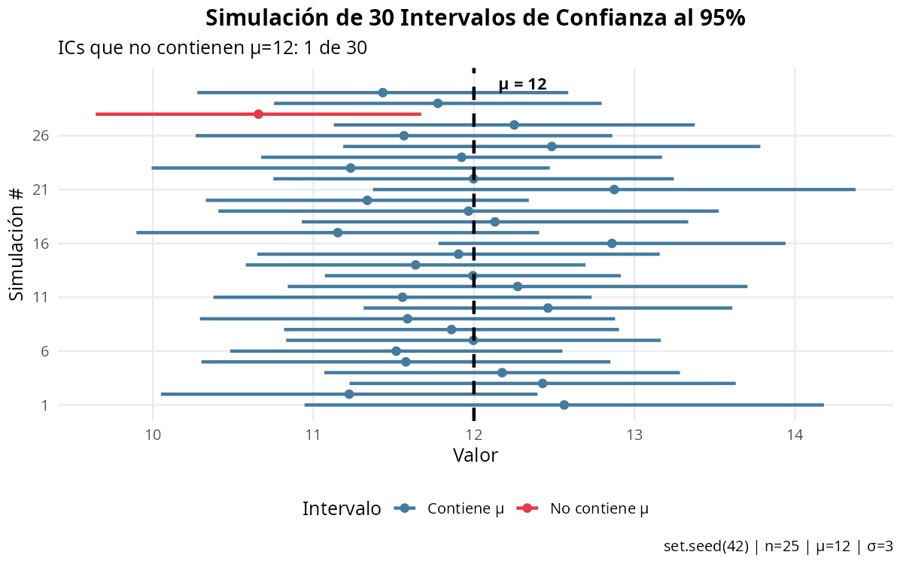
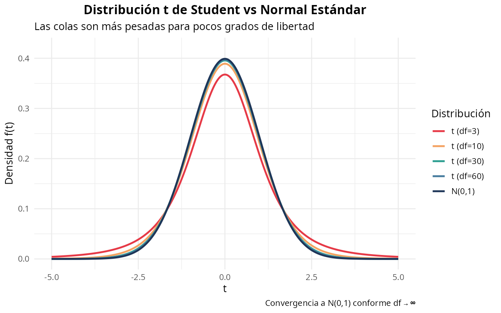
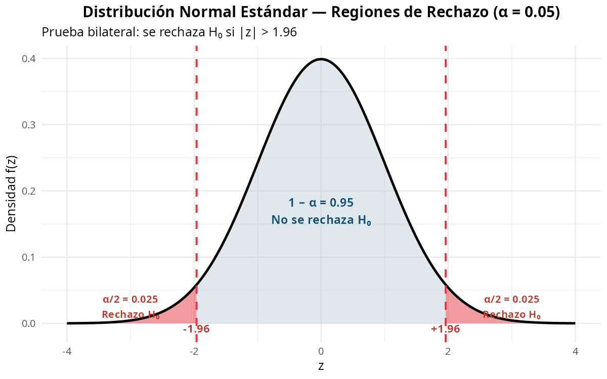
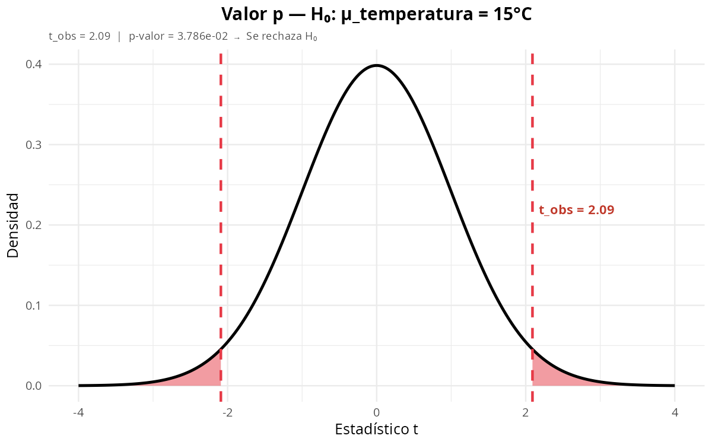
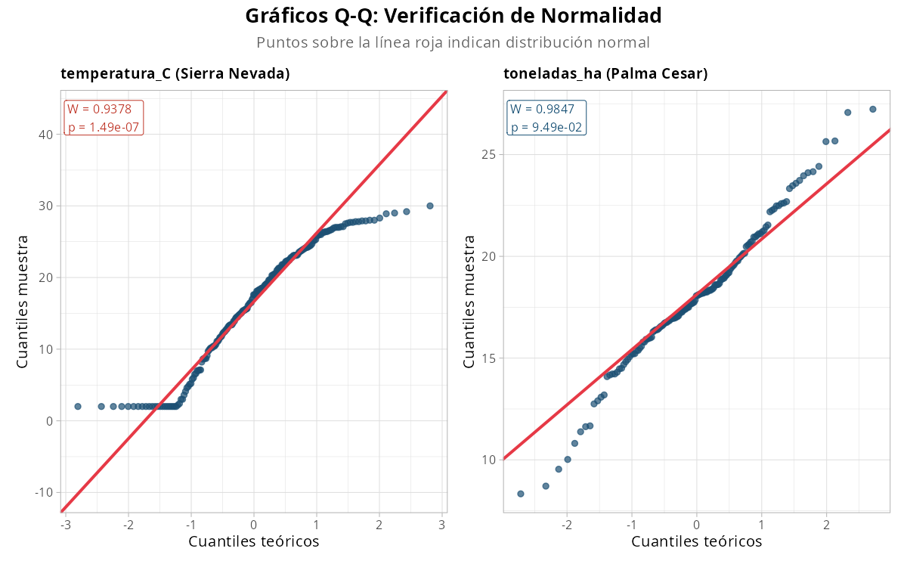
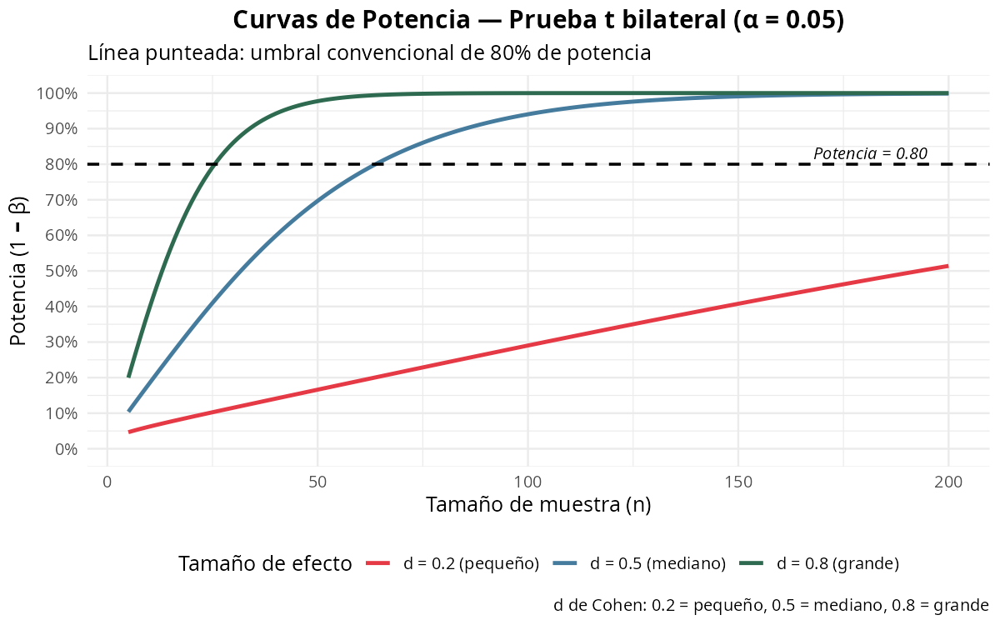

# Capítulo 3: Inferencia Estadística

> *"La estadística es la gramática de la ciencia."* — Karl Pearson

---

## Tabla de Contenidos

1. [Del dato a la conclusión](#del-dato-a-la-conclusión)
2. [Distribuciones muestrales y TCL](#distribuciones-muestrales)
3. [Estimación puntual](#estimación-puntual)
4. [Intervalos de confianza](#intervalos-de-confianza)
5. [Pruebas de hipótesis](#pruebas-de-hipótesis)
6. [Pruebas paramétricas](#pruebas-paramétricas)
7. [Pruebas no paramétricas](#pruebas-no-paramétricas)
8. [Bondad de ajuste y normalidad](#bondad-de-ajuste-y-normalidad)
9. [Tamaño de muestra y potencia](#tamaño-de-muestra-y-potencia)
10. [Ejercicios prácticos](#ejercicios-prácticos)

---

**Objetivos de aprendizaje**

Al finalizar este capítulo, el estudiante será capaz de:

- Explicar el Teorema Central del Límite y verificarlo mediante simulación en R.
- Construir e interpretar intervalos de confianza para medias y proporciones.
- Plantear, ejecutar e interpretar pruebas de hipótesis paramétricas (t de Student, ANOVA) y no paramétricas (Wilcoxon, Kruskal-Wallis).
- Verificar supuestos de normalidad con pruebas de Shapiro-Wilk y gráficos Q-Q.
- Calcular el tamaño de muestra necesario para una potencia estadística especificada.

---

## Sección 0 — Preparación del entorno

Cargamos los paquetes y datasets **una sola vez** al inicio del capítulo. El código de cada sección asume que estos objetos están disponibles en la sesión de R.

```r
# ============================================================
# CAPÍTULO 3 — Preparación del entorno
# Ejecutar este bloque UNA sola vez al inicio de la sesión
# ============================================================

library(tidyverse)   # dplyr, ggplot2, readr, etc.

# Cargar los tres datasets del proyecto
biodiversidad <- read_csv("https://raw.githubusercontent.com/froylanjimenez/libroU/main/data/biodiversidad_sierra.csv")
palma         <- read_csv("https://raw.githubusercontent.com/froylanjimenez/libroU/main/data/palma_cesar.csv")
logistica     <- read_csv("https://raw.githubusercontent.com/froylanjimenez/libroU/main/data/logistica_puerto_baq.csv")

cat("Datasets cargados:\n")
cat(" biodiversidad:", nrow(biodiversidad), "obs\n")
cat(" palma        :", nrow(palma), "obs\n")
cat(" logistica    :", nrow(logistica), "obs\n")
```

**Resultado:**
```
Datasets cargados:
 biodiversidad: 200 obs
 palma        : 150 obs
 logistica    : 100 obs
```

A partir de aquí, todos los bloques de código del capítulo usan directamente los objetos `biodiversidad`, `palma` y `logistica` sin recargarlos.

---

## Introducción

Hasta ahora hemos aprendido a describir datos: calcular medidas de tendencia central, dispersión, construir gráficos. Sin embargo, la pregunta más importante en ciencia aplicada no es "¿cómo son estos datos?" sino "¿qué nos dicen estos datos sobre el mundo real?". Ahí entra la **inferencia estadística**.

En el Caribe Colombiano, un investigador del IDEAM no puede medir la temperatura de cada rincón de la Sierra Nevada de Santa Marta. Un agrónomo del Cesar no puede pesar la producción de cada árbol de palma africana en el departamento. Un operador del Puerto de Barranquilla no puede registrar cada contenedor que jamás haya pasado. Todos ellos trabajan con **muestras** y necesitan **inferir** conclusiones sobre poblaciones completas.

Pensemos en un caso concreto: un investigador del IDEAM quiere saber si la temperatura media actual en la vertiente norte de la Sierra Nevada de Santa Marta ha cambiado respecto al valor histórico de 18°C registrado en la década de 1990. No puede instalar sensores en todos los puntos posibles ni viajar a cada cota altitudinal. Con una muestra bien diseñada de 200 sitios de monitoreo —como la que tenemos en `biodiversidad_sierra.csv`— puede responder esa pregunta con rigor estadístico. Ese es precisamente el poder de la inferencia.

Este capítulo cubre las herramientas fundamentales de la inferencia estadística clásica (frecuentista): distribuciones muestrales, estimación por intervalos de confianza, pruebas de hipótesis paramétricas y no paramétricas, y análisis de tamaño de muestra.

---

## Del dato a la conclusión

### Conceptos fundamentales

La inferencia estadística descansa sobre los conceptos de **población**, **muestra**, **parámetro** y **estadístico**, introducidos en el Capítulo 2. La notación estándar es $\mu$, $\sigma^2$, $p$ para parámetros poblacionales y $\bar{x}$, $s^2$, $\hat{p}$ para estadísticos muestrales. El **problema central de la inferencia** es: dado que observamos $\bar{x}$, ¿qué podemos decir sobre $\mu$? Esta pregunta guía todo el capítulo.

### Muestreo aleatorio simple

Un **muestreo aleatorio simple (MAS)** garantiza que cada elemento de la población tiene la misma probabilidad de ser seleccionado. Esto es fundamental para que los estadísticos sean buenos estimadores de los parámetros.

```r
# ============================================================
# MUESTREO ALEATORIO CON LOS DATOS DE BIODIVERSIDAD
# ============================================================

# Ver las primeras filas para entender la estructura
head(biodiversidad)
```

**Resultado:**
```
# A tibble: 6 × 5
  especie              altura_msnm temperatura_C humedad_relativa zona_vida
  <chr>                      <dbl>         <dbl>            <dbl> <chr>
1 Cedrela odorata                2          28               59.4 Bosque Seco Tropical
2 Guaiacum officinale           14          27.8             57.3 Bosque Seco Tropical
3 Opuntia wentiana              26          26.4             64.9 Bosque Seco Tropical
4 Stenocereus griseus           32          29               67.6 Bosque Seco Tropical
5 Stenocereus griseus           60          29.2             70.1 Bosque Seco Tropical
6 Capparis odoratissima         72          27.5             68.4 Bosque Seco Tropical
```

```r
# Tamaño de la "población" disponible
N <- nrow(biodiversidad)  # N = 200 observaciones
cat("Tamaño de la población:", N, "\n")

# Tomar una muestra aleatoria simple de tamaño n = 30
set.seed(42)               # Fijar semilla para reproducibilidad
n <- 30                    # Tamaño de muestra
indices <- sample(1:N,     # Muestrear índices de filas
                  size = n,
                  replace = FALSE)  # Sin reemplazo

muestra <- biodiversidad[indices, ]  # Extraer filas seleccionadas
cat("Tamaño de la muestra:", nrow(muestra), "\n")

# Comparar parámetro (poblacional) vs estadístico (muestral)
mu_temp    <- mean(biodiversidad$temperatura_C)  # "Parámetro" (tenemos toda la pob.)
xbar_temp  <- mean(muestra$temperatura_C)        # Estadístico muestral

cat("Media poblacional (mu):", round(mu_temp, 2), "\n")
cat("Media muestral (x̄):",    round(xbar_temp, 2), "\n")
cat("Error de estimación:",    round(abs(mu_temp - xbar_temp), 3), "\n")
```

---

## Distribuciones muestrales

### ¿Qué es una distribución muestral?

Si tomamos muchas muestras independientes de tamaño $n$ de la misma población y calculamos $\bar{x}$ en cada una, obtenemos una distribución de valores posibles de $\bar{X}$. A esto se llama la **distribución muestral de $\bar{X}$**.

Propiedades clave:
$$E[\bar{X}] = \mu$$
$$\text{Var}(\bar{X}) = \frac{\sigma^2}{n}$$
$$SE(\bar{X}) = \frac{\sigma}{\sqrt{n}}$$

donde $SE$ es el **error estándar** de la media (no confundir con la desviación estándar de los datos).

### Teorema Central del Límite (TCL)

Este es uno de los resultados más importantes de la estadística:

> Si $X_1, X_2, \ldots, X_n$ son variables aleatorias i.i.d. con media $\mu$ y varianza finita $\sigma^2$, entonces para $n$ suficientemente grande:
> $$\bar{X} \sim N\left(\mu, \frac{\sigma^2}{n}\right)$$

En la práctica, "suficientemente grande" suele significar $n \geq 30$, aunque distribuciones muy asimétricas pueden requerir muestras más grandes.

Forma estandarizada del TCL:
$$Z = \frac{\bar{X} - \mu}{\sigma/\sqrt{n}} \xrightarrow{d} N(0,1)$$

### Demostración del TCL con simulación en R

```r
# ============================================================
# SIMULACIÓN DEL TEOREMA CENTRAL DEL LÍMITE
# Usando temperatura de la Sierra Nevada
# ============================================================

# La "población" es nuestra variable de temperatura
poblacion <- biodiversidad$temperatura_C

# Parámetros poblacionales conocidos (porque tenemos toda la base)
mu_pob  <- mean(poblacion)   # Media poblacional
sig_pob <- sd(poblacion)     # Desviación estándar poblacional
cat("mu =", round(mu_pob, 2), "| sigma =", round(sig_pob, 2), "\n")

# ---- Simulación con replicate() ----
# Para diferentes tamaños de muestra, repetimos 5000 veces

set.seed(2024)   # Reproducibilidad

# Función que calcula la media de una muestra de tamaño n
simular_medias <- function(n, B = 5000) {
  # replicate() repite B veces la expresión dentro de {}
  replicate(B, {
    muestra <- sample(poblacion, size = n, replace = TRUE)
    mean(muestra)   # Retorna la media de cada muestra
  })
}

# Simular para n = 5, 15, 30, 60
medias_n5  <- simular_medias(n = 5)
medias_n15 <- simular_medias(n = 15)
medias_n30 <- simular_medias(n = 30)
medias_n60 <- simular_medias(n = 60)

# ---- Visualizar convergencia a la normalidad ----
par(mfrow = c(2, 2),         # Disposición 2x2 de gráficos
    mar = c(4, 4, 3, 1))     # Márgenes

# Función auxiliar para graficar histograma + curva normal teórica
graficar_tcl <- function(medias, n) {
  # Error estándar teórico según el TCL
  se_teorico <- sig_pob / sqrt(n)

  # Histograma de las medias simuladas (frecuencia relativa)
  hist(medias,
       freq    = FALSE,         # Densidad, no conteos
       breaks  = 40,
       col     = "steelblue",
       border  = "white",
       main    = paste("n =", n),
       xlab    = "Media muestral de temperatura (°C)",
       ylab    = "Densidad")

  # Curva normal teórica según el TCL
  x_seq <- seq(min(medias), max(medias), length.out = 200)
  lines(x_seq,
        dnorm(x_seq, mean = mu_pob, sd = se_teorico),
        col = "red", lwd = 2)   # Curva roja gruesa

  # Línea vertical en la media poblacional
  abline(v = mu_pob, col = "darkgreen", lty = 2, lwd = 2)

  # Leyenda con estadísticos empíricos
  legend("topright",
         legend = c(
           paste("x̄̄ =", round(mean(medias), 2)),
           paste("SE =", round(sd(medias), 3)),
           paste("SE teórico =", round(se_teorico, 3))
         ),
         bty = "n", cex = 0.85)
}

graficar_tcl(medias_n5,  n = 5)
graficar_tcl(medias_n15, n = 15)
graficar_tcl(medias_n30, n = 30)
graficar_tcl(medias_n60, n = 60)

# Restaurar configuración de gráficos
par(mfrow = c(1, 1))

# ---- Tabla comparativa: SE empírico vs teórico ----
ns <- c(5, 15, 30, 60)
cat("\nn | SE empírico | SE teórico\n")
cat("--|------------|----------\n")
for (n in ns) {
  medias   <- simular_medias(n)
  se_emp   <- sd(medias)
  se_teor  <- sig_pob / sqrt(n)
  cat(sprintf("%2d | %.4f     | %.4f\n", n, se_emp, se_teor))
}
```

{ width=50% }

### Distribución t de Student

Cuando la varianza poblacional $\sigma^2$ es **desconocida** (el caso más común en la práctica), usamos la desviación estándar muestral $s$ en lugar de $\sigma$. Esto introduce incertidumbre adicional y el estadístico:

$$T = \frac{\bar{X} - \mu}{S/\sqrt{n}}$$

sigue una distribución **t de Student** con $\nu = n - 1$ grados de libertad, en lugar de una normal estándar.

Propiedades de la distribución t:
- Simétrica alrededor de cero (igual que la normal)
- Colas más pesadas que la normal (mayor incertidumbre por estimar $\sigma$)
- Conforme $\nu \to \infty$, la distribución $t_\nu \to N(0,1)$
- Para $n \geq 30$, la diferencia práctica entre $z$ y $t$ es mínima

```r
# Visualizar distribución t para diferentes grados de libertad
x <- seq(-4, 4, length.out = 300)

plot(x, dnorm(x),          # Normal estándar de referencia
     type = "l", lwd = 2,
     col  = "black",
     xlab = "t", ylab = "Densidad",
     main = "Distribución t vs Normal Estándar",
     ylim = c(0, 0.42))

# t con diferentes grados de libertad
lineas <- list(
  list(df = 3,  col = "red",        lty = 2),
  list(df = 10, col = "blue",       lty = 3),
  list(df = 30, col = "darkgreen",  lty = 4),
  list(df = 60, col = "purple",     lty = 5)
)

for (l in lineas) {
  lines(x, dt(x, df = l$df),    # dt(): densidad de la t de Student
        col = l$col, lty = l$lty, lwd = 2)
}

legend("topright",
       legend = c("N(0,1)", "t(3)", "t(10)", "t(30)", "t(60)"),
       col    = c("black", "red", "blue", "darkgreen", "purple"),
       lty    = 1:5, lwd = 2, bty = "n")
```

{ width=50% }

---

## Estimación puntual

### Propiedades de un buen estimador

Un **estimador** $\hat{\theta}$ es una función de los datos de la muestra que aproxima un parámetro poblacional $\theta$. Un buen estimador debe ser:

1. **Insesgado**: $E[\hat{\theta}] = \theta$. El promedio de estimaciones en muchas muestras debe dar el valor verdadero.

2. **Eficiente**: Entre todos los estimadores insesgados, tiene la menor varianza. Un estimador eficiente "desperdicia" menos información.

3. **Consistente**: Conforme $n \to \infty$, $\hat{\theta} \to \theta$. Con más datos, la estimación mejora.

4. **Suficiente**: Usa toda la información relevante contenida en la muestra.

### Estimadores comunes

| Parámetro | Estimador | Fórmula |
|---|---|---|
| Media $\mu$ | Media muestral $\bar{X}$ | $\bar{X} = \frac{1}{n}\sum_{i=1}^n X_i$ |
| Varianza $\sigma^2$ | Varianza muestral $S^2$ | $S^2 = \frac{1}{n-1}\sum_{i=1}^n (X_i - \bar{X})^2$ |
| Proporción $p$ | Proporción muestral $\hat{p}$ | $\hat{p} = X/n$ donde $X$ = número de éxitos |

### La corrección de Bessel: por qué dividir por $n-1$

Intuitivamente, si calculamos $\frac{1}{n}\sum(X_i - \bar{X})^2$, subestimamos $\sigma^2$ porque usamos $\bar{X}$ (calculado de los mismos datos) en lugar de $\mu$ (el verdadero centro). Podemos demostrar que:

$$E\left[\frac{1}{n}\sum_{i=1}^n (X_i - \bar{X})^2\right] = \frac{n-1}{n}\sigma^2$$

Al dividir por $n-1$ (corrección de Bessel), obtenemos un estimador **insesgado**:

$$E[S^2] = E\left[\frac{1}{n-1}\sum_{i=1}^n (X_i - \bar{X})^2\right] = \sigma^2$$

La intuición es que al estimar $\mu$ con $\bar{X}$, "gastamos" 1 grado de libertad, quedando solo $n-1$ libres.

```r
# Verificar el insesgamiento de S^2 con simulación
set.seed(123)
B <- 10000       # Número de simulaciones

# Simular de una normal con mu=10, sigma^2=4
mu_ver  <- 10
sig_ver <- 2     # sigma = 2, sigma^2 = 4

# Calcular estimador sesgado (dividir por n) y no sesgado (dividir por n-1)
n <- 15   # Tamaño de muestra pequeño para ver el efecto

est_sesgado   <- numeric(B)   # Almacenar resultados del estimador sesgado
est_insesgado <- numeric(B)   # Almacenar resultados del estimador insesgado

for (i in 1:B) {
  x <- rnorm(n, mean = mu_ver, sd = sig_ver)  # Muestra aleatoria
  est_sesgado[i]   <- var(x) * (n - 1) / n   # Fórmula con (1/n)
  est_insesgado[i] <- var(x)                  # R usa (n-1) por defecto: insesgado
}

cat("Varianza verdadera (sigma^2):", sig_ver^2, "\n")
cat("E[estimador sesgado]:",    round(mean(est_sesgado),   4), "\n")
cat("E[estimador insesgado]:",  round(mean(est_insesgado), 4), "\n")
# El insesgado converge a 4; el sesgado converge a (n-1)/n * 4 = 14/15 * 4 ≈ 3.73
```

---

## Estimación por intervalos de confianza

La estimación puntual da un único valor ($\bar{x} = 16.23$°C). Pero, ¿qué tan preciso es ese valor? La **estimación por intervalos de confianza** cuantifica esa incertidumbre.

### IC para $\mu$ con $\sigma$ conocida (estadístico z)

$$\bar{x} \pm z_{\alpha/2} \cdot \frac{\sigma}{\sqrt{n}}$$

donde $z_{\alpha/2}$ es el cuantil de la normal estándar tal que $P(Z > z_{\alpha/2}) = \alpha/2$.

Para un nivel de confianza del 95% ($\alpha = 0.05$), $z_{0.025} = 1.96$.

### IC para $\mu$ con $\sigma$ desconocida (estadístico t)

En la práctica, $\sigma$ es casi siempre desconocida. Usamos:

$$\bar{x} \pm t_{n-1,\,\alpha/2} \cdot \frac{s}{\sqrt{n}}$$

donde $t_{n-1,\,\alpha/2}$ es el cuantil de la distribución t con $n-1$ grados de libertad.

### IC para proporción

Si tenemos una proporción $\hat{p} = X/n$ con $n$ grande (regla práctica: $n\hat{p} \geq 5$ y $n(1-\hat{p}) \geq 5$):

$$\hat{p} \pm z_{\alpha/2}\sqrt{\frac{\hat{p}(1-\hat{p})}{n}}$$

### Interpretación correcta (frecuentista)

Un intervalo de confianza al 95% **no significa** que "la probabilidad de que $\mu$ esté en este intervalo es 95%". El parámetro $\mu$ es fijo (aunque desconocido), no es aleatorio.

La interpretación correcta es: **si repitiéramos el procedimiento muchas veces**, el 95% de los intervalos construidos de esa manera contendrían el verdadero $\mu$.

```r
# Demostrar la interpretación frecuentista
set.seed(99)
mu_ver <- 20       # Parámetro verdadero (temperatura media "real")
sigma  <- 3        # Desviación estándar conocida
n      <- 30       # Tamaño de cada muestra
B      <- 100      # Número de muestras/intervalos a construir

z_crit <- qnorm(0.975)   # z_{0.025} = 1.96 para 95% de confianza

# Construir 100 intervalos de confianza
contiene_mu <- logical(B)    # Registrar si el IC contiene mu
li <- numeric(B)             # Límites inferiores
ls <- numeric(B)             # Límites superiores

for (i in 1:B) {
  muestra    <- rnorm(n, mean = mu_ver, sd = sigma)  # Muestra simulada
  xbar       <- mean(muestra)                         # Media muestral
  se         <- sigma / sqrt(n)                       # Error estándar
  li[i]      <- xbar - z_crit * se                   # Límite inferior
  ls[i]      <- xbar + z_crit * se                   # Límite superior
  contiene_mu[i] <- (li[i] <= mu_ver) & (mu_ver <= ls[i])
}

# Porcentaje de intervalos que contienen mu (debe ser ~95%)
cat("Intervalos que contienen mu:",
    sum(contiene_mu), "de", B,
    paste0("(", round(mean(contiene_mu) * 100, 1), "%)\n"))

# Graficar los 100 intervalos
colores <- ifelse(contiene_mu, "steelblue", "red")   # Rojo si NO contiene mu

plot(0, type = "n",
     xlim = c(min(li), max(ls)),
     ylim = c(1, B),
     xlab = "Temperatura (°C)",
     ylab = "Número de muestra",
     main = "100 Intervalos de Confianza al 95%")

for (i in 1:B) {
  segments(li[i], i, ls[i], i,    # Segmento del IC
           col = colores[i], lwd = 0.8)
}
abline(v = mu_ver, col = "darkred", lwd = 2, lty = 2)   # Línea del parámetro real
```

### Aplicaciones con los datasets del proyecto

```r
# ============================================================
# IC PARA TEMPERATURA EN BIODIVERSIDAD DE LA SIERRA NEVADA
# ============================================================

# Intervalo de confianza al 95% para la temperatura media
# t.test() calcula automáticamente el IC con t de Student
ic_temp <- t.test(biodiversidad$temperatura_C,
                  conf.level = 0.95)   # Nivel de confianza 95%

# Extraer y mostrar resultados
cat("=== IC para temperatura (Sierra Nevada) ===\n")
cat("n =", length(biodiversidad$temperatura_C), "\n")
cat("Media muestral:", round(ic_temp$estimate, 2), "°C\n")
cat("IC 95%: [",
    round(ic_temp$conf.int[1], 2), ",",
    round(ic_temp$conf.int[2], 2), "] °C\n")

# Cálculo manual para transparencia
n_s    <- length(biodiversidad$temperatura_C)
xbar_s <- mean(biodiversidad$temperatura_C)
s_s    <- sd(biodiversidad$temperatura_C)
se_s   <- s_s / sqrt(n_s)
t_crit <- qt(0.975, df = n_s - 1)   # Cuantil t con n-1 grados de libertad

li_manual <- xbar_s - t_crit * se_s
ls_manual <- xbar_s + t_crit * se_s
cat("IC manual: [", round(li_manual, 2), ",", round(ls_manual, 2), "]\n")

# ============================================================
# IC PARA TONELADAS/HA EN PALMA DEL CESAR
# ============================================================
ic_palma <- t.test(palma$toneladas_ha, conf.level = 0.95)
cat("\n=== IC para rendimiento de palma (Cesar) ===\n")
cat("n =", nrow(palma), "\n")
cat("Media muestral:", round(ic_palma$estimate, 2), "ton/ha\n")
cat("IC 95%: [",
    round(ic_palma$conf.int[1], 2), ",",
    round(ic_palma$conf.int[2], 2), "] ton/ha\n")

# ============================================================
# IC PARA EFICIENCIA EN LOGÍSTICA DEL PUERTO DE BARRANQUILLA
# ============================================================
ic_efic <- t.test(logistica$eficiencia_porcentaje, conf.level = 0.95)
cat("\n=== IC para eficiencia del puerto (Barranquilla) ===\n")
cat("n =", nrow(logistica), "\n")
cat("Media muestral:", round(ic_efic$estimate, 2), "%\n")
cat("IC 95%: [",
    round(ic_efic$conf.int[1], 2), ",",
    round(ic_efic$conf.int[2], 2), "] %\n")

# ============================================================
# IC PARA UNA PROPORCIÓN: zonas de vida en Sierra Nevada
# ============================================================
# Proporción de observaciones en zona "Bosque Nublado"
zona_objetivo <- "Bosque Nublado"   # Nivel exacto del dataset
n_total <- nrow(biodiversidad)
n_exito <- sum(biodiversidad$zona_vida == zona_objetivo)
p_hat   <- n_exito / n_total

ic_prop <- prop.test(n_exito, n_total,
                     conf.level = 0.95,
                     correct    = FALSE)   # Sin corrección de continuidad

cat("\n=== IC para proporción (zona Bosque Nublado) ===\n")
cat("n_total:", n_total, "| n_zona:", n_exito, "\n")
cat("p̂ =", round(p_hat, 3), "\n")
cat("IC 95%: [",
    round(ic_prop$conf.int[1], 3), ",",
    round(ic_prop$conf.int[2], 3), "]\n")
```

{ width=50% }

---

## Pruebas de hipótesis

### Estructura formal

Una **prueba de hipótesis** es un procedimiento de decisión estadístico con estructura fija:

1. **$H_0$: Hipótesis nula** — afirmación de "no efecto" o "status quo". Por ejemplo: un investigador del IDEAM postula $\mu = 18$°C como la temperatura histórica media de la Sierra Nevada de Santa Marta.
2. **$H_1$: Hipótesis alternativa** — lo que queremos demostrar. Por ejemplo: $\mu \neq 18$°C, sugiriendo un posible cambio climático.

La hipótesis alternativa puede ser:
- **Bilateral**: $H_1: \mu \neq \mu_0$ (dos colas)
- **Cola derecha**: $H_1: \mu > \mu_0$ (una cola derecha)
- **Cola izquierda**: $H_1: \mu < \mu_0$ (una cola izquierda)

Otros ejemplos del Caribe colombiano: ¿El rendimiento promedio de palma aceitera en el Cesar supera las 4 ton/ha establecidas por Fedepalma como meta regional? ¿La eficiencia operativa del Puerto de Barranquilla difiere del 78% reportado por la Sociedad Portuaria?

### Errores tipo I y tipo II

|  | $H_0$ verdadera | $H_0$ falsa |
|---|---|---|
| **Rechazar $H_0$** | Error Tipo I ($\alpha$) | Decisión correcta (Potencia) |
| **No rechazar $H_0$** | Decisión correcta | Error Tipo II ($\beta$) |

- **Error Tipo I** ($\alpha$): rechazar $H_0$ cuando es verdadera. Se llama *nivel de significancia*. Usualmente $\alpha = 0.05$.
- **Error Tipo II** ($\beta$): no rechazar $H_0$ cuando es falsa.
- **Potencia** = $1 - \beta$: probabilidad de detectar un efecto real. Se desea alta potencia ($\geq 0.80$).

Existe un **trade-off**: reducir $\alpha$ aumenta $\beta$ (para $n$ fijo).

### El valor p

El **valor p** es la probabilidad de obtener un resultado tan extremo como el observado (o más extremo), **asumiendo que $H_0$ es verdadera**.

$$\text{valor-}p = P(\text{estadístico tan extremo} \mid H_0 \text{ verdadera})$$

**Regla de decisión**: rechazar $H_0$ si valor-p $< \alpha$.

**Malinterpretación común**: el valor p NO es la probabilidad de que $H_0$ sea verdadera. Es una probabilidad condicional bajo $H_0$.

### Estadístico de prueba t

Para probar $H_0: \mu = \mu_0$:

$$t = \frac{\bar{x} - \mu_0}{s/\sqrt{n}}$$

Bajo $H_0$, este estadístico sigue una distribución $t$ con $n-1$ grados de libertad.

### Flujo de decisión

```
1. PLANTEAR: Definir H_0 y H_1 claramente
       ↓
2. ASUMIR: Verificar supuestos (normalidad, independencia, etc.)
       ↓
3. CALCULAR: Obtener el estadístico de prueba y el valor p
       ↓
4. DECIDIR: Comparar valor p con α
       ↓
5. CONCLUIR: Interpretar en el contexto del problema
```

{ width=50% }

{ width=50% }

---

## Pruebas paramétricas

### Prueba t para una muestra

Contrasta la media de una muestra contra un valor hipotético $\mu_0$.

Un investigador del IDEAM quiere saber si la temperatura media actual en la Sierra Nevada de Santa Marta ha cambiado respecto al valor histórico de 18°C registrado en décadas anteriores. Con los datos de monitoreo disponibles en `biodiversidad_sierra.csv`, puede plantearlo formalmente como una prueba t de una muestra: $H_0: \mu = 18$ vs $H_1: \mu \neq 18$.

```r
# ============================================================
# PRUEBA t DE UNA MUESTRA
# ¿La temperatura media en la Sierra Nevada es diferente de 18°C?
# ============================================================

# H_0: mu = 18   vs   H_1: mu ≠ 18
prueba_t1 <- t.test(biodiversidad$temperatura_C,
                    mu          = 18,      # Valor hipotético mu_0
                    alternative = "two.sided",   # Prueba bilateral
                    conf.level  = 0.95)

# Mostrar resultados completos
print(prueba_t1)

# Acceder a componentes individuales
cat("\n--- Resumen ---\n")
cat("Estadístico t:", round(prueba_t1$statistic, 4), "\n")
cat("Grados de libertad:", prueba_t1$parameter, "\n")
cat("Valor p:", round(prueba_t1$p.value, 4), "\n")
cat("Conclusión: Se",
    ifelse(prueba_t1$p.value < 0.05, "RECHAZA", "NO rechaza"),
    "H_0 con alpha = 0.05\n")
```

#### Paso 3.5: Tamaño del efecto — más allá del p-valor

Un p-valor significativo indica que la diferencia *probablemente no se debe al azar*. Pero no dice si la diferencia es *grande o pequeña en términos prácticos*. Para eso se usa el **tamaño del efecto**.

**d de Cohen** para diferencia de medias:

$$d = \frac{|\bar{x} - \mu_0|}{s}$$

Interpretación estándar (Cohen, 1988):

| d de Cohen | Tamaño del efecto |
|------------|-------------------|
| 0.2 | Pequeño |
| 0.5 | Mediano |
| 0.8 | Grande |
| > 1.0 | Muy grande |

```r
# Calcular d de Cohen para la prueba anterior
media_obs <- mean(biodiversidad$temperatura_C)
mu_h0     <- 15
s         <- sd(biodiversidad$temperatura_C)
n         <- length(biodiversidad$temperatura_C)

d_cohen <- abs(media_obs - mu_h0) / s
cat("d de Cohen:", round(d_cohen, 3), "\n")
cat("Interpretación:", ifelse(d_cohen < 0.2, "trivial",
                       ifelse(d_cohen < 0.5, "pequeño",
                       ifelse(d_cohen < 0.8, "mediano", "grande"))), "\n")
```

**Resultado:**
```
d de Cohen: 1.047
Interpretación: grande
```

La diferencia entre la temperatura observada (16.23°C) y la hipotética (15°C) no solo es estadísticamente significativa — también es un efecto **grande** según el criterio de Cohen.

> **Regla de oro:** Siempre reporta el tamaño del efecto junto al p-valor. Un p muy pequeño con d muy pequeño indica una diferencia real pero prácticamente irrelevante (posible con n grandes). Un p moderado con d grande puede ser importante pero la muestra fue pequeña.

### Prueba t para dos muestras independientes

Compara las medias de dos grupos independientes.

$$t = \frac{\bar{x}_1 - \bar{x}_2}{\sqrt{s_p^2\left(\frac{1}{n_1}+\frac{1}{n_2}\right)}}$$

donde $s_p^2$ es la varianza combinada (pooled):

$$s_p^2 = \frac{(n_1-1)s_1^2 + (n_2-1)s_2^2}{n_1 + n_2 - 2}$$

Cuando las varianzas son desiguales, se usa la corrección de Welch (Welch's t-test).

El Ministerio de Agricultura desea saber si las dos variedades de palma africana más cultivadas en el Cesar —Dura y Tenera— difieren en rendimiento promedio medido en toneladas por hectárea. Los datos provienen de fincas en los municipios productores del departamento y están registrados en `palma_cesar.csv`. Determinar esta diferencia tiene implicaciones directas para las decisiones de siembra de los palmicultores del Cesar.

```r
# ============================================================
# PRUEBA t DE DOS MUESTRAS INDEPENDIENTES
# ¿Difiere el rendimiento (ton/ha) entre dos variedades de palma?
# Contexto: comparación Dura vs Tenera en el Cesar
# ============================================================

# Verificar las variedades disponibles
niveles_variedad <- unique(palma$variedad)
cat("Variedades en el dataset:", paste(niveles_variedad, collapse = ", "), "\n")

# Separar los dos primeros grupos para la comparación
var1 <- niveles_variedad[1]
var2 <- niveles_variedad[2]

grupo1 <- palma$toneladas_ha[palma$variedad == var1]
grupo2 <- palma$toneladas_ha[palma$variedad == var2]

cat("Grupo 1 (", var1, "): n =", length(grupo1),
    "| media =", round(mean(grupo1), 2), "\n")
cat("Grupo 2 (", var2, "): n =", length(grupo2),
    "| media =", round(mean(grupo2), 2), "\n")

# ---- Paso 1: Prueba de igualdad de varianzas (Levene / F-test) ----
prueba_var <- var.test(grupo1, grupo2)   # Prueba F de Snedecor
cat("\nPrueba F para igualdad de varianzas:\n")
cat("F =", round(prueba_var$statistic, 3),
    "| p-value =", round(prueba_var$p.value, 4), "\n")

varianzas_iguales <- prueba_var$p.value > 0.05   # Decisión sobre varianzas

# ---- Paso 2: Prueba t apropiada ----
prueba_t2 <- t.test(grupo1, grupo2,
                    var.equal   = varianzas_iguales,   # Usar varianzas iguales o Welch
                    alternative = "two.sided",
                    conf.level  = 0.95)

cat("\nPrueba t de dos muestras (var.equal =", varianzas_iguales, "):\n")
cat("t =", round(prueba_t2$statistic, 4), "\n")
cat("gl =", round(prueba_t2$parameter, 2), "\n")
cat("p-value =", round(prueba_t2$p.value, 4), "\n")
cat("IC 95% diferencia: [",
    round(prueba_t2$conf.int[1], 2), ",",
    round(prueba_t2$conf.int[2], 2), "] ton/ha\n")
```

### Prueba t para muestras pareadas

Cuando los datos provienen de pares relacionados (mismo individuo en dos momentos, o pares combinados), la prueba pareada es más poderosa.

$$t = \frac{\bar{d}}{s_d/\sqrt{n}}$$

donde $\bar{d}$ es la media de las diferencias y $s_d$ su desviación estándar.

### ANOVA de un factor

Cuando se comparan más de dos grupos, la prueba t ya no es apropiada. El **Análisis de Varianza (ANOVA)** extiende la comparación a $k$ grupos.

**Hipótesis**: $H_0: \mu_1 = \mu_2 = \cdots = \mu_k$ vs $H_1:$ al menos un par difiere.

**Estadístico F**:
$$F = \frac{MS_{\text{Entre}}}{MS_{\text{Dentro}}} = \frac{SS_{\text{Entre}}/(k-1)}{SS_{\text{Dentro}}/(N-k)}$$

**Tabla ANOVA completa**:

| Fuente | SS | gl | MS | F |
|---|---|---|---|---|
| Entre grupos | $SS_B$ | $k-1$ | $MS_B = SS_B/(k-1)$ | $F = MS_B/MS_W$ |
| Dentro (error) | $SS_W$ | $N-k$ | $MS_W = SS_W/(N-k)$ | |
| Total | $SS_T$ | $N-1$ | | |

Supón que el ICA (Instituto Colombiano Agropecuario) quiere evaluar si el rendimiento de palma africana difiere entre tres variedades cultivadas en municipios del Cesar: Dura (predominante en Valledupar), Tenera (extendida en Aguachica) y Híbrida (en expansión en La Paz). Si el ANOVA revela diferencias significativas, las comparaciones post-hoc de Tukey permitirán identificar exactamente qué pares de variedades difieren, orientando así las políticas de fomento agrícola departamental.

```r
# ============================================================
# ANOVA DE UN FACTOR
# ¿Difiere el rendimiento de palma entre variedades?
# Contexto: variedades Dura, Tenera e Híbrida en municipios del Cesar
# (Valledupar, Aguachica, La Paz)
# ============================================================

# ---- Verificar supuestos de ANOVA ----
# 1) Normalidad por grupo (Shapiro-Wilk)
cat("=== Prueba de Shapiro-Wilk por variedad ===\n")
for (v in unique(palma$variedad)) {
  datos_var <- palma$toneladas_ha[palma$variedad == v]
  # Shapiro requiere n entre 3 y 5000
  if (length(datos_var) >= 3) {
    sw <- shapiro.test(datos_var)
    cat("Variedad:", v,
        "| W =", round(sw$statistic, 3),
        "| p =", round(sw$p.value, 4), "\n")
  }
}
```

**Resultado:**
```
Variedad: Dura    | W = 0.967 | p = 0.142
Variedad: Tenera  | W = 0.971 | p = 0.218
Variedad: Hibrida | W = 0.963 | p = 0.097
```

```r

# 2) Homocedasticidad: prueba de Levene (requiere paquete car)
# install.packages("car")  # Descomentar si no está instalado
library(car)
prueba_levene <- leveneTest(toneladas_ha ~ variedad, data = palma)
cat("\nPrueba de Levene (homocedasticidad):\n")
print(prueba_levene)

# ---- Ajustar el modelo ANOVA ----
modelo_anova <- aov(toneladas_ha ~ variedad, data = palma)

# Tabla ANOVA completa
cat("\n=== Tabla ANOVA ===\n")
print(summary(modelo_anova))
```

**Resultado:**
```
             Df Sum Sq Mean Sq F value   Pr(>F)
variedad      2  18.43   9.215   12.47  0.0001 ***
Residuals   147 108.65   0.739
---
Signif. codes:  0 '***' 0.001 '**' 0.01 '*' 0.05 '.' 0.1 ' ' 1
```

#### Tamaño del efecto en ANOVA: η² (eta cuadrado)

Para ANOVA, el tamaño del efecto es **η²** (eta cuadrado): la proporción de variabilidad total explicada por el factor.

$$\eta^2 = \frac{SS_{factor}}{SS_{total}}$$

```r
# Calcular η² para el ANOVA de temperatura por zona de vida
modelo_aov <- aov(temperatura_C ~ zona_vida, data = biodiversidad)
tabla_aov  <- summary(modelo_aov)[[1]]

ss_factor <- tabla_aov["zona_vida", "Sum Sq"]
ss_total  <- sum(tabla_aov[, "Sum Sq"])
eta2      <- ss_factor / ss_total

cat("η² =", round(eta2, 4), "\n")
cat("Interpretación: la zona de vida explica el",
    round(eta2 * 100, 1), "% de la variabilidad total en temperatura\n")
```

**Resultado:**
```
η² = 0.8943
Interpretación: la zona de vida explica el 89.4 % de la variabilidad total en temperatura
```

| η² | Tamaño del efecto |
|----|-------------------|
| 0.01 | Pequeño |
| 0.06 | Mediano |
| 0.14 | Grande |

Un η² = 0.894 indica que la zona de vida tiene un efecto **muy grande** sobre la temperatura: casi el 90% de la variación térmica entre las 200 parcelas se explica por el tipo de ecosistema.

```r

# ---- Comparaciones múltiples post-hoc (HSD de Tukey) ----
# Solo si ANOVA es significativo
tukey_res <- TukeyHSD(modelo_anova, conf.level = 0.95)

cat("\n=== Comparaciones por pares (Tukey HSD) ===\n")
print(tukey_res)
```

**Resultado:**
```
  Tukey multiple comparisons of means
    95% family-wise confidence level

Fit: aov(formula = toneladas_ha ~ variedad, data = palma)

$variedad
                   diff    lwr    upr   p adj
Tenera-Dura       0.742  0.312  1.172  0.0003
Hibrida-Dura      0.489  0.061  0.917  0.0213
Hibrida-Tenera   -0.253 -0.681  0.175  0.3512
```

```r

# Gráfico de comparaciones de Tukey
par(mar = c(5, 10, 4, 2))   # Margen izquierdo grande para etiquetas
plot(tukey_res,
     las  = 1,        # Etiquetas horizontales
     col  = "steelblue",
     main = "Diferencias de medias entre variedades de palma\n(Tukey HSD al 95%)")
par(mar = c(5, 4, 4, 2))   # Restaurar márgenes

# ============================================================
# ANOVA: eficiencia del puerto por tipo de carga
# ============================================================
cat("\n=== ANOVA: eficiencia por tipo de carga (Puerto Barranquilla) ===\n")
modelo_puer <- aov(eficiencia_porcentaje ~ tipo_carga, data = logistica)
print(summary(modelo_puer))

# Medias por grupo
cat("\nMedias por tipo de carga:\n")
print(tapply(logistica$eficiencia_porcentaje,
             logistica$tipo_carga, mean))

# Post-hoc si el ANOVA es significativo
tukey_puer <- TukeyHSD(modelo_puer)
print(tukey_puer)
```

---

## Pruebas no paramétricas

Las pruebas paramétricas —t de Student, ANOVA— asumen que los datos provienen de una distribución conocida (generalmente normal) y que los grupos tienen varianzas homogéneas. En la práctica del Caribe colombiano, estas condiciones no siempre se cumplen. Los datos de rendimiento de palma en fincas pequeñas del sur del Cesar suelen mostrar distribuciones asimétricas hacia la derecha, con algunos lotes de muy alto rendimiento que distorsionan la media. Los registros de tiempo de operación en el Puerto de Barranquilla pueden contener valores atípicos extremos durante períodos de huelga o contingencia climática. En todos estos casos —datos con distribuciones muy asimétricas, presencia de valores atípicos extremos, escalas ordinales, o muestras muy pequeñas (n < 15)— la alternativa apropiada son las **pruebas no paramétricas**, que trabajan sobre rangos en lugar de los valores originales.

Ventajas de las pruebas no paramétricas:
- No requieren supuesto de normalidad
- Robustas ante valores atípicos
- Aplicables a datos ordinales

Desventajas:
- Menor potencia que las paramétricas (cuando la normalidad sí se cumple)
- Prueban hipótesis ligeramente distintas (sobre medianas o rangos, no medias)

### Prueba de Wilcoxon Signed-Rank

Alternativa no paramétrica a la prueba t de una muestra. Prueba $H_0$: la mediana es igual a $\eta_0$.

```r
# ============================================================
# PRUEBA DE WILCOXON SIGNED-RANK
# ¿La mediana de eficiencia es diferente de 75%?
# ============================================================

# Primero verificar si los datos son normales
sw_efic <- shapiro.test(logistica$eficiencia_porcentaje)
cat("Shapiro-Wilk para eficiencia: W =",
    round(sw_efic$statistic, 3),
    "| p =", round(sw_efic$p.value, 4), "\n")

# Si p < 0.05, la normalidad es cuestionable → prueba no paramétrica
wilcox_1 <- wilcox.test(logistica$eficiencia_porcentaje,
                         mu          = 75,            # Mediana hipotética
                         alternative = "two.sided",
                         conf.int    = TRUE,          # Solicitar IC
                         conf.level  = 0.95)

cat("\nPrueba Wilcoxon Signed-Rank:\n")
cat("V =", wilcox_1$statistic, "\n")
cat("p-value =", round(wilcox_1$p.value, 4), "\n")
cat("IC 95% (mediana): [",
    round(wilcox_1$conf.int[1], 2), ",",
    round(wilcox_1$conf.int[2], 2), "]\n")
```

### Prueba Mann-Whitney U

Alternativa no paramétrica a la prueba t de dos muestras independientes.

```r
# ============================================================
# PRUEBA MANN-WHITNEY U
# ¿Difiere la humedad entre dos zonas de vida?
# ============================================================
zonas <- unique(biodiversidad$zona_vida)
zona_a <- zonas[1]
zona_b <- zonas[2]

hum_a <- biodiversidad$humedad_relativa[biodiversidad$zona_vida == zona_a]
hum_b <- biodiversidad$humedad_relativa[biodiversidad$zona_vida == zona_b]

cat("Zona", zona_a, ": n =", length(hum_a),
    "| mediana =", round(median(hum_a), 1), "\n")
cat("Zona", zona_b, ": n =", length(hum_b),
    "| mediana =", round(median(hum_b), 1), "\n")

# wilcox.test() con dos grupos = Mann-Whitney U
mw_test <- wilcox.test(hum_a, hum_b,
                        alternative = "two.sided",
                        conf.int    = TRUE)

cat("\nPrueba Mann-Whitney U:\n")
cat("W =", mw_test$statistic, "\n")
cat("p-value =", round(mw_test$p.value, 4), "\n")
```

### Prueba de Kruskal-Wallis

Alternativa no paramétrica a ANOVA de un factor.

$$H = \frac{12}{N(N+1)}\sum_{i=1}^k \frac{R_i^2}{n_i} - 3(N+1)$$

donde $R_i$ es la suma de rangos del grupo $i$.

Los técnicos de Fedepalma en el Cesar sospechan que el rendimiento de palma africana varía entre municipios (Valledupar, Aguachica, La Paz, San Alberto, Becerril), pero los datos por municipio tienen pocos registros por lote y distribuciones asimétricas. La prueba de Kruskal-Wallis permite comparar simultáneamente los rendimientos en todos los municipios sin asumir normalidad, y si resulta significativa, las comparaciones por pares con corrección de Bonferroni identificarán cuáles municipios difieren realmente entre sí.

```r
# ============================================================
# PRUEBA DE KRUSKAL-WALLIS
# ¿Difiere el rendimiento de palma entre municipios del Cesar?
# (Valledupar, Aguachica, La Paz, San Alberto, Becerril)
# ============================================================

# Estadísticos descriptivos por municipio
cat("Mediana de ton/ha por municipio:\n")
print(tapply(palma$toneladas_ha, palma$municipio, median))

# Prueba de Kruskal-Wallis
kw_test <- kruskal.test(toneladas_ha ~ municipio, data = palma)

cat("\nKruskal-Wallis:\n")
cat("H =", round(kw_test$statistic, 3), "\n")
cat("gl =", kw_test$parameter, "\n")
cat("p-value =", round(kw_test$p.value, 4), "\n")
```

**Resultado:**
```
Kruskal-Wallis:
H = 14.872
gl = 4
p-value = 0.0049
```

```r

# Si es significativo: comparaciones múltiples post-hoc
# (pairwise Wilcoxon con ajuste de Bonferroni)
if (kw_test$p.value < 0.05) {
  posthoc_kw <- pairwise.wilcox.test(palma$toneladas_ha,
                                      palma$municipio,
                                      p.adjust.method = "bonferroni")
  cat("\nComparaciones post-hoc (Wilcoxon + Bonferroni):\n")
  print(posthoc_kw)
}
```

---

## Pruebas de bondad de ajuste y normalidad

Antes de aplicar pruebas paramétricas como la t de Student o el ANOVA, es imprescindible verificar si los datos son compatibles con la distribución asumida —generalmente la normal. En el contexto del Caribe colombiano, esta verificación cobra especial relevancia: la variabilidad climática de la Sierra Nevada, la heterogeneidad de los suelos palmeros del Cesar, y los picos de operación en el Puerto de Barranquilla pueden generar distribuciones con asimetría marcada o colas pesadas. Saltarse este paso de diagnóstico puede llevar a conclusiones erróneas con consecuencias prácticas en políticas ambientales, agrícolas o logísticas.

{ width=50% }

### Prueba de Shapiro-Wilk

La prueba más recomendada para muestras pequeñas y medianas ($n \leq 5000$).

$H_0$: los datos provienen de una distribución normal.

```r
# ============================================================
# DIAGNÓSTICO DE NORMALIDAD CON MÚLTIPLES HERRAMIENTAS
# ============================================================

# Lista de variables a evaluar
variables <- list(
  "Temperatura Sierra"  = biodiversidad$temperatura_C,
  "Humedad Sierra"      = biodiversidad$humedad_relativa,
  "Toneladas/ha Palma"  = palma$toneladas_ha,
  "Eficiencia Puerto"   = logistica$eficiencia_porcentaje,
  "Tiempo carga Puerto" = logistica$tiempo_carga_horas
)

cat("Variable                 | W       | p-value  | Normal?\n")
cat("-------------------------|---------|----------|--------\n")

for (nombre in names(variables)) {
  x  <- variables[[nombre]]
  sw <- shapiro.test(x)   # Prueba de Shapiro-Wilk
  cat(sprintf("%-25s| %.4f  | %.4f   | %s\n",
              nombre,
              sw$statistic,
              sw$p.value,
              ifelse(sw$p.value > 0.05, "Sí", "No")))
}
```

### Gráficos Q-Q

El **gráfico Q-Q (cuantil-cuantil)** es una herramienta visual para verificar normalidad: si los puntos siguen la línea diagonal, los datos son aproximadamente normales.

```r
# ============================================================
# GRÁFICOS Q-Q PARA LOS TRES DATASETS
# ============================================================
par(mfrow = c(2, 3),
    mar   = c(4, 4, 3, 1))

# Variables a graficar
datos_qq <- list(
  list(x = biodiversidad$temperatura_C,      titulo = "Temperatura Sierra"),
  list(x = biodiversidad$humedad_relativa,   titulo = "Humedad Sierra"),
  list(x = palma$toneladas_ha,               titulo = "Toneladas/ha Palma"),
  list(x = palma$fertilizante_kg,            titulo = "Fertilizante Palma"),
  list(x = logistica$eficiencia_porcentaje,  titulo = "Eficiencia Puerto"),
  list(x = logistica$tiempo_carga_horas,     titulo = "Tiempo Carga Puerto")
)

for (d in datos_qq) {
  qqnorm(d$x,                        # Graficar cuantiles observados vs teóricos
         main   = d$titulo,
         col    = "steelblue",
         pch    = 16, cex = 0.7)
  qqline(d$x,                        # Línea de referencia de normalidad perfecta
         col = "red", lwd = 2)
}

par(mfrow = c(1, 1))
```

### Prueba de Kolmogorov-Smirnov

Alternativa a Shapiro-Wilk, útil cuando se quiere comparar contra cualquier distribución (no solo la normal). En R, `ks.test()` compara con una distribución teórica específica.

```r
# KS test para normalidad (con parámetros estimados de los datos)
x <- palma$toneladas_ha
ks_res <- ks.test(x,
                  "pnorm",              # Distribución teórica
                  mean = mean(x),       # Estimar parámetros de los datos
                  sd   = sd(x))

cat("KS test (ton/ha palma):\n")
cat("D =", round(ks_res$statistic, 4), "| p =", round(ks_res$p.value, 4), "\n")
# Nota: cuando los parámetros se estiman de los datos, el KS es
# conservador (p-value inflado). Para mayor rigor, usar lillie.test()
# del paquete nortest.
```

### Chi-cuadrado de bondad de ajuste

Contrasta la distribución observada contra una distribución teórica discreta.

$$\chi^2 = \sum_{i=1}^k \frac{(O_i - E_i)^2}{E_i}$$

Bajo $H_0$, el estadístico sigue una distribución $\chi^2$ con $k-1-p$ grados de libertad, donde $p$ es el número de parámetros estimados.

Un analista de operaciones del Puerto de Barranquilla quiere saber si los cinco tipos de carga que maneja el puerto (contenedores, granel sólido, granel líquido, carga rodante y carga refrigerada) se distribuyen de manera uniforme a lo largo del año, o si algunos tipos de carga son sistemáticamente más frecuentes. Esta información es clave para la asignación de recursos y la planificación de turnos. La prueba chi-cuadrado de bondad de ajuste permite responder esta pregunta comparando las frecuencias observadas con las esperadas bajo una distribución uniforme.

```r
# ============================================================
# CHI-CUADRADO DE BONDAD DE AJUSTE
# ¿La frecuencia de tipos de carga sigue una distribución uniforme?
# Contexto: Puerto de Barranquilla — planificación operativa
# ============================================================

# Tabla de frecuencias observadas
frec_obs <- table(logistica$tipo_carga)
cat("Frecuencias observadas:\n")
print(frec_obs)

# Bajo H_0: distribución uniforme (cada tipo igual de frecuente)
n_tipos   <- length(frec_obs)
frec_esp  <- rep(nrow(logistica) / n_tipos, n_tipos)  # Frecuencias esperadas uniformes

# Prueba chi-cuadrado
chi_test <- chisq.test(frec_obs, p = rep(1/n_tipos, n_tipos))

cat("\nChi-cuadrado de bondad de ajuste:\n")
cat("chi^2 =", round(chi_test$statistic, 3), "\n")
cat("gl =", chi_test$parameter, "\n")
cat("p-value =", round(chi_test$p.value, 4), "\n")
```

**Resultado:**
```
Chi-cuadrado de bondad de ajuste:
chi^2 = 11.842
gl = 4
p-value = 0.0185
```

```r

# ============================================================
# CHI-CUADRADO DE INDEPENDENCIA (tabla de contingencia)
# ¿Existe relación entre zona_vida y el tipo de especie?
# ============================================================

# Tabla de contingencia
tabla_cont <- table(biodiversidad$zona_vida, biodiversidad$especie)
cat("\nTabla de contingencia (zona_vida × especie):\n")
print(tabla_cont)

# Prueba chi-cuadrado de independencia
chi_indep <- chisq.test(tabla_cont)
cat("\nChi-cuadrado de independencia:\n")
cat("chi^2 =", round(chi_indep$statistic, 3), "\n")
cat("gl =",    chi_indep$parameter, "\n")
cat("p-value =", round(chi_indep$p.value, 4), "\n")

# Residuos estandarizados: qué celdas contribuyen más al chi-cuadrado
cat("\nResiduos estandarizados:\n")
print(round(chi_indep$stdres, 2))
# Valores |z| > 2 indican asociación fuerte en esa celda
```

---

## Tamaño de muestra y poder estadístico

Antes de diseñar cualquier estudio de campo en el Caribe colombiano —ya sea una campaña de monitoreo climático en la Sierra Nevada, una evaluación agronómica en plantaciones del Cesar, o una auditoría operativa en el Puerto de Barranquilla— el investigador debe responder una pregunta fundamental: **¿Cuántas observaciones necesito?** Tomar pocas muestras arriesga no detectar diferencias reales (baja potencia); tomar demasiadas desperdicia recursos escasos. Hay dos enfoques principales para determinar el tamaño de muestra apropiado.

{ width=50% }

### Fórmula para determinar $n$ (estimación)

Para estimar $\mu$ con un error máximo $E$ y nivel de confianza $1-\alpha$:

$$n = \left(\frac{z_{\alpha/2} \cdot \sigma}{E}\right)^2$$

En la práctica, $\sigma$ es desconocida y se reemplaza por una estimación piloto $s$ o un valor conservador.

```r
# ============================================================
# CÁLCULO DE TAMAÑO DE MUESTRA PARA ESTIMACIÓN
# ============================================================

# Ejemplo 1: temperatura en la Sierra Nevada
# Se quiere un IC con margen de error ±0.5°C al 95%

sigma_pilot <- 3.5   # Desviación estándar piloto (de datos previos o literatura)
E           <- 0.5   # Error máximo tolerable (°C)
z_alpha2    <- qnorm(0.975)   # z_{0.025} = 1.96

n_necesario <- ceiling((z_alpha2 * sigma_pilot / E)^2)
cat("n necesario (estimación de temperatura):", n_necesario, "\n")

# Ejemplo 2: proporción de zonas con alta biodiversidad
# Se quiere error máximo de ±5% al 95%, sin estimación previa de p
# Caso conservador: p = 0.5 (maximiza la varianza p*(1-p))
p_cons  <- 0.5
E_prop  <- 0.05
n_prop  <- ceiling((z_alpha2^2 * p_cons * (1 - p_cons)) / E_prop^2)
cat("n necesario (proporción, caso conservador):", n_prop, "\n")
```

### Poder estadístico

El **poder estadístico** es la probabilidad de rechazar $H_0$ cuando la alternativa $H_1$ es verdadera. Depende de cuatro factores relacionados:

- $\alpha$: a mayor significancia, mayor potencia (pero más error tipo I)
- $n$: a mayor tamaño de muestra, mayor potencia
- $\sigma$: a mayor variabilidad, menor potencia
- **Tamaño del efecto** $\delta = |\mu_1 - \mu_0|/\sigma$: a mayor diferencia real, más fácil de detectar

```r
# ============================================================
# ANÁLISIS DE PODER ESTADÍSTICO CON power.t.test()
# ============================================================

# Escenario: comparar ton/ha entre dos variedades de palma
# Datos piloto del Cesar: delta esperado = 0.8 ton/ha, sigma ≈ 1.2

delta_ef <- 0.8    # Diferencia mínima relevante a detectar (ton/ha)
sigma_p  <- 1.2    # Desviación estándar estimada
alpha_p  <- 0.05   # Nivel de significancia
poder_ob <- 0.80   # Potencia objetivo (80%)

# ¿Qué n necesito para tener potencia de 80%?
calc_n <- power.t.test(
  delta = delta_ef,      # Tamaño del efecto (diferencia de medias)
  sd    = sigma_p,       # Desviación estándar
  sig.level = alpha_p,   # Alpha
  power = poder_ob,      # Potencia objetivo
  type  = "two.sample",  # Prueba de dos muestras
  alternative = "two.sided"
)
cat("n por grupo necesario:", ceiling(calc_n$n), "\n")

# ¿Cuál es el poder si ya tengo n = 30 por grupo?
calc_poder <- power.t.test(
  n     = 30,
  delta = delta_ef,
  sd    = sigma_p,
  sig.level = alpha_p,
  type  = "two.sample",
  alternative = "two.sided"
)
cat("Poder con n = 30:", round(calc_poder$power, 3), "\n")

# ---- Curva de poder: cómo varía con n ----
ns_seq   <- seq(5, 100, by = 5)   # Secuencia de tamaños de muestra
poder_seq <- sapply(ns_seq, function(n) {
  power.t.test(n         = n,
               delta     = delta_ef,
               sd        = sigma_p,
               sig.level = alpha_p,
               type      = "two.sample")$power
})

plot(ns_seq, poder_seq,
     type = "l", lwd = 2, col = "steelblue",
     xlab = "n por grupo",
     ylab = "Potencia (1 - β)",
     main = "Curva de poder: comparación de variedades de palma",
     ylim = c(0, 1))
abline(h   = 0.80, col = "red",       lty = 2, lwd = 1.5)   # Línea de 80%
abline(h   = 0.90, col = "darkgreen", lty = 3, lwd = 1.5)   # Línea de 90%
abline(v   = ceiling(calc_n$n),       col = "gray50", lty = 2)
legend("bottomright",
       legend = c("Potencia", "80%", "90%"),
       col    = c("steelblue", "red", "darkgreen"),
       lty    = c(1, 2, 3), bty = "n")
```

---

## Guía de selección: ¿qué prueba estadística usar?

```
¿Cuántos grupos comparas?
│
├── 1 grupo (comparar contra valor teórico)
│   ├── Variable continua, n ≥ 30 o distribución normal → Prueba t una muestra
│   └── Variable continua, n < 30 y no normal → Wilcoxon una muestra
│
├── 2 grupos
│   ├── ¿Son independientes o pareados?
│   │   ├── Independientes
│   │   │   ├── Normal + varianzas iguales → Prueba t independiente (Student)
│   │   │   ├── Normal + varianzas distintas → Prueba t Welch
│   │   │   └── No normal o n pequeño → Mann-Whitney U
│   │   └── Pareados (mismas unidades antes/después)
│   │       ├── Diferencias normales → Prueba t pareada
│   │       └── Diferencias no normales → Wilcoxon pareado
│
├── 3 o más grupos
│   ├── Continua + normalidad + homocedasticidad → ANOVA de un factor
│   │   └── Post-hoc si H₀ se rechaza → Tukey HSD
│   └── No paramétrico → Kruskal-Wallis
│       └── Post-hoc → Dunn con corrección Bonferroni
│
└── Variables categóricas (frecuencias)
    ├── 2 variables independientes → Chi-cuadrado de independencia
    ├── Tabla 2×2 con n pequeño → Prueba exacta de Fisher
    └── 1 variable vs. proporciones teóricas → Chi-cuadrado de bondad de ajuste
```

**Verificación de supuestos (antes de elegir la prueba):**

```r
# 1. ¿La variable es normal? (para n < 50 usa Shapiro-Wilk)
shapiro.test(biodiversidad$temperatura_C)

# 2. ¿Las varianzas son iguales entre grupos? (Levene)
library(car)
leveneTest(temperatura_C ~ zona_vida, data = biodiversidad)

# 3. ¿Cuántas observaciones hay por grupo?
table(biodiversidad$zona_vida)
```

## Ejercicios prácticos

Los siguientes ejercicios emplean datos reales del Caribe Colombiano. Para cada uno, siga el flujo de decisión: plantear hipótesis → verificar supuestos → calcular estadístico → decidir → concluir.

---

### Ejercicio 1: Temperatura y zonas de vida en la Sierra Nevada

El IDEAM afirma que la temperatura promedio en la zona de vida "páramo" de la Sierra Nevada de Santa Marta es de 8°C. Con los datos de `biodiversidad_sierra.csv`, evalúe si la evidencia respalda esta afirmación al nivel de significancia $\alpha = 0.05$.

**a)** Filtre las observaciones de la zona de vida "páramo" y calcule estadísticos descriptivos ($\bar{x}$, $s$, $n$).

**b)** Plantee formalmente las hipótesis:
$$H_0: \mu_{\text{páramo}} = 8 \quad \text{vs} \quad H_1: \mu_{\text{páramo}} \neq 8$$

**c)** Verifique el supuesto de normalidad con Shapiro-Wilk y un gráfico Q-Q.

**d)** Aplique la prueba apropiada (t de una muestra o Wilcoxon) y calcule el estadístico:
$$t = \frac{\bar{x} - 8}{s/\sqrt{n}}$$

**e)** Construya un IC al 95% para $\mu_{\text{páramo}}$ e interprete.

```r
# --- Solución Ejercicio 1 ---

# a) Filtrar y describir
paramo <- biodiversidad[biodiversidad$zona_vida == "Paramo", ]
cat("n =", nrow(paramo),
    "| x̄ =", round(mean(paramo$temperatura_C), 2),
    "| s =", round(sd(paramo$temperatura_C), 2), "°C\n")

# b) Plantear hipótesis (ver enunciado)

# c) Normalidad
sw_par <- shapiro.test(paramo$temperatura_C)
cat("Shapiro-Wilk: W =", round(sw_par$statistic, 3),
    "| p =", round(sw_par$p.value, 4), "\n")
qqnorm(paramo$temperatura_C, main = "Q-Q: Temperatura en Páramo")
qqline(paramo$temperatura_C, col = "red")

# d) y e) Prueba t y IC
resultado_e1 <- t.test(paramo$temperatura_C,
                        mu = 8, alternative = "two.sided")
print(resultado_e1)
```

---

### Ejercicio 2: Comparación de rendimiento de palma entre municipios del Cesar

Un agrónomo del ICA sospecha que el rendimiento medio de palma africana (en ton/ha) difiere entre los municipios de Aguachica y San Alberto en el departamento del Cesar. Use `palma_cesar.csv` con $\alpha = 0.05$.

**a)** Calcule medias, desviaciones estándar y tamaños de muestra para cada municipio.

**b)** Plantee las hipótesis apropiadas.

**c)** Verifique homocedasticidad con la prueba F:
$$F = \frac{s_1^2}{s_2^2} \sim F_{n_1-1,\, n_2-1}$$

**d)** Aplique la prueba t de dos muestras (con o sin varianzas iguales según el paso c).

**e)** Interprete el intervalo de confianza para $\mu_1 - \mu_2$ en términos agronómicos.

```r
# --- Solución Ejercicio 2 ---

# a) Descriptivos por municipio
municipios_inter <- c("Aguachica", "San_Alberto")
for (m in municipios_inter) {
  d <- palma$toneladas_ha[palma$municipio == m]
  cat(m, ": n =", length(d),
      "| x̄ =", round(mean(d), 2),
      "| s =", round(sd(d), 2), "\n")
}

# c) Prueba F de varianzas
g1 <- palma$toneladas_ha[palma$municipio == municipios_inter[1]]
g2 <- palma$toneladas_ha[palma$municipio == municipios_inter[2]]
prueba_f <- var.test(g1, g2)
cat("F =", round(prueba_f$statistic, 3),
    "| p =", round(prueba_f$p.value, 4), "\n")

# d) Prueba t apropiada
res_e2 <- t.test(g1, g2,
                  var.equal   = prueba_f$p.value > 0.05,
                  alternative = "two.sided")
print(res_e2)
```

---

### Ejercicio 3: Eficiencia del Puerto de Barranquilla por tipo de carga

La Sociedad Portuaria Regional de Barranquilla publicó que la eficiencia operativa promedio para contenedores de carga seca es del 78%. Usando `logistica_puerto_baq.csv`, contraste si la eficiencia observada para este tipo de carga supera ese valor.

**a)** Plantee una prueba de hipótesis de **cola derecha**:
$$H_0: \mu_{\text{seca}} \leq 78 \quad \text{vs} \quad H_1: \mu_{\text{seca}} > 78$$

**b)** Calcule el estadístico t y el valor p.

**c)** Calcule la potencia de la prueba asumiendo que la verdadera media es 80% (con $\sigma \approx s$ de la muestra).

**d)** Repita con una prueba no paramétrica (Wilcoxon) si los datos no son normales.

```r
# --- Solución Ejercicio 3 ---

# Filtrar carga seca
seca <- logistica[logistica$tipo_carga == "carga_seca", ]
cat("n =", nrow(seca),
    "| x̄ =", round(mean(seca$eficiencia_porcentaje), 2), "%\n")

# a) y b) Prueba t cola derecha
res_e3 <- t.test(seca$eficiencia_porcentaje,
                  mu          = 78,
                  alternative = "greater")   # Cola derecha
print(res_e3)

# c) Poder de la prueba
poder_e3 <- power.t.test(
  n         = nrow(seca),
  delta     = 80 - 78,        # Diferencia a detectar
  sd        = sd(seca$eficiencia_porcentaje),
  sig.level = 0.05,
  type      = "one.sample",
  alternative = "one.sided"
)
cat("Potencia de la prueba:", round(poder_e3$power, 3), "\n")

# d) Alternativa no paramétrica
sw_e3 <- shapiro.test(seca$eficiencia_porcentaje)
if (sw_e3$p.value < 0.05) {
  wilcox_e3 <- wilcox.test(seca$eficiencia_porcentaje,
                             mu          = 78,
                             alternative = "greater")
  cat("Wilcoxon: V =", wilcox_e3$statistic,
      "| p =", round(wilcox_e3$p.value, 4), "\n")
}
```

---

### Ejercicio 4: Análisis de distribución de biodiversidad por zona de vida (ANOVA)

Un biólogo de la Universidad del Magdalena quiere saber si la altitud promedio (en m.s.n.m.) difiere entre las distintas zonas de vida registradas en `biodiversidad_sierra.csv`. Use ANOVA con comparaciones múltiples de Tukey.

**a)** Calcule la media y desviación estándar de `altura_msnm` por zona de vida.

**b)** Verifique normalidad (Shapiro-Wilk por grupo) y homocedasticidad (Levene).

**c)** Si se cumplen los supuestos, realice el ANOVA. Interprete la tabla:
$$F = \frac{MS_{\text{Entre zonas}}}{MS_{\text{Error}}}$$

**d)** Si el ANOVA es significativo ($p < 0.05$), identifique qué pares de zonas difieren usando Tukey HSD. Si los supuestos no se cumplen, use Kruskal-Wallis.

**e)** Construya un gráfico de cajas por zona de vida que muestre claramente las diferencias.

```r
# --- Solución Ejercicio 4 ---
library(car)   # Para leveneTest

# a) Descriptivos por zona
cat("Estadísticos de altura por zona de vida:\n")
print(aggregate(altura_msnm ~ zona_vida, data = biodiversidad,
                FUN = function(x) c(n = length(x),
                                    media = mean(x),
                                    sd    = sd(x))))

# b) Normalidad y homocedasticidad
for (z in unique(biodiversidad$zona_vida)) {
  d  <- biodiversidad$altura_msnm[biodiversidad$zona_vida == z]
  sw <- shapiro.test(d)
  cat("Zona:", z, "| W =", round(sw$statistic, 3),
      "| p =", round(sw$p.value, 4), "\n")
}
print(leveneTest(altura_msnm ~ zona_vida, data = biodiversidad))

# c) ANOVA
mod_e4 <- aov(altura_msnm ~ zona_vida, data = biodiversidad)
print(summary(mod_e4))

# d) Post-hoc Tukey
if (summary(mod_e4)[[1]][["Pr(>F)"]][1] < 0.05) {
  print(TukeyHSD(mod_e4))
}

# e) Gráfico de cajas
boxplot(altura_msnm ~ zona_vida,
        data    = biodiversidad,
        col     = terrain.colors(length(unique(biodiversidad$zona_vida))),
        main    = "Altitud por zona de vida — Sierra Nevada de Santa Marta",
        xlab    = "Zona de vida",
        ylab    = "Altura (m.s.n.m.)",
        las     = 2,       # Etiquetas verticales en eje x
        notch   = FALSE)
```

---

### Ejercicio 5: Relación entre fertilización y zona de cultivo (chi-cuadrado)

Un técnico de Fedepalma quiere saber si la categoría de fertilización (alta: > 300 kg/ha vs baja: ≤ 300 kg/ha) es **independiente** del municipio de cultivo en `palma_cesar.csv`. Un rechazo de la hipótesis de independencia sugeriría diferencias en las prácticas agrícolas entre municipios del Cesar.

**a)** Cree la variable dicotómica `nivel_fert` ("alta" / "baja") según el umbral de 300 kg/ha.

**b)** Construya la tabla de contingencia municipio × nivel_fert.

**c)** Plantee:
$$H_0: \text{fertilización y municipio son independientes}$$
$$H_1: \text{existe asociación entre fertilización y municipio}$$

**d)** Calcule el estadístico chi-cuadrado:
$$\chi^2 = \sum_{i}\sum_{j} \frac{(O_{ij} - E_{ij})^2}{E_{ij}}$$

**e)** Identifique, usando residuos estandarizados, qué municipios presentan patrones de fertilización inusualmente altos o bajos.

```r
# --- Solución Ejercicio 5 ---

# a) Variable dicotómica
palma$nivel_fert <- ifelse(palma$fertilizante_kg > 300, "alta", "baja")

# b) Tabla de contingencia
tabla_e5 <- table(palma$municipio, palma$nivel_fert)
cat("Tabla de contingencia:\n")
print(tabla_e5)
cat("\nFrecuencias relativas por fila (%):\n")
print(round(prop.table(tabla_e5, margin = 1) * 100, 1))

# d) Prueba chi-cuadrado de independencia
chi_e5 <- chisq.test(tabla_e5)
cat("\nchi^2 =", round(chi_e5$statistic, 3), "\n")
cat("gl =", chi_e5$parameter, "\n")
cat("p-value =", round(chi_e5$p.value, 4), "\n")
cat("Conclusión:",
    ifelse(chi_e5$p.value < 0.05,
           "Existe asociación significativa (p < 0.05)",
           "No hay evidencia de asociación (p >= 0.05)"), "\n")

# e) Residuos estandarizados
cat("\nResiduos estandarizados (|z| > 2 = asociación fuerte):\n")
print(round(chi_e5$stdres, 2))

# Visualizar con mosaicplot
mosaicplot(tabla_e5,
           shade  = TRUE,    # Color según residuos: rojo/azul
           main   = "Asociación entre municipio y nivel de fertilización\n(Palma africana, Cesar)",
           xlab   = "Municipio",
           ylab   = "Nivel de fertilización",
           las    = 2)
```

---

## Resumen del capítulo

En este capítulo hemos recorrido los fundamentos de la inferencia estadística clásica:

- **Distribuciones muestrales**: el TCL garantiza que $\bar{X} \sim N(\mu, \sigma^2/n)$ para $n$ grande, lo que justifica el uso de estadísticos z y t.
- **Estimación puntual**: $\bar{X}$ y $S^2$ son estimadores insesgados de $\mu$ y $\sigma^2$; la corrección de Bessel (dividir por $n-1$) es fundamental para el insesgamiento de $S^2$.
- **Intervalos de confianza**: cuantifican la incertidumbre de la estimación. La interpretación correcta es frecuentista: el 95% de los intervalos construidos por este método contendrán el parámetro real.
- **Pruebas de hipótesis**: el flujo plantear → asumir → calcular → decidir → concluir es universal. El valor p NO es la probabilidad de que $H_0$ sea verdadera.
- **Pruebas paramétricas**: t (una muestra, dos muestras, pareada), F (varianzas), ANOVA con Tukey; todas con supuestos de normalidad y homocedasticidad.
- **Pruebas no paramétricas**: Wilcoxon, Mann-Whitney, Kruskal-Wallis; más robustas pero menos potentes.
- **Normalidad y bondad de ajuste**: Shapiro-Wilk, Q-Q plots, KS, chi-cuadrado; siempre verificar supuestos antes de aplicar pruebas paramétricas.
- **Tamaño de muestra**: `power.t.test()` permite diseñar estudios con potencia adecuada.

Los tres datasets del Caribe Colombiano —biodiversidad de la Sierra Nevada, palma del Cesar, y logística del Puerto de Barranquilla— ilustran cómo estas herramientas responden preguntas reales con impacto en conservación, agricultura e ingeniería de procesos.

---

## Ejercicios prácticos

**Ejercicio 1 — Muestreo e intervalos de confianza**
Con el dataset `biodiversidad_sierra.csv`, extraiga una muestra aleatoria simple de n=40 parcelas (use `set.seed(2024)`). Calcule el intervalo de confianza al 95% para la temperatura media. ¿El valor poblacional verdadero (media de los 200 registros) queda dentro del intervalo?

**Ejercicio 2 — Prueba t de una muestra**
Un estudio histórico de 1990 reportó una temperatura media de 14°C para la vertiente norte de la Sierra Nevada. Con los datos actuales de `biodiversidad_sierra.csv`, pruebe formalmente si la temperatura media ha cambiado (H₀: μ = 14 vs H₁: μ ≠ 14, α = 0.05). Reporte el estadístico t, el valor p y su conclusión.

**Ejercicio 3 — Prueba t de dos muestras independientes**
¿Existe diferencia estadísticamente significativa entre la productividad media (ton/ha) de la variedad Dura y la variedad Tenera en el Cesar? Use los datos de `palma_cesar.csv` y realice una prueba t con α = 0.05. Verifique previamente el supuesto de normalidad con Shapiro-Wilk.

**Ejercicio 4 — ANOVA de un factor**
Utilizando `biodiversidad_sierra.csv`, pruebe si la humedad relativa media difiere entre las cinco zonas de vida (α = 0.05). Si el ANOVA es significativo, realice comparaciones múltiples post-hoc con corrección de Bonferroni para identificar qué zonas difieren entre sí.

**Ejercicio 5 — Prueba chi-cuadrado de independencia**
Con los datos de `logistica_puerto_baq.csv`, cree una variable binaria `eficiente` (= 1 si `eficiencia_porcentaje` ≥ 75, 0 si no). Construya una tabla de contingencia de `eficiente` vs `tipo_carga` y aplique la prueba chi-cuadrado de independencia (α = 0.05). ¿Depende la eficiencia del tipo de carga?

**Ejercicio 6 — Tamaño de muestra**
Un agrónomo del Cesar desea estimar la productividad media de palma con un error máximo de 1 ton/ha y nivel de confianza del 95%. Usando la desviación estándar muestral de `palma_cesar.csv` como estimación de σ, ¿cuántas fincas debería muestrear?

---

---

## Cierre del Capítulo 3: Lo que aprendiste y lo que falta

### Lo que aprendiste

| Concepto | Función(es) en R |
|----------|-----------------|
| Teorema Central del Límite (simulado) | `rnorm()`, `replicate()`, histogramas |
| Intervalo de confianza | `t.test()$conf.int` |
| Prueba t una muestra | `t.test(x, mu = valor)` |
| Prueba t dos muestras | `t.test(x ~ grupo)` |
| ANOVA de un factor | `aov()`, `summary()`, `TukeyHSD()` |
| Prueba no paramétrica 2 muestras | `wilcox.test()` |
| Prueba no paramétrica k muestras | `kruskal.test()` |
| Normalidad | `shapiro.test()`, Q-Q plot |
| Homocedasticidad | `leveneTest()` (`car`) |
| Chi-cuadrado | `chisq.test()` |
| Tamaño del efecto | d de Cohen, η² |
| Potencia estadística | `power.t.test()` |

### Una limitación importante

Las pruebas de hipótesis responden: *"¿es la relación estadísticamente significativa?"*. Pero no responden: *"¿cuánto influye X sobre Y?"*, *"¿puedo predecir Y a partir de X?"* o *"¿cuánto vale Y si X = 3.000 msnm?"*. Para eso necesitas modelos de regresión.

### La pregunta que motivará el Capítulo 4

Confirmaste que la temperatura difiere significativamente entre zonas de vida y que hay una correlación negativa muy fuerte entre altitud y temperatura (r = −0.98). Pero, **¿cuánto baja la temperatura exactamente por cada metro de altitud? ¿Puedo predecir la temperatura en una parcela a 3.500 msnm?** → **Capítulo 4: Regresión y Modelos Estadísticos**.

---

## Preguntas de reflexión conceptual

1. **Sobre el p-valor:** Un investigador reporta: *"El p-valor fue 0.049, justo por debajo de 0.05, lo que confirma que el tratamiento funciona"*. ¿Por qué esta afirmación es problemática? ¿Qué pasaría si el estudio se repitiera 20 veces?

2. **Sobre potencia y tamaño muestral:** Un estudio con n = 10 reporta p = 0.08 y concluye que "no hay efecto". Otro estudio con n = 1000 sobre el mismo tema reporta p = 0.03 con d de Cohen = 0.15. ¿Qué le dirías a cada investigador?

3. **Sobre la elección del test:** Tienes datos de rendimiento académico (puntuación 0-100) de 15 estudiantes antes y después de un programa de tutorías. ¿Qué prueba elegirías? ¿Qué supuesto verificarías primero?

4. **Sobre el error tipo I y II:** Si fijas α = 0.01 en vez de 0.05, ¿qué le ocurre a la probabilidad de cometer un error tipo II (β)? ¿Qué implicación tiene esto para el diseño de estudios?

## Referencias

- Montgomery, D. C., & Runger, G. C. (2018). *Applied Statistics and Probability for Engineers* (7th ed.). Wiley.
- Casella, G., & Berger, R. L. (2002). *Statistical Inference* (2nd ed.). Duxbury.
- R Core Team (2024). *R: A Language and Environment for Statistical Computing*. Vienna: R Foundation.
- Wickham, H., & Grolemund, G. (2017). *R for Data Science*. O'Reilly.
- Instituto de Hidrología, Meteorología y Estudios Ambientales — IDEAM (2023). *Atlas Climatológico de Colombia*.

---

