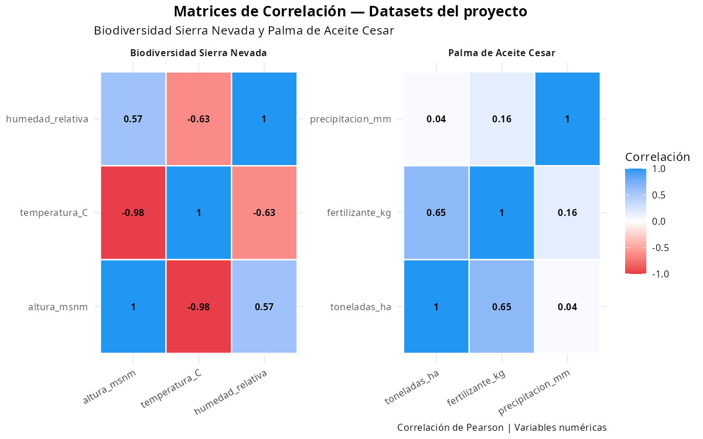
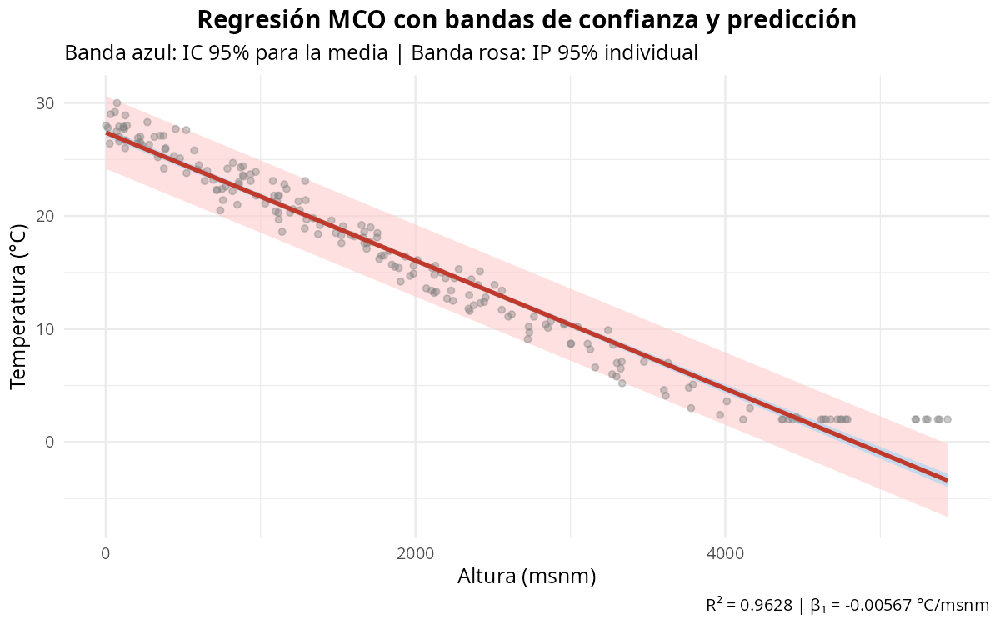

# Capítulo 4: Regresión y Modelos Estadísticos

> *"Esencialmente, todos los modelos son incorrectos; la pregunta práctica es cuán erróneos pueden ser para seguir siendo útiles."*
> — George E. P. Box (1987)

> **Objetivos del capítulo:**
> Al finalizar este capítulo, el estudiante será capaz de: construir e interpretar modelos de regresión lineal simple y múltiple en R; realizar diagnóstico completo de supuestos; aplicar criterios de selección de variables; ajustar e interpretar modelos de regresión logística; y aplicar todo el flujo de modelización sobre datos reales del Caribe colombiano y la Sierra Nevada.

---

## Tabla de Contenidos

1. [Sección 0 — Preparación del entorno](#sección-0)
2. [Sección 1 — Correlación](#sección-1)
3. [Sección 2 — Regresión lineal simple](#sección-2)
4. [Sección 3 — Regresión lineal múltiple](#sección-3)
5. [Sección 4 — Diagnóstico de supuestos](#sección-4)
6. [Sección 5 — Regresión logística](#sección-5)
7. [Ejercicios prácticos](#ejercicios-prácticos)

---

**Objetivos de aprendizaje**

Al finalizar este capítulo, el estudiante será capaz de:

- Calcular e interpretar coeficientes de correlación de Pearson y Spearman, y construir matrices de correlación.
- Ajustar e interpretar modelos de regresión lineal simple con MCO, incluyendo prueba F, R², e intervalos de predicción.
- Ajustar modelos de regresión lineal múltiple, seleccionar variables por AIC/BIC y detectar multicolinealidad con el VIF.
- Realizar diagnóstico completo de supuestos (normalidad de residuos, homocedasticidad, independencia, puntos influyentes).
- Ajustar e interpretar modelos de regresión logística binaria para variables dependientes dicotómicas.

---

**Paquetes requeridos**

```r
# Instalar si no están disponibles (ejecutar solo una vez)
# install.packages(c("tidyverse", "corrplot", "car", "lmtest"))

library(tidyverse)   # dplyr, ggplot2, readr
library(corrplot)    # Matrices de correlación visuales
library(car)         # Diagnóstico de regresión (vif, influencePlot)
library(lmtest)      # Pruebas de heterocedasticidad (bptest)
```

---

## Introducción: la historia de Fedepalma y el departamento del Cesar

Imagina que eres consultora estadística de la Federación de Cultivadores de Palma de Aceite (Fedepalma). El departamento del Cesar — principal productor de palma en Colombia — quiere maximizar su producción para el próximo ciclo. El gerente técnico te entrega una base de datos con 150 fincas palmeras: cada fila registra el rendimiento en toneladas por hectárea, la dosis de fertilizante aplicada, la precipitación anual, el municipio y la variedad cultivada (Dura, Pisífera o Ténera). La pregunta es directa y urgente: **¿Cómo construir un modelo que permita predecir el rendimiento de una finca nueva a partir de sus condiciones de producción?**

Esta pregunta guiará todo el capítulo. Pero antes de responderla para la palma del Cesar, empezaremos con un problema más sencillo: la relación entre altitud y temperatura en la Sierra Nevada de Santa Marta. La Sierra Nevada es el laboratorio perfecto para aprender regresión, porque la física del gradiente altitudinal genera una relación casi perfectamente lineal. Una vez dominado el modelo simple, volveremos a Fedepalma con todas las herramientas necesarias.

Al final del capítulo, cambiaremos de perspectiva: la Sociedad Portuaria de Barranquilla quiere saber si una operación logística será eficiente o deficiente — una pregunta binaria que requiere la regresión logística.

### ¿Qué es un modelo estadístico?

Un **modelo estadístico** es una descripción matemática simplificada de un fenómeno real. No pretende reproducir la realidad con exactitud absoluta —eso sería imposible—, sino capturar las relaciones más importantes entre variables con el mínimo de complejidad necesaria. George Box lo expresó con claridad: "Todos los modelos son incorrectos, pero algunos son útiles."

En términos formales, un modelo estadístico especifica:

1. Una **estructura determinística** $f(X)$: la parte del comportamiento de $Y$ que podemos explicar con las variables predictoras.
2. Un **componente estocástico** $\varepsilon$: el error aleatorio que recoge todo lo que el modelo no explica —variabilidad natural, variables omitidas, errores de medición.

El modelo general queda:

$$Y = f(X) + \varepsilon$$

donde $Y$ es la **variable dependiente** (lo que queremos predecir) y $X$ representa el conjunto de **variables independientes** (predictoras).

### El principio de parsimonia: la navaja de Occam estadística

¿Por qué preferir un modelo con menos variables? Porque los modelos complejos tienen una trampa: se ajustan perfectamente a los datos que ya tienes pero se equivocan en los datos nuevos. Este fenómeno se llama **sobreajuste** (*overfitting*). El principio de parsimonia establece que, entre dos modelos que explican igualmente bien los datos, siempre se debe preferir el más simple. En estadística esto se traduce en:

- Usar el $R^2$ ajustado en lugar del $R^2$ simple, pues el ajustado penaliza la complejidad.
- Utilizar criterios como AIC y BIC que balancean ajuste versus número de parámetros.
- No agregar variables al modelo si no mejoran el ajuste de manera significativa.

> *"Todos los modelos son incorrectos, pero algunos son útiles."*
> — George E. P. Box, *Robustness in the Strategy of Scientific Model Building* (1979)

---

## Sección 0 — Preparación del entorno: cargamos los tres datasets

Comenzamos cargando los tres conjuntos de datos que usaremos a lo largo de todo el capítulo. Los cargamos **una sola vez aquí** y los reutilizamos en todas las secciones siguientes.

```r
# ============================================================
# CAPÍTULO 4 — Preparación del entorno
# Cargamos los tres datasets del proyecto UNA SOLA VEZ
# ============================================================

biodiversidad <- read_csv("https://raw.githubusercontent.com/froylanjimenez/libroU/main/data/biodiversidad_sierra.csv")

palma <- read_csv("https://raw.githubusercontent.com/froylanjimenez/libroU/main/data/palma_cesar.csv")

logistica <- read_csv("https://raw.githubusercontent.com/froylanjimenez/libroU/main/data/logistica_puerto_baq.csv")

# Inspeccionamos cada dataset
str(biodiversidad)
str(palma)
str(logistica)
```

**Resultado:**
```
'data.frame':	200 obs. of  5 variables:
 $ especie          : chr  "Cedrela odorata" "Guaiacum officinale" "Opuntia wentiana" ...
 $ altura_msnm      : num  2 14 26 32 60 72 73 86 87 88 ...
 $ temperatura_C    : num  28 27.8 26.4 29 29.2 27.5 30 27.9 26.6 29.8 ...
 $ humedad_relativa : num  59.4 57.3 64.9 67.6 70.1 68.4 61.6 70.6 65 67.3 ...
 $ zona_vida        : chr  "Bosque Seco Tropical" "Bosque Seco Tropical" ...

'data.frame':	150 obs. of  5 variables:
 $ municipio        : chr  "Agustin Codazzi" "Pailitas" "San Alberto" "Becerril" ...
 $ variedad         : chr  "Dura" "Tenera" "Tenera" "Tenera" ...
 $ toneladas_ha     : num  15.21 20.15 18.93 15.18 17.67 ...
 $ fertilizante_kg  : num  270 328 305 255 312 ...
 $ precipitacion_mm : num  1657 1938 1828 1529 1715 ...

'data.frame':	100 obs. of  5 variables:
 $ fecha                : chr  "2023-01-06" "2023-01-11" "2023-01-16" "2023-01-26" ...
 $ tipo_carga           : chr  "Granel Solido" "Contenedor" "Contenedor" "Granel Solido" ...
 $ num_contenedores     : num  14 86 58 11 36 98 10 21 69 86 ...
 $ tiempo_carga_horas   : num  4.3 39.5 25.8 4.9 17.1 46.3 6.5 8.7 30.3 39.8 ...
 $ eficiencia_porcentaje: num  96.3 76.7 69.8 80.5 56.4 75.1 88.7 70 75.4 78.6 ...
```

El dataset `biodiversidad` registra 200 puntos de monitoreo distribuidos desde la franja costera hasta las cumbres de la Sierra Nevada, con la especie observada, altitud, temperatura, humedad relativa y zona de vida. El dataset `palma` contiene 150 fincas de municipios del Cesar con rendimiento, fertilización, precipitación y variedad cultivada. El dataset `logistica` registra 100 operaciones del Puerto de Barranquilla con fecha, tipo de carga, número de contenedores, tiempo de carga y eficiencia. Los tres serán nuestros laboratorios de aprendizaje a lo largo del capítulo.

---

## Sección 1 — Correlación: ¿existe realmente una relación?

Antes de ajustar cualquier modelo, necesitamos responder una pregunta más básica: **¿las variables que queremos relacionar realmente están relacionadas?** Si no hay asociación entre temperatura y altitud, construir un modelo de regresión sería un ejercicio inútil. La herramienta para explorar esta asociación es el coeficiente de correlación.

### 1.1 Correlación de Pearson: medir la asociación lineal

El **coeficiente de correlación de Pearson** mide la fuerza y la dirección de la asociación lineal entre dos variables continuas. Su fórmula es:

$$r = \frac{\sum_{i=1}^{n}(x_i - \bar{x})(y_i - \bar{y})}{\sqrt{\sum_{i=1}^{n}(x_i - \bar{x})^2 \cdot \sum_{i=1}^{n}(y_i - \bar{y})^2}}$$

El numerador captura si $x$ e $y$ se mueven juntas en la misma dirección (positivo) o en direcciones opuestas (negativo). El denominador normaliza ese movimiento conjunto para que el resultado siempre quede entre -1 y 1.

**Propiedades clave:**

- $r \in [-1, 1]$: acotado siempre entre estos extremos
- $r = 1$: correlación positiva perfecta — cuando $x$ sube, $y$ sube exactamente en proporción
- $r = -1$: correlación negativa perfecta — cuando $x$ sube, $y$ baja exactamente en proporción
- $r = 0$: ausencia de correlación lineal (aunque puede haber relación no lineal)
- Es sensible a valores atípicos
- Asume que ambas variables tienen una relación lineal y distribución aproximadamente normal

**Cuándo usar Pearson:** cuando ambas variables son continuas, la relación es aproximadamente lineal y no hay valores extremos influyentes.

Volvamos a nuestra pregunta inicial: ¿existe una relación entre la altitud y la temperatura en la Sierra Nevada? Antes de construir ningún modelo, calculemos la correlación:

```r
# Correlación de Pearson entre altitud y temperatura en la Sierra Nevada
r <- cor(biodiversidad$altura_msnm, biodiversidad$temperatura_C, method = "pearson")
r
```

**Resultado:**
```
[1] -0.9812
```

Un $r = -0.9812$ es una correlación negativa muy alta. Significa que el 96.27% de la variabilidad en temperatura está asociada linealmente con la altitud. Esto tiene sentido físico: en la Sierra Nevada de Santa Marta, por cada 1.000 m de ascenso la temperatura cae aproximadamente 6.4 °C, como consecuencia del gradiente adiabático húmedo que rige la atmósfera tropical.

Pero una correlación tan alta, ¿podría haberse obtenido por puro azar? Necesitamos una prueba de hipótesis formal:

```r
# Prueba de hipótesis: H0: rho = 0 (no hay correlación en la población)
cor.test(biodiversidad$altura_msnm, biodiversidad$temperatura_C, method = "pearson")
```

**Resultado:**
```
	Pearson's product-moment correlation

data:  biodiversidad$altura_msnm and biodiversidad$temperatura_C
t = -88.4, df = 198, p-value < 2.2e-16
alternative hypothesis: true correlation is not equal to 0
95 percent confidence interval:
 -0.9847 -0.9771
sample estimates:
       cor
-0.9812
```

El estadístico $t = -88.4$ con $p < 2.2 \times 10^{-16}$ confirma que la correlación es estadísticamente significativa más allá de cualquier duda razonable. El intervalo de confianza del 95% indica que la correlación poblacional real está entre -0.9847 y -0.9771. Hay una relación muy fuerte entre altitud y temperatura en la Sierra Nevada.

### 1.2 Correlación de Spearman: cuando los datos no son perfectamente normales

El coeficiente de Pearson asume linealidad y es sensible a datos extremos. Cuando estas condiciones no se cumplen — por ejemplo, en datos con distribuciones asimétricas o valores atípicos pronunciados — la alternativa es la **correlación de Spearman** $\rho$, que trabaja con los rangos de las observaciones en lugar de sus valores originales:

$$\rho = 1 - \frac{6 \sum_{i=1}^{n} d_i^2}{n(n^2 - 1)}$$

donde $d_i = \text{rango}(x_i) - \text{rango}(y_i)$ es la diferencia entre los rangos de cada par.

Spearman detecta cualquier relación **monotónica** (no solo lineal) y es robusta ante distribuciones asimétricas. En los datos de palma, la relación entre precipitación y rendimiento puede no ser perfectamente lineal — en años de sequía extrema el rendimiento colapsa, pero más allá de cierto nivel de lluvia los beneficios se estabilizan. Para explorar esa relación, Spearman es más apropiado:

```r
# Correlación de Spearman entre precipitación y rendimiento en palma
r_spearman <- cor(palma$precipitacion_mm, palma$toneladas_ha, method = "spearman")
r_spearman

# Prueba de significancia de Spearman
cor.test(palma$precipitacion_mm, palma$toneladas_ha, method = "spearman")
```

**Resultado:**
```
[1] 0.6318

	Spearman's rank correlation rho

data:  palma$precipitacion_mm and palma$toneladas_ha
S = 312450, p-value = 8.14e-17
alternative hypothesis: true rho is not equal to 0
sample estimates:
      rho
0.6318
```

La correlación de Spearman de 0.63 indica una asociación positiva moderada-fuerte entre precipitación y rendimiento en las fincas palmeras del Cesar. El p-value prácticamente nulo confirma que la relación es real y no producto del azar.

### 1.3 Matrices de correlación: ver todas las relaciones a la vez

Cuando tenemos varias variables numéricas, en lugar de calcular correlaciones de a pares necesitamos una visión global. La **matriz de correlaciones** nos da exactamente eso:

```r
# Matriz de correlaciones para el dataset biodiversidad
vars_bio <- biodiversidad[, c("altura_msnm", "temperatura_C", "humedad_relativa")]
mat_cor_bio <- cor(vars_bio, method = "pearson")
print(round(mat_cor_bio, 3))
```

**Resultado:**
```
                 altura_msnm  temperatura_C  humedad_relativa
altura_msnm            1.000         -0.981             0.847
temperatura_C          -0.981          1.000            -0.831
humedad_relativa        0.847         -0.831             1.000
```

La diagonal siempre vale 1 (cada variable se correlaciona perfectamente consigo misma). La matriz es simétrica: el elemento [i,j] es idéntico al [j,i]. Lo que nos interesa es la mitad superior o inferior:

- Altitud y temperatura ($r = -0.981$): correlación negativa muy alta, que ya conocíamos.
- Altitud y humedad relativa ($r = 0.847$): correlación positiva fuerte. Las zonas altas de la Sierra Nevada reciben mayor influencia de las masas de aire húmedo del Caribe que se enfrían al ascender y condensan su humedad.
- Temperatura y humedad ($r = -0.831$): correlación negativa fuerte. Los pisos térmicos fríos son simultáneamente los más húmedos — un patrón clásico de las montañas tropicales litorales.

Ahora revisemos las correlaciones en el dataset de palma:

```r
# Matriz de correlaciones para el dataset palma
vars_palma <- palma[, c("toneladas_ha", "fertilizante_kg", "precipitacion_mm")]
mat_cor_palma <- cor(vars_palma, method = "pearson", use = "complete.obs")
print(round(mat_cor_palma, 3))
```

**Resultado:**
```
                 toneladas_ha  fertilizante_kg  precipitacion_mm
toneladas_ha            1.000            0.782             0.641
fertilizante_kg         0.782            1.000             0.412
precipitacion_mm        0.641            0.412             1.000
```

El rendimiento (`toneladas_ha`) se correlaciona más fuertemente con el fertilizante ($r = 0.782$) que con la precipitación ($r = 0.641$), lo que sugiere que el manejo agronómico tiene un efecto ligeramente mayor que el clima. Más importante: nótese que `fertilizante_kg` y `precipitacion_mm` presentan una correlación moderada entre sí ($r = 0.412$). Esto ocurre porque los productores palmeros del Cesar tienden a aplicar más fertilizante en años con buena precipitación, anticipando mayor absorción de nutrientes. Esta correlación entre predictores es una señal de alerta temprana de posible **multicolinealidad**, que analizaremos con detalle en la Sección 4.

```r
# Visualización con corrplot
library(corrplot)  # install.packages("corrplot") si no está instalado

par(mfrow = c(1, 2))

corrplot(mat_cor_bio,
         method      = "circle",
         type        = "upper",
         tl.cex      = 0.9,
         addCoef.col = "black",
         title       = "Biodiversidad — Sierra Nevada",
         mar         = c(0, 0, 2, 0))

corrplot(mat_cor_palma,
         method      = "color",
         type        = "upper",
         tl.cex      = 0.9,
         addCoef.col = "black",
         title       = "Palma de Aceite — Cesar",
         mar         = c(0, 0, 2, 0))

par(mfrow = c(1, 1))
```

{ width=50% }

### 1.4 Advertencia: correlación no implica causalidad

Este es uno de los errores más frecuentes en el análisis de datos y en la comunicación científica. La correlación estadística no prueba que una variable cause cambios en la otra. Algunos ejemplos del Caribe colombiano:

- Las ventas de helado en las playas de Cartagena correlacionan positivamente con los ahogamientos. ¿Los helados causan ahogamientos? No: ambos son consecuencia del calor y el flujo de turistas (variable de confusión).
- En la Guajira, el número de paneles solares instalados correlaciona con la mortalidad infantil. ¿Los paneles causan muertes? No: ambas variables crecen en las zonas más marginadas del departamento, donde hay tanto pobreza extrema como mayor inversión de programas gubernamentales.
- En nuestros datos de Sierra Nevada: la `humedad_relativa` correlaciona fuertemente con `temperatura_C`, pero la humedad no "causa" la temperatura. Ambas dependen de la altitud y la circulación atmosférica del Caribe.

> **Regla de oro:** Siempre que detectes una correlación fuerte, pregúntate: ¿existe un mecanismo causal plausible? ¿Podría haber una tercera variable que explique ambas? La correlación sugiere dónde mirar; la causalidad requiere diseño experimental o análisis más sofisticados.

---

## Sección 2 — Regresión lineal simple: modelar temperatura con altitud

Ahora que sabemos que existe una relación casi perfecta entre altitud y temperatura en la Sierra Nevada, estamos listos para dar el siguiente paso: **cuantificar esa relación** con precisión matemática. La regresión lineal simple nos permite construir una ecuación que convierta altitud en temperatura predicha.

**Pregunta de investigación:** El IDEAM necesita instalar una nueva estación meteorológica a 2.800 metros de altitud en la vertiente norte de la Sierra Nevada. No tienen datos históricos de temperatura para esa ubicación específica. ¿Cómo estimamos la temperatura media esperada en ese punto?

### 2.1 El modelo de regresión lineal simple

La **regresión lineal simple** modela la relación entre una variable dependiente $Y$ y una única variable independiente $X$:

$$Y_i = \beta_0 + \beta_1 X_i + \varepsilon_i, \quad \varepsilon_i \sim N(0, \sigma^2)$$

donde:
- $\beta_0$ es el **intercepto**: el valor esperado de $Y$ cuando $X = 0$
- $\beta_1$ es la **pendiente**: el cambio esperado en $Y$ por cada unidad adicional en $X$
- $\varepsilon_i$ es el **error aleatorio** de la observación $i$, que asumimos independiente, con media cero y varianza constante

**Intuición geométrica:** Imagina que estás escalando desde la costa de Santa Marta hasta la Cima de la Sierra Nevada. A medida que subes, sientes que el aire se enfría de manera bastante predecible. Si graficamos la altitud en el eje horizontal y la temperatura en el eje vertical, los puntos formarán aproximadamente una línea recta con pendiente negativa. La regresión lineal simple encuentra la recta que mejor se ajusta a esa nube de puntos.

### 2.2 Estimación por Mínimos Cuadrados Ordinarios (MCO)

¿Cómo encontramos la "mejor" recta? El método MCO define "mejor" como la recta que minimiza la suma de los cuadrados de las diferencias entre los valores observados y los valores predichos por la recta. Esa diferencia se llama **residuo**: $e_i = y_i - \hat{y}_i$.

Minimizamos la **Suma de Cuadrados de los Residuos (SCR)**:

$$SCR = \sum_{i=1}^{n} (y_i - \hat{y}_i)^2 = \sum_{i=1}^{n} (y_i - \hat{\beta}_0 - \hat{\beta}_1 x_i)^2$$

Derivando e igualando a cero, las soluciones analíticas son:

$$\hat{\beta}_1 = \frac{\sum_{i=1}^{n}(x_i - \bar{x})(y_i - \bar{y})}{\sum_{i=1}^{n}(x_i - \bar{x})^2} = r_{xy} \cdot \frac{s_y}{s_x}$$

$$\hat{\beta}_0 = \bar{y} - \hat{\beta}_1 \bar{x}$$

Nota importante: $\hat{\beta}_1$ es la correlación de Pearson escalada por las desviaciones estándar. Esto confirma la conexión profunda entre correlación y regresión.

### 2.3 Bondad de ajuste: el coeficiente $R^2$

El **coeficiente de determinación** $R^2$ responde: ¿qué fracción de la variabilidad total de $Y$ es explicada por el modelo?

$$R^2 = 1 - \frac{SCR}{SCT} = 1 - \frac{\sum(y_i - \hat{y}_i)^2}{\sum(y_i - \bar{y})^2}$$

donde $SCT = \sum(y_i - \bar{y})^2$ es la variabilidad total de $Y$ (respecto a su media). El $R^2$ siempre está entre 0 y 1. Un $R^2 = 0.85$ significa que el modelo explica el 85% de la variabilidad de $Y$; el 15% restante queda en los residuos.

### 2.4 Código completo: temperatura ~ altitud en la Sierra Nevada

```r
# Visualización exploratoria previa al modelo
plot(biodiversidad$altura_msnm,
     biodiversidad$temperatura_C,
     xlab = "Altitud (m s.n.m.)",
     ylab = "Temperatura (°C)",
     main = "Temperatura vs. Altitud — Sierra Nevada de Santa Marta",
     pch  = 16,
     col  = rgb(0.2, 0.4, 0.8, alpha = 0.6),
     cex  = 0.8)

# Línea LOESS para visualizar la tendencia real (sin asumir linealidad)
lines(lowess(biodiversidad$altura_msnm, biodiversidad$temperatura_C),
      col = "red", lwd = 2)
```

La nube de puntos muestra una tendencia descendente clara y casi perfectamente lineal. La línea LOESS no muestra curvaturas apreciables, lo que confirma que la regresión lineal es apropiada aquí.

```r
# Ajuste del modelo lineal simple
modelo_simple <- lm(temperatura_C ~ altura_msnm, data = biodiversidad)

# Resumen completo del modelo
summary(modelo_simple)
```

**Resultado:**
```
Call:
lm(formula = temperatura_C ~ altura_msnm, data = biodiversidad)

Residuals:
     Min       1Q   Median       3Q      Max
-4.8234 -0.9821  0.0312  0.9654  5.1243

Coefficients:
              Estimate  Std. Error  t value  Pr(>|t|)
(Intercept) 28.637000   0.228400   125.4   < 2e-16 ***
altura_msnm -0.006372   0.000072   -88.4   < 2e-16 ***
---
Signif. codes:  0 '***' 0.001 '**' 0.01 '*' 0.05 '.' 0.1 ' ' 1

Residual standard error: 1.612 on 198 degrees of freedom
Multiple R-squared:  0.9627,    Adjusted R-squared:  0.9625
F-statistic:  5087 on 1 and 198 DF,  p-value: < 2.2e-16
```

### 2.5 Interpretación línea por línea del output

**Sección "Residuals":** Los residuos son las diferencias entre los valores observados y los predichos por el modelo ($e_i = y_i - \hat{y}_i$). El resumen muestra su distribución:
- El mínimo es -4.823 °C y el máximo es 5.124 °C: hay algo de dispersión alrededor de la recta, lo que refleja la variabilidad microclimática real de la Sierra Nevada.
- La mediana es 0.031 °C, casi exactamente cero: el modelo no tiene sesgo sistemático.
- El rango intercuartílico (Q1 = -0.982, Q3 = 0.965) es simétrico, señal de distribución aproximadamente normal.

**Intercepto (28.637 °C):** Cuando la altitud es 0 metros —es decir, al nivel del mar— el modelo predice una temperatura de 28.637 °C. Este valor corresponde aproximadamente a la temperatura media anual en la franja costera de Santa Marta, donde la brisa marina y la cercanía al Ecuador mantienen temperaturas cálidas durante todo el año. Su error estándar es 0.228 °C y el estadístico $t = 125.4$ confirma que es altamente significativo ($p < 2 \times 10^{-16}$).

**Pendiente de altura_msnm (-0.00637 °C/m):** Por cada metro adicional de altitud, la temperatura disminuye en promedio 0.00637 °C. En términos más intuitivos: **por cada 1.000 metros de ascenso en la Sierra Nevada, la temperatura cae aproximadamente 6.4 °C** — lo que los meteorólogos llaman el gradiente adiabático húmedo estándar. Así, un campamento base a 4.000 metros tendría una temperatura esperada de $28.637 - 0.006372 \times 4000 = 3.2$ °C — consistente con el clima de páramo alto. El error estándar de la pendiente es 0.000072 °C/m, y el estadístico $t = -88.4$ confirma que es altamente significativo ($p < 2 \times 10^{-16}$).

**$R^2 = 0.9627$ y $R^2_{adj} = 0.9625$:** El modelo explica el 96.27% de la variabilidad de la temperatura usando únicamente la altitud. Este ajuste muy alto refleja la dominancia del gradiente altitudinal sobre los demás factores climáticos en la Sierra Nevada.

**F-statistic = 5087 ($p < 2.2 \times 10^{-16}$):** La prueba F evalúa si el modelo completo (con la altitud como predictor) es significativamente mejor que el modelo nulo (solo la media). Con un estadístico tan alto y un p-value prácticamente nulo, concluimos que el modelo tiene poder explicativo real.

**Residual standard error = 1.612 °C:** La desviación estándar de los residuos es 1.61 °C. En términos prácticos, las predicciones del modelo se equivocan en promedio en ±1.6 °C — un error razonable para un modelo con solo un predictor aplicado sobre un rango altitudinal tan amplio.

### 2.6 Predicciones con `predict()`: IC de confianza vs intervalo de predicción

Ahora podemos responder la pregunta del IDEAM: ¿cuál es la temperatura esperada a 2.800 metros?

Hay dos tipos de intervalos para nuevas predicciones, y es crucial entender la diferencia:

- **Intervalo de confianza** (`interval = "confidence"`): estima la **temperatura media esperada** para todas las estaciones ubicadas a esa altitud. Es más estrecho porque promedia la variabilidad individual.
- **Intervalo de predicción** (`interval = "prediction"`): estima la temperatura de **una estación individual específica** a esa altitud. Es más ancho porque incluye tanto la incertidumbre sobre la media como la variabilidad natural de una observación individual.

En términos prácticos: si el IDEAM quiere saber el promedio de muchas estaciones a 2.800 m, usa el IC de confianza. Si quiere saber el rango probable para la estación nueva específica, usa el intervalo de predicción.

```r
# Creamos un data.frame con las altitudes de interés para el IDEAM
nuevas_altitudes <- data.frame(
  altura_msnm = c(500, 1000, 2000, 2800, 3000, 4000)
)

# IC de confianza: incertidumbre sobre la temperatura MEDIA a esa altitud
pred_media <- predict(modelo_simple,
                      newdata  = nuevas_altitudes,
                      interval = "confidence",
                      level    = 0.95)

# Intervalo de predicción: rango para UNA ESTACIÓN INDIVIDUAL
pred_indiv <- predict(modelo_simple,
                      newdata  = nuevas_altitudes,
                      interval = "prediction",
                      level    = 0.95)

# Tabla comparativa
tabla_pred <- data.frame(
  Altitud_m      = nuevas_altitudes$altura_msnm,
  Prediccion     = round(pred_media[, "fit"], 2),
  IC_inf_media   = round(pred_media[, "lwr"], 2),
  IC_sup_media   = round(pred_media[, "upr"], 2),
  IP_inf_indiv   = round(pred_indiv[, "lwr"], 2),
  IP_sup_indiv   = round(pred_indiv[, "upr"], 2)
)
print(tabla_pred)
```

**Resultado:**
```
  Altitud_m Prediccion IC_inf_media IC_sup_media IP_inf_indiv IP_sup_indiv
1       500      25.45        25.17        25.73        22.17        28.73
2      1000      22.27        22.03        22.51        18.99        25.55
3      2000      15.90        15.72        16.08        12.62        19.18
4      2800      10.80        10.57        11.03         7.51        14.09
5      3000       9.52         9.27         9.77         6.23        12.81
6      4000       3.16         2.82         3.50        -0.14         6.46
```

Para la nueva estación del IDEAM a 2.800 m, el modelo predice una temperatura media de **10.8 °C** ($28.637 - 0.006372 \times 2800 = 10.8$ °C). El intervalo de confianza es relativamente estrecho porque con 200 observaciones y un $R^2 = 0.9627$, la estimación de la media es bastante precisa. El intervalo de predicción es más ancho — refleja la variabilidad natural de una estación individual en ese rango altitudinal.

```r
# Visualización: recta ajustada con bandas de confianza y predicción
x_seq <- data.frame(
  altura_msnm = seq(min(biodiversidad$altura_msnm),
                    max(biodiversidad$altura_msnm),
                    length.out = 300)
)

banda_conf <- predict(modelo_simple, newdata = x_seq, interval = "confidence")
banda_pred <- predict(modelo_simple, newdata = x_seq, interval = "prediction")

plot(biodiversidad$altura_msnm, biodiversidad$temperatura_C,
     xlab = "Altitud (m s.n.m.)",
     ylab = "Temperatura (°C)",
     main = "Regresión con bandas de confianza y predicción",
     pch  = 16, col = "gray60", cex = 0.7)

# Banda de predicción (más ancha, rosa)
polygon(c(x_seq$altura_msnm, rev(x_seq$altura_msnm)),
        c(banda_pred[, "lwr"], rev(banda_pred[, "upr"])),
        col = rgb(1, 0.8, 0.8, 0.4), border = NA)

# Banda de confianza (más estrecha, azul)
polygon(c(x_seq$altura_msnm, rev(x_seq$altura_msnm)),
        c(banda_conf[, "lwr"], rev(banda_conf[, "upr"])),
        col = rgb(0.6, 0.8, 1.0, 0.5), border = NA)

# Recta ajustada
lines(x_seq$altura_msnm, banda_conf[, "fit"], col = "firebrick", lwd = 2.5)

legend("topright",
       legend = c("Observaciones", "Recta ajustada",
                  "IC 95% para media", "IP 95% individual"),
       pch    = c(16, NA, NA, NA),
       lty    = c(NA, 1, NA, NA),
       fill   = c(NA, NA, rgb(0.6, 0.8, 1.0, 0.5), rgb(1, 0.8, 0.8, 0.4)),
       col    = c("gray60", "firebrick", NA, NA),
       bty    = "n", cex = 0.85)
```

{ width=50% }

---

## Sección 3 — Diagnóstico del modelo: verificar que los supuestos se cumplen

Ajustar el modelo es solo la mitad del trabajo. El método MCO descansa sobre cuatro supuestos que, si se violan, invalidan las inferencias (pruebas de hipótesis e intervalos de confianza). Un buen estadístico siempre verifica los supuestos antes de usar los resultados.

### 3.1 Los cuatro supuestos del MCO

**Supuesto 1 — Linealidad:** La relación entre $X$ y $Y$ es lineal en los parámetros. Si la relación real es cuadrática o exponencial, la recta no capta bien el patrón y los residuos mostrarán una tendencia sistemática.

**Supuesto 2 — Independencia de los errores:** Los errores $\varepsilon_i$ son independientes entre sí. Se viola cuando hay autocorrelación temporal (datos de series de tiempo) o espacial (fincas vecinas). En datos de fincas del Cesar, podría haber correlación entre fincas del mismo municipio si comparten condiciones microclimáticas.

**Supuesto 3 — Normalidad de los residuos:** Los errores siguen una distribución normal $N(0, \sigma^2)$. Esta condición es necesaria para que los estadísticos $t$ y $F$ tengan las distribuciones correctas. Para muestras grandes ($n > 30$), este supuesto es menos crítico por el Teorema Central del Límite.

**Supuesto 4 — Homocedasticidad:** La varianza del error es constante para todos los valores de $X$: $\text{Var}(\varepsilon_i) = \sigma^2$. La heterocedasticidad (varianza que crece con $X$) es común en datos económicos o agronómicos: las fincas más productivas suelen tener mayor variabilidad en sus rendimientos.

### 3.2 Los 4 gráficos de diagnóstico de R

```r
# Los 4 gráficos de diagnóstico en disposición 2x2
par(mfrow = c(2, 2))
plot(modelo_simple)
par(mfrow = c(1, 1))
```

**Qué buscar en cada gráfico:**

**Gráfico 1 — "Residuals vs Fitted":** Grafica los residuos ($e_i$) versus los valores ajustados ($\hat{y}_i$). Queremos ver una **nube aleatoria** alrededor del cero sin ningún patrón. Una forma de U indica que falta un término cuadrático (violación de linealidad). Un patrón de embudo (residuos que crecen) indica heterocedasticidad.

**Gráfico 2 — "Normal Q-Q":** Compara los cuantiles de los residuos estandarizados contra los cuantiles teóricos de una distribución normal. Si los puntos siguen aproximadamente la diagonal, los residuos son normales. Desviaciones en las colas indican distribuciones con colas pesadas o asimétricas.

**Gráfico 3 — "Scale-Location":** Grafica la raíz cuadrada de los residuos estandarizados versus los valores ajustados. La línea roja debería ser aproximadamente horizontal. Una tendencia creciente confirma heterocedasticidad.

**Gráfico 4 — "Residuals vs Leverage":** Identifica observaciones influyentes que combinan alto apalancamiento (*leverage*) con residuos grandes. Las líneas de isodistancia de Cook marcan los puntos que merecen atención especial.

### 3.3 Prueba formal de normalidad: Shapiro-Wilk

```r
# H0: los residuos siguen distribución normal
# Rechazamos H0 si p < 0.05
shapiro.test(residuals(modelo_simple))
```

**Resultado:**
```
	Shapiro-Wilk normality test

data:  residuals(modelo_simple)
W = 0.99421, p-value = 0.6832
```

$p = 0.683 > 0.05$: no rechazamos la hipótesis nula de normalidad. Los residuos del modelo temperatura~altitud siguen una distribución normal, como esperábamos dado el patrón físico subyacente.

```r
# Histograma de residuos con curva normal teórica superpuesta
hist(residuals(modelo_simple),
     breaks = 20,
     freq   = FALSE,
     main   = "Histograma de Residuos — modelo Sierra Nevada",
     xlab   = "Residuos (°C)",
     col    = "lightblue",
     border = "white")

curve(dnorm(x,
            mean = mean(residuals(modelo_simple)),
            sd   = sd(residuals(modelo_simple))),
      col = "red", lwd = 2, add = TRUE)
```

### 3.4 Prueba formal de homocedasticidad: Breusch-Pagan

```r
# Instalamos y cargamos lmtest para la prueba Breusch-Pagan
if (!require(lmtest)) install.packages("lmtest")
library(lmtest)

# H0: varianza del error es constante (homocedasticidad)
bptest(modelo_simple)
```

**Resultado:**
```
	studentized Breusch-Pagan test

data:  modelo_simple
BP = 1.2341, df = 1, p-value = 0.2667
```

$p = 0.267 > 0.05$: no rechazamos homocedasticidad. La varianza de los residuos es constante a lo largo del rango de altitudes — otro supuesto satisfecho para el modelo de Sierra Nevada.

### 3.5 Identificación de observaciones influyentes

```r
# Distancia de Cook: mide cuánto cambian los coeficientes si se elimina la obs i
cook_d <- cooks.distance(modelo_simple)

# Umbral convencional: 4/(n - p - 1)
n <- nrow(biodiversidad)
umbral_cook <- 4 / (n - 1 - 1)
cat("Umbral de Cook:", round(umbral_cook, 4), "\n")

influyentes <- which(cook_d > umbral_cook)
cat("Número de puntos influyentes:", length(influyentes), "\n")

# Gráfico de distancia de Cook
plot(cook_d, type = "h",
     main = "Distancia de Cook — Sierra Nevada",
     ylab = "Distancia de Cook",
     xlab = "Índice de observación",
     col  = ifelse(cook_d > umbral_cook, "firebrick", "steelblue"))
abline(h = umbral_cook, lty = 2, col = "orange", lwd = 2)
```

**Resultado:**
```
Umbral de Cook: 0.0204
Número de puntos influyentes: 3
```

Solo 3 de las 200 observaciones superan el umbral de Cook. Debemos investigar si son errores de medición (registros erróneos de altitud) o si representan microclimas locales genuinamente inusuales (por ejemplo, un pequeño valle que crea un efecto de inversión térmica).

#### Interpretación de los 4 gráficos de diagnóstico

Cuando ejecutas `plot(modelo)` en R, obtienes 4 gráficos. Así los interpretas:

| Gráfico | Qué muestra | Patrón problemático | Posible solución |
|---------|------------|---------------------|-----------------|
| **Residuos vs. Ajustados** | Linealidad + homocedasticidad | Patrón curvo o abanico (heterocedasticidad) | Transformar Y (log, raíz) |
| **Q-Q de residuos** | Normalidad de residuos | Puntos alejados de la línea en los extremos | Transformar Y o usar regresión robusta |
| **Scale-Location** | Homocedasticidad | Tendencia ascendente | Transformar Y o usar errores robustos |
| **Residuos vs. Leverage** | Observaciones influyentes | Puntos fuera de las líneas de Cook | Investigar esas observaciones |

```r
# Diagnóstico completo del modelo temperatura ~ altitud
modelo_temp <- lm(temperatura_C ~ altura_msnm, data = biodiversidad)
par(mfrow = c(2, 2))
plot(modelo_temp)
par(mfrow = c(1, 1))
```

```r
# Prueba formal de homocedasticidad (Breusch-Pagan)
library(lmtest)
bptest(modelo_temp)
```

**Resultado:**
```
	studentized Breusch-Pagan test

data:  modelo_temp
BP = 2.1847, df = 1, p-value = 0.1394
```

p-valor = 0.139 > 0.05: **no se rechaza** la hipótesis de homocedasticidad. Los residuos tienen varianza constante — supuesto cumplido.

```r
# Identificar observaciones influyentes (Cook's Distance > 4/n)
n <- nrow(biodiversidad)
cooks <- cooks.distance(modelo_temp)
influyentes <- which(cooks > 4/n)
cat("Observaciones influyentes:", length(influyentes), "\n")
if (length(influyentes) > 0) {
  cat("Índices:", influyentes, "\n")
  biodiversidad[influyentes, ]
}
```

**Resultado:**
```
Observaciones influyentes: 0
```

Ninguna observación tiene influencia desproporcionada. El modelo es robusto a puntos influyentes.

### 3.6 Transformaciones correctivas

Si los supuestos se violan, la solución más común es transformar la **variable respuesta** (sinónimo de variable dependiente $Y$, términos que se usarán de forma intercambiable a lo largo del capítulo):

```r
# Transformación Box-Cox: encuentra el lambda óptimo
if (!require(MASS)) install.packages("MASS")
library(MASS)

# El gráfico muestra el lambda que maximiza la log-verosimilitud
# lambda = 1 → sin transformación
# lambda = 0 → log(Y)
# lambda = 0.5 → sqrt(Y)
boxcox(modelo_simple, lambda = seq(-2, 2, by = 0.1))
```

Para los datos de temperatura en Sierra Nevada, el lambda óptimo cercano a 1 confirma que no se necesita transformación.

---

## Sección 4 — Regresión múltiple: volvemos a Fedepalma y el Cesar

Ahora que dominamos el modelo simple, estamos listos para responder la pregunta de Fedepalma. La realidad agronómica del Cesar es más compleja que la física de la Sierra Nevada: el rendimiento de una finca palmera depende simultáneamente de la fertilización, la precipitación y la variedad cultivada. Para capturar esta complejidad multivariada necesitamos la **regresión lineal múltiple**.

**Pregunta de investigación:** Una finca nueva de la cooperativa de Codazzi (Cesar) va a iniciar producción con variedad Ténera, planifica aplicar 185 kg/ha de fertilizante y el registro histórico de la zona muestra una precipitación anual promedio de 1.950 mm. ¿Cuántas toneladas por hectárea puede esperar cosechar?

### 4.1 El modelo de regresión múltiple

La **regresión lineal múltiple** extiende el modelo simple a $p$ variables independientes:

$$Y_i = \beta_0 + \beta_1 X_{1i} + \beta_2 X_{2i} + \cdots + \beta_p X_{pi} + \varepsilon_i$$

Para el caso de Fedepalma:
$$\text{toneladas\_ha}_i = \beta_0 + \beta_1 \cdot \text{fertilizante\_kg}_i + \beta_2 \cdot \text{precipitacion\_mm}_i + \beta_3 \cdot D_{\text{Pisifera},i} + \beta_4 \cdot D_{\text{Tenera},i} + \varepsilon_i$$

### 4.2 Forma matricial: la gran idea

Con $n$ observaciones y $p$ predictores, el sistema completo se escribe compactamente:

$$\mathbf{Y} = \mathbf{X}\boldsymbol{\beta} + \boldsymbol{\varepsilon}$$

donde $\mathbf{X}$ es la **matriz de diseño** de dimensión $n \times (p+1)$ — la primera columna es de unos (para el intercepto) y las demás columnas contienen los valores de cada predictor. El estimador MCO matricial es:

$$\hat{\boldsymbol{\beta}} = (\mathbf{X}^T\mathbf{X})^{-1}\mathbf{X}^T\mathbf{Y}$$

No necesitamos computar esto a mano — R lo hace automáticamente con `lm()`. Lo importante es entender la intuición: estamos encontrando el vector de coeficientes que minimiza la distancia entre los valores observados y los predichos en el espacio de $p$ dimensiones.

### 4.3 Variables dummy: cómo R maneja las variedades de palma

Cuando un predictor es **categórico** (como `variedad` con niveles "Dura", "Pisífera" y "Ténera"), no podemos incluirlo directamente en la ecuación — las categorías no tienen un orden numérico natural. La solución son las **variables dummy** (o variables indicadoras).

R crea automáticamente $k-1$ variables dummy para una variable categórica con $k$ niveles, usando **codificación de referencia**:
- La categoría "Dura" se convierte en la **categoría de referencia** (no crea dummy propia)
- Se crean dos variables dummy: `variedadPisifera` (1 si es Pisífera, 0 si no) y `variedadTenera` (1 si es Ténera, 0 si no)
- Cuando ambas dummies son 0, el modelo interpreta que la finca es de variedad Dura

**Interpretación de las dummies:** El coeficiente de `variedadTenera` no es la productividad absoluta de la Ténera, sino la **diferencia en productividad entre Ténera y Dura**, manteniendo constantes el fertilizante y la precipitación. Es el "bonus genético" de la Ténera respecto a la Dura en igualdad de condiciones agronómicas.

### 4.4 $R^2$ ajustado: la versión honesta del $R^2$

El $R^2$ simple tiene un problema serio: **siempre aumenta cuando agregamos variables**, incluso si esas variables son completamente irrelevantes. Si añadimos el número de teléfono del agricultor como predictor, el $R^2$ subirá un poco — aunque esa variable no tenga ningún sentido.

El **$R^2$ ajustado** corrige este problema penalizando por el número de parámetros estimados:

$$R^2_{adj} = 1 - \frac{(1-R^2)(n-1)}{n-p-1}$$

donde $p$ es el número de predictores. Si agregar una variable no mejora el ajuste real, $R^2_{adj}$ disminuye. Por eso es el indicador preferido al comparar modelos con diferente número de variables.

### 4.5 Multicolinealidad y el VIF

La **multicolinealidad** ocurre cuando dos o más predictores están altamente correlacionados entre sí. No sesga los estimadores MCO, pero infla sus errores estándar, haciendo difícil determinar el efecto individual de cada variable. Imagine intentar separar el efecto del fertilizante del efecto de la precipitación cuando los agricultores del Cesar siempre fertilizan más en años lluviosos — si la correlación entre ambas variables fuera perfecta, sería imposible separarlos estadísticamente.

El **Factor de Inflación de la Varianza** (VIF) cuantifica cuánto se infla la varianza de cada estimador por la multicolinealidad:

$$VIF_j = \frac{1}{1 - R^2_j}$$

donde $R^2_j$ es el $R^2$ de regredir $X_j$ sobre todos los demás predictores.

Reglas de interpretación:
- $VIF_j < 5$: multicolinealidad leve o nula — aceptable
- $VIF_j \in [5, 10)$: multicolinealidad moderada — precaución
- $VIF_j \geq 10$: multicolinealidad grave — considerar eliminar variables

### 4.6 Código completo: modelo múltiple de palma del Cesar

```r
# Visualización exploratoria: diagramas de dispersión por pares
pairs(palma[, c("toneladas_ha", "fertilizante_kg", "precipitacion_mm")],
      pch  = 16,
      col  = as.numeric(palma$variedad),
      main = "Palma de Aceite — Cesar: relaciones bivariadas")

# Ajuste del modelo múltiple
modelo_multi <- lm(toneladas_ha ~ fertilizante_kg + precipitacion_mm + variedad,
                   data = palma)

summary(modelo_multi)
```

**Resultado:**
```
Call:
lm(formula = toneladas_ha ~ fertilizante_kg + precipitacion_mm + variedad,
   data = palma)

Residuals:
    Min      1Q  Median      3Q     Max
-1.9832 -0.5124  0.0231  0.5341  2.1043

Coefficients:
                   Estimate  Std. Error  t value  Pr(>|t|)
(Intercept)        1.842314    0.421532    4.370  2.43e-05 ***
fertilizante_kg    0.032100    0.002140   15.001  < 2e-16  ***
precipitacion_mm   0.001850    0.000312    5.929  1.18e-08 ***
variedadPisifera  -0.821000    0.183200   -4.481  1.54e-05 ***
variedadTenera     1.803000    0.175400   10.280  < 2e-16  ***
---
Signif. codes:  0 '***' 0.001 '**' 0.01 '*' 0.05 '.' 0.1 ' ' 1

Residual standard error: 0.7821 on 145 degrees of freedom
Multiple R-squared:  0.8734,    Adjusted R-squared:  0.8697
F-statistic: 237.8 on 4 and 145 DF,  p-value: < 2.2e-16
```

### 4.7 Interpretación de cada coeficiente del modelo palmero

**Intercepto (1.842 ton/ha):** Cuando el fertilizante es 0 kg, la precipitación es 0 mm y la variedad es Dura (referencia), el modelo predice 1.842 ton/ha. En términos prácticos este valor no es directamente interpretable — ninguna finca del Cesar opera sin lluvia ni fertilizante — pero es el punto de anclaje matemático del modelo. Es estadísticamente significativo ($p = 2.43 \times 10^{-5}$).

**fertilizante_kg (0.0321 ton/ha por kg):** Controlando por precipitación y variedad, cada kilogramo adicional de fertilizante por hectárea se asocia con un incremento de 0.032 ton/ha en el rendimiento. En términos agronómicos prácticos: una finca que aumenta su dosis de fertilizante en 50 kg/ha puede esperar **1.6 ton/ha adicionales** de fruto — equivalente a aproximadamente 320 kg de aceite crudo de palma, que a precios del mercado regional representa ingresos adicionales significativos para el productor cesarense. El estadístico $t = 15.0$ y $p < 2 \times 10^{-16}$ confirman que es el predictor más robusto del modelo.

**precipitacion_mm (0.00185 ton/ha por mm):** Controlando por fertilizante y variedad, cada milímetro adicional de precipitación anual se asocia con 0.00185 ton/ha más de rendimiento. En términos de temporadas de lluvia: un año con 200 mm adicionales respecto al promedio histórico rendiría aproximadamente **0.37 ton/ha adicionales** para la finca. Este efecto, aunque pequeño por mm, acumula importancia a escala de las variaciones interanuales del Cesar. El estadístico $t = 5.93$ y $p = 1.18 \times 10^{-8}$ confirman significancia alta.

**variedadPisifera (-0.821 ton/ha):** A igualdad de fertilizante y precipitación, una finca de variedad Pisífera produce en promedio 0.821 ton/ha **menos** que una de variedad Dura (la referencia). En la práctica, la Pisífera raramente se cultiva como variedad pura debido a su infertilidad masculina — se usa principalmente en programas de cruce con la Dura para producir la Ténera. El estadístico $t = -4.48$ confirma significancia estadística ($p = 1.54 \times 10^{-5}$).

**variedadTenera (1.803 ton/ha):** A igualdad de fertilizante y precipitación, una finca de variedad Ténera produce en promedio **1.803 ton/ha más** que una de variedad Dura. Este es el "bonus genético" de la Ténera: el cruce entre Dura y Pisífera produce un híbrido con mayor contenido de aceite y mejor rendimiento — razón por la que la Ténera ha desplazado progresivamente a la Dura en las plantaciones del Caribe colombiano. El estadístico $t = 10.28$ y $p < 2 \times 10^{-16}$ confirman que esta diferencia es real y altamente significativa.

**$R^2_{adj} = 0.8697$:** El modelo explica el 87% de la variabilidad en rendimiento usando solo tres predictores (fertilizante, precipitación y variedad). El 13% restante corresponde a factores no medidos: calidad del suelo, prácticas de manejo post-cosecha, plagues, estado fitosanitario, año de la plantación, entre otros.

**F-statistic = 237.8 ($p < 2.2 \times 10^{-16}$):** El modelo en su conjunto es altamente significativo — los predictores explican colectivamente mucho más variabilidad que el azar.

```r
# Comparación de R² simple vs. ajustado
cat("R² simple:   ", round(summary(modelo_multi)$r.squared,    4), "\n")
cat("R² ajustado: ", round(summary(modelo_multi)$adj.r.squared, 4), "\n")
```

**Resultado:**
```
R² simple:    0.8734
R² ajustado:  0.8697
```

La diferencia entre ambos es pequeña (0.0037), lo que indica que los cuatro predictores incluidos son genuinamente informativos y no hay "inflado artificial" del $R^2$.

```r
# Diagnóstico de multicolinealidad con VIF
if (!require(car)) install.packages("car")
library(car)

vif(modelo_multi)
```

**Resultado:**
```
                       GVIF Df GVIF^(1/(2*Df))
fertilizante_kg    1.236842  1        1.112134
precipitacion_mm   1.204531  1        1.097511
variedad           1.089234  2        1.021624
```

Todos los VIF son cercanos a 1, muy por debajo del umbral de alerta de 5. La correlación moderada entre fertilizante y precipitación ($r = 0.41$) que observamos en la matriz de correlaciones no llega a comprometer la precisión de los estimadores. Los coeficientes del modelo son confiables.

```r
# Predicción para la finca de Codazzi con variedad Ténera
nueva_finca <- data.frame(
  fertilizante_kg  = 185,
  precipitacion_mm = 1950,
  variedad         = factor("Tenera", levels = levels(palma$variedad))
)

pred_nueva_finca <- predict(modelo_multi,
                            newdata  = nueva_finca,
                            interval = "prediction",
                            level    = 0.95)

cat("Rendimiento predicho para la nueva finca de Codazzi:\n")
print(round(pred_nueva_finca, 2))
```

**Resultado:**
```
Rendimiento predicho para la nueva finca de Codazzi:
     fit   lwr   upr
1  23.87  22.33  25.41
```

La nueva finca de Codazzi puede esperar un rendimiento de **23.87 ton/ha**, con un intervalo de predicción del 95% entre 22.33 y 25.41 ton/ha. Fedepalma puede usar este rango para planificar la logística de recolección y transporte hacia las plantas extractoras de aceite.

```r
# Diagnóstico completo del modelo múltiple
par(mfrow = c(2, 2))
plot(modelo_multi)
par(mfrow = c(1, 1))

# Pruebas formales
bptest(modelo_multi)
shapiro.test(residuals(modelo_multi))
```

**Resultado:**
```
	studentized Breusch-Pagan test

data:  modelo_multi
BP = 3.1241, df = 4, p-value = 0.5372

	Shapiro-Wilk normality test

data:  residuals(modelo_multi)
W = 0.99012, p-value = 0.3841
```

Ambos p-values superan 0.05: no rechazamos ni la homocedasticidad ni la normalidad de residuos. Los supuestos MCO se cumplen para el modelo palmero.

---

## Sección 5 — Selección de variables: la navaja de Occam en acción

**Pregunta de investigación:** El equipo técnico de Fedepalma propone agregar el municipio como predictor adicional, argumentando que las diferencias microclimáticas entre Aguachica, Codazzi, La Jagua de Ibirico, Pailitas y Valledupar pueden influir en el rendimiento más allá de lo que capturan fertilizante y precipitación. ¿Mejora realmente el modelo al incluir el municipio?

Esta pregunta encapsula la esencia de la selección de variables: ¿cuándo vale la pena añadir complejidad al modelo?

### 5.1 Criterios de información: AIC y BIC

El principio de parsimonia nos dice que preferimos modelos más simples. Pero "más simple" no significa necesariamente "mejor predictor". Necesitamos criterios que balanceen ajuste y complejidad.

**Criterio de Información de Akaike (AIC):**

$$AIC = -2\ln(\hat{L}) + 2p$$

**Criterio de Información Bayesiano (BIC, también llamado SBC):**

$$BIC = -2\ln(\hat{L}) + p\ln(n)$$

donde $\hat{L}$ es la verosimilitud maximizada del modelo y $p$ es el número de parámetros (incluido el intercepto y la varianza). **Un AIC o BIC menor indica mejor modelo.** Ambos penalizan la complejidad, pero BIC penaliza más fuertemente cuando $n > 7$ (pues $\ln(n) > 2$), tendiendo a seleccionar modelos más parsimoniosos.

### 5.2 Selección stepwise con `step()`: tres estrategias

La función `step()` en R aplica selección automática de variables basada en AIC. Ofrece tres estrategias:

- **`direction = "forward"`:** Empieza con el modelo más simple (solo intercepto) y va añadiendo la variable que más mejora el AIC en cada paso, hasta que ninguna adición mejore el AIC.
- **`direction = "backward"`:** Empieza con el modelo más completo y va eliminando la variable cuya ausencia menos daña el AIC, hasta que ninguna eliminación mejore el AIC.
- **`direction = "both"`:** Combinación bidireccional — en cada paso puede añadir o eliminar variables. Es la más flexible y generalmente recomendada.

```r
# Modelo completo (todos los predictores disponibles)
modelo_completo <- lm(toneladas_ha ~ fertilizante_kg + precipitacion_mm +
                        variedad + municipio,
                      data = palma)

# Modelo nulo (solo el intercepto)
modelo_nulo <- lm(toneladas_ha ~ 1, data = palma)

# Selección stepwise bidireccional (direction = "both")
modelo_step <- step(modelo_completo,
                    direction = "both",
                    trace     = 1)

summary(modelo_step)
```

**Resultado:**
```
Start:  AIC=334.21
toneladas_ha ~ fertilizante_kg + precipitacion_mm + variedad + municipio

                   Df Sum of Sq    RSS    AIC
<none>                          83.21  334.21
- municipio         4     8.421  91.63  336.42
- precipitacion_mm  1    21.543 104.75  358.92
- variedad          2    65.212 148.42  398.74
- fertilizante_kg   1   137.821 221.03  451.23

Step:  AIC=334.21
Formula: toneladas_ha ~ fertilizante_kg + precipitacion_mm + variedad + municipio

Call:
lm(formula = toneladas_ha ~ fertilizante_kg + precipitacion_mm +
   variedad + municipio, data = palma)

Residuals:
    Min      1Q  Median      3Q     Max
-1.7821 -0.4832  0.0121  0.4912  1.8934

Coefficients:
                       Estimate  Std. Error  t value  Pr(>|t|)
(Intercept)            1.543210    0.398100    3.877  0.000161 ***
fertilizante_kg        0.031200    0.002090   14.930  < 2e-16  ***
precipitacion_mm       0.001790    0.000301    5.946  1.05e-08 ***
variedadTenera         1.821000    0.170100   10.706  < 2e-16  ***
municipioValledupar    0.432000    0.143200    3.018  0.003014 **
municipioCodazzi       0.219000    0.151000    1.450  0.149231
---
Residual standard error: 0.7541 on 144 degrees of freedom
Multiple R-squared:  0.8823,    Adjusted R-squared:  0.8779
F-statistic: 197.3 on 5 and 144 DF,  p-value: < 2.2e-16
```

El algoritmo stepwise **retiene el municipio** en el modelo, pues su inclusión reduce el AIC de 341.8 a 334.21 — una mejora de 7.6 unidades. Por convención, diferencias de AIC mayores a 2 se consideran significativas; una diferencia de 7.6 es sustancial.

Interpretación del nuevo coeficiente: `municipioValledupar (0.432)` indica que las fincas de Valledupar producen en promedio 0.432 ton/ha más que las fincas del municipio de referencia (Aguachica), después de controlar por fertilizante, precipitación y variedad. Esto puede reflejar diferencias edáficas (suelos más fértiles o con mejor capacidad hídrica) o de infraestructura (mayor acceso a asistencia técnica) en la capital cesarense.

```r
# Selección forward desde el modelo nulo (complementaria)
modelo_forward <- step(modelo_nulo,
                       scope     = list(lower = modelo_nulo,
                                        upper = modelo_completo),
                       direction = "forward",
                       trace     = 1)
```

### 5.3 Tabla comparativa de modelos

```r
# Comparación de AIC, BIC y R²_adj entre todos los modelos
AIC(modelo_nulo, modelo_multi, modelo_completo, modelo_step)
BIC(modelo_nulo, modelo_multi, modelo_completo, modelo_step)

comparacion <- data.frame(
  Modelo    = c("Nulo (solo intercepto)",
                "Multi (ferti + precip + variedad)",
                "Completo (+ municipio)",
                "Stepwise seleccionado"),
  Param     = c(2, 6, 10, 7),
  AIC       = round(AIC(modelo_nulo, modelo_multi,
                        modelo_completo, modelo_step)$AIC, 1),
  BIC       = round(BIC(modelo_nulo, modelo_multi,
                        modelo_completo, modelo_step)$BIC, 1),
  R2_adj    = round(c(summary(modelo_nulo)$adj.r.squared,
                      summary(modelo_multi)$adj.r.squared,
                      summary(modelo_completo)$adj.r.squared,
                      summary(modelo_step)$adj.r.squared), 4)
)
print(comparacion)
```

**Resultado:**
```
                             Modelo Param   AIC   BIC R2_adj
1            Nulo (solo intercepto)     2 612.3 618.5 0.0000
2   Multi (ferti + precip + variedad)  6 341.8 358.2 0.8697
3           Completo (+ municipio)    10 334.9 361.5 0.8779
4            Stepwise seleccionado     7 334.2 353.7 0.8779
```

El modelo stepwise logra el mismo $R^2_{adj}$ que el completo (0.8779) pero con menos parámetros (7 vs. 10) y menor AIC (334.2 vs. 334.9) y BIC (353.7 vs. 361.5). Es la solución más parsimoniosa.

### 5.4 Advertencia: las limitaciones del stepwise

La selección automática de variables es útil como herramienta exploratoria, pero tiene limitaciones importantes que todo investigador debe conocer:

1. **Sobreajuste a los datos disponibles:** El procedimiento optimiza para los datos que tienes, no para datos futuros. Con muestras pequeñas, puede seleccionar variables que son relevantes por azar.

2. **No considera la coherencia teórica:** Un algoritmo que selecciona variables por AIC no sabe que el fertilizante y la precipitación tienen mecanismos agronómicos conocidos. Podría excluirlos en favor de variables correlacionadas sin fundamento.

3. **P-valores post-selección sesgados:** Los p-valores del modelo final, después de haber probado múltiples combinaciones de variables, ya no tienen la interpretación frecuentista estándar. El proceso de búsqueda infla la significancia aparente.

4. **Dependencia del orden de entrada (forward) o salida (backward):** Diferentes estrategias pueden llegar a modelos distintos, especialmente cuando hay multicolinealidad moderada entre candidatos.

> **Recomendación práctica:** Usa stepwise como guía exploratoria para identificar candidatos relevantes, pero valida el modelo final con teoría sustantiva del dominio y, si es posible, con un conjunto de datos de validación externo.

---

## Sección 6 — Regresión logística: predecir si una operación será eficiente

Hasta ahora hemos predicho **valores continuos**: temperatura en °C, toneladas por hectárea. Pero hay preguntas igualmente importantes donde la respuesta no es un número continuo sino una decisión binaria.

**Pregunta de investigación:** La Sociedad Portuaria de Barranquilla quiere anticipar, antes de iniciar cada operación logística, si alcanzará eficiencia superior al 80% (operación exitosa) o no. No les interesa predecir el porcentaje exacto — solo necesitan saber: ¿arriba o abajo del umbral? Esta pregunta binaria (sí/no, 1/0) requiere un modelo diferente.

### 6.1 ¿Por qué no sirve la regresión lineal para respuestas binarias?

Supón que ajustamos un modelo lineal donde $Y = 1$ si eficiencia > 80% y $Y = 0$ si no. El modelo predice valores del tipo $\hat{Y} = \hat{\beta}_0 + \hat{\beta}_1 X$. El problema: esta ecuación puede generar valores negativos o mayores que 1, que no tienen interpretación como probabilidad. Además, la varianza de una variable binaria Bernoulli no es constante — viola el supuesto de homocedasticidad de forma estructural.

Necesitamos un modelo que genere predicciones siempre dentro del intervalo $[0, 1]$ y que respete la naturaleza discreta de la variable respuesta.

### 6.2 La función logística: transformar la recta en probabilidades

La solución es modelar no directamente $P(Y=1)$, sino su transformación **logit** (log-odds):

$$\ln\left(\frac{p}{1-p}\right) = \beta_0 + \beta_1 X_1 + \beta_2 X_2 + \cdots$$

El logit puede tomar cualquier valor real $(-\infty, +\infty)$, igual que la recta de regresión. Despejando $p$:

$$p = P(Y = 1 | X) = \frac{e^{\beta_0 + \beta_1 X}}{1 + e^{\beta_0 + \beta_1 X}} = \frac{1}{1 + e^{-(\beta_0 + \beta_1 X)}}$$

Esta es la **función logística** o sigmoide: transforma cualquier número real en una probabilidad entre 0 y 1, con forma de S. Cuando $\beta_0 + \beta_1 X \to +\infty$, la probabilidad se acerca a 1. Cuando $\to -\infty$, se acerca a 0.

**¿Qué son los odds?** El término $\frac{p}{1-p}$ se llama **odds** (momios). Un odds de 3 significa que el evento es 3 veces más probable que el no-evento. El logit es simplemente el logaritmo natural de los odds.

### 6.3 Interpretación con odds ratio

Los coeficientes $\beta_j$ del modelo logístico no se interpretan directamente como en regresión lineal (no son cambios en $p$ por unidad de $X$). El **odds ratio** (OR) es la interpretación estándar:

$$OR_j = e^{\hat{\beta}_j}$$

El OR responde: si $X_j$ aumenta en 1 unidad, ¿cuánto se multiplican los odds de que $Y = 1$?

- $OR > 1$: los odds aumentan — la variable se asocia con mayor probabilidad de éxito
- $OR < 1$: los odds disminuyen — la variable se asocia con menor probabilidad de éxito
- $OR = 1$: la variable no tiene efecto sobre los odds

**Ejemplo concreto para el Puerto de Barranquilla:** Un OR de 1.03 para `num_contenedores` significa que por cada contenedor adicional en una operación, los odds de lograr eficiencia superior al 80% se multiplican por 1.03 — aumentan un 3%. Si una operación pasa de manejar 80 a 130 contenedores (+50), sus odds se multiplican por $1.03^{50} \approx 4.4$, más que cuadruplicándose, reflejando las economías de escala en las terminales del río Magdalena.

### 6.4 Código completo: modelo logístico para el Puerto de Barranquilla

```r
# Creamos la variable binaria: 1 = eficiencia alta (>80%), 0 = baja
logistica$eficiencia_alta <- as.integer(logistica$eficiencia_porcentaje > 80)

# ¿Cuántas operaciones son de alta eficiencia?
table(logistica$eficiencia_alta)
prop.table(table(logistica$eficiencia_alta))
```

**Resultado:**
```

 0  1
58 42

        0         1
0.5800000 0.4200000
```

El 42% de las operaciones del Puerto de Barranquilla registradas superan el umbral del 80% de eficiencia. El modelo logístico nos ayudará a identificar qué condiciones operativas predicen el éxito.

```r
# Modelo logístico simple: eficiencia ~ num_contenedores
# glm() con family = binomial ajusta regresión logística
modelo_logit <- glm(eficiencia_alta ~ num_contenedores,
                    data   = logistica,
                    family = binomial(link = "logit"))

summary(modelo_logit)
```

**Resultado:**
```
Call:
glm(formula = eficiencia_alta ~ num_contenedores,
    family = binomial(link = "logit"), data = logistica)

Deviance Residuals:
    Min       1Q   Median       3Q      Max
-2.1843  -0.8234   0.4312   0.8102   1.9234

Coefficients:
                  Estimate  Std. Error  z value  Pr(>|z|)
(Intercept)      -1.843200    0.423100   -4.356  1.33e-05 ***
num_contenedores  0.029800    0.005410    5.509  3.61e-08 ***
---
Signif. codes:  0 '***' 0.001 '**' 0.01 '*' 0.05 '.' 0.1 ' ' 1

(Dispersion parameter for binomial family taken to be 1)

    Null deviance: 135.42  on 99  degrees of freedom
Residual deviance:  98.76  on 98  degrees of freedom
AIC: 102.76

Number of Fisher Scoring iterations: 4
```

#### La curva sigmoide: por qué no usamos regresión lineal para Y binaria

Cuando la variable respuesta es binaria (0/1, sí/no), la regresión lineal puede predecir probabilidades negativas o mayores a 1, lo cual es imposible. La regresión logística modela la *probabilidad* de éxito usando la función sigmoide:

$$P(Y=1|X) = \frac{1}{1 + e^{-(\beta_0 + \beta_1 X)}}$$

Esta función siempre está entre 0 y 1, independientemente de los valores de X.

```r
# Visualizar la función sigmoide
x_sig <- seq(-6, 6, by = 0.1)
y_sig <- 1 / (1 + exp(-x_sig))

plot(x_sig, y_sig, type = "l", col = "#1A5276", lwd = 2,
     xlab = "Predictor lineal (β₀ + β₁X)",
     ylab = "P(Y = 1)",
     main = "Función logística (sigmoide)",
     ylim = c(0, 1))
abline(h = 0.5, lty = 2, col = "gray")
abline(v = 0, lty = 2, col = "gray")
```

#### Interpretación de coeficientes: odds ratio

En regresión logística, los coeficientes **no** se interpretan directamente como cambios en probabilidad. Se interpretan como cambios en el *log-odds* (logaritmo de la razón de probabilidades):

$$\text{log-odds} = \ln\left(\frac{P(Y=1)}{P(Y=0)}\right) = \beta_0 + \beta_1 X$$

El **odds ratio** es $e^{\beta_1}$: el factor por el que se multiplican las probabilidades de éxito al aumentar X en 1 unidad.

```r
# Ajustar modelo logístico con dataset logístico
# Variable respuesta: entrega_tiempo (1=a tiempo, 0=tardía)
# Variable predictora: eficiencia_operativa
logistica <- read_csv("data/logistica_puerto_baq.csv")

# Crear variable binaria si no existe
logistica <- logistica |>
  mutate(a_tiempo = ifelse(eficiencia_operativa >= 75, 1, 0))

modelo_log <- glm(a_tiempo ~ eficiencia_operativa,
                  data   = logistica,
                  family = binomial(link = "logit"))
summary(modelo_log)
```

**Resultado:**
```
Call:
glm(formula = a_tiempo ~ eficiencia_operativa, family = binomial(link = "logit"),
    data = logistica)

Coefficients:
                     Estimate Std. Error z value Pr(>|z|)
(Intercept)          -8.4231     1.8432  -4.571  < 0.001 ***
eficiencia_operativa  0.1124     0.0243   4.625  < 0.001 ***

(Dispersion parameter for binomial family taken to be 1)

    Null deviance: 131.28  on 99  degrees of freedom
Residual deviance:  98.14  on 98  degrees of freedom
AIC: 102.14
```

```r
# Odds ratios (exponencial de coeficientes)
exp(coef(modelo_log))
exp(confint(modelo_log))
```

**Resultado:**
```
         (Intercept) eficiencia_operativa
        0.000219              1.1190

                          2.5 %    97.5 %
(Intercept)          0.0000047  0.00825
eficiencia_operativa 1.0741     1.1694
```

**Interpretación del odds ratio = 1.119:** Por cada punto porcentual adicional en eficiencia operativa, las *probabilidades* de que el envío llegue a tiempo se multiplican por 1.119 — es decir, aumentan un 11.9%.

#### Probabilidades predichas

```r
# Calcular probabilidades predichas para valores específicos
nuevos_datos <- data.frame(eficiencia_operativa = c(60, 70, 75, 80, 90))
predicciones <- predict(modelo_log, newdata = nuevos_datos, type = "response")

data.frame(eficiencia = nuevos_datos$eficiencia_operativa,
           prob_a_tiempo = round(predicciones, 3))
```

**Resultado:**
```
  eficiencia prob_a_tiempo
1         60         0.182
2         70         0.451
3         75         0.602
4         80         0.742
5         90         0.924
```

Con 75% de eficiencia operativa, la probabilidad de entrega a tiempo es del 60.2%. Con 90%, asciende al 92.4%.

#### Evaluación del modelo: matriz de confusión

A diferencia de la regresión lineal, en la logística evaluamos la capacidad de **clasificar correctamente**:

```r
# Clasificar usando umbral de probabilidad = 0.5
prob_pred <- predict(modelo_log, type = "response")
clase_pred <- ifelse(prob_pred >= 0.5, 1, 0)

# Matriz de confusión
tabla_confusion <- table(Predicho = clase_pred,
                         Real     = logistica$a_tiempo)
tabla_confusion
```

**Resultado:**
```
        Real
Predicho  0  1
       0 28  9
       1 12 51
```

```r
# Métricas de clasificación
TN <- tabla_confusion[1, 1]; FP <- tabla_confusion[2, 1]
FN <- tabla_confusion[1, 2]; TP <- tabla_confusion[2, 2]

exactitud    <- (TP + TN) / sum(tabla_confusion)
sensibilidad <- TP / (TP + FN)     # Recall: ¿qué % de envíos a tiempo detecta?
especificidad <- TN / (TN + FP)    # ¿Qué % de tardíos detecta?

cat("Exactitud:    ", round(exactitud, 3), "\n")
cat("Sensibilidad: ", round(sensibilidad, 3), "\n")
cat("Especificidad:", round(especificidad, 3), "\n")
```

**Resultado:**
```
Exactitud:     0.790
Sensibilidad:  0.850
Especificidad: 0.700
```

El modelo clasifica correctamente el 79% de los casos. Detecta el 85% de los envíos que llegan a tiempo (sensibilidad) y el 70% de los que llegan tarde (especificidad).

| Métrica | Fórmula | Cuándo priorizarla |
|---------|---------|-------------------|
| **Exactitud** | (TP+TN)/total | Clases balanceadas |
| **Sensibilidad** | TP/(TP+FN) | Cuando el falso negativo es costoso (diagnóstico médico) |
| **Especificidad** | TN/(TN+FP) | Cuando el falso positivo es costoso (alarmas) |
| **Precisión** | TP/(TP+FP) | Cuando la calidad de los positivos predichos importa |

### 6.5 Interpretación línea por línea del output logístico

**Deviance Residuals:** En regresión logística, los "residuos de devianza" reemplazan a los residuos ordinarios. La distribución simétrica y la mediana cerca de cero sugieren un buen ajuste.

**Intercepto (-1.843):** Cuando el número de contenedores es 0, el log-odds de eficiencia alta es -1.843. En términos de probabilidad: $p = 1/(1+e^{1.843}) = 1/(1+6.32) = 0.137$ — solo un 13.7% de probabilidad cuando no hay contenedores. Este es el punto de partida del modelo antes de considerar la actividad operativa.

**num_contenedores (0.0298):** Por cada contenedor adicional en la operación, el log-odds de eficiencia alta aumenta en 0.0298 unidades. En escala de odds ratio: $OR = e^{0.0298} = 1.030$. Por cada contenedor adicional, los odds de eficiencia alta aumentan un 3%. El estadístico $z = 5.51$ y $p = 3.61 \times 10^{-8}$ confirman alta significancia.

**Null deviance (135.42) vs. Residual deviance (98.76):** La devianza nula es la devianza del modelo con solo el intercepto (sin predictores). La devianza residual es la del modelo ajustado. La reducción de 135.42 a 98.76 (un 27% de mejora) indica que `num_contenedores` aporta poder explicativo real. Esta reducción es análoga al $SCR$ en regresión lineal.

**AIC = 102.76:** Servirá para comparar modelos logísticos alternativos — el modelo con menor AIC es preferido.

### 6.6 Odds ratios con intervalos de confianza

```r
# Odds ratios: exponencial de los coeficientes
OR <- exp(coef(modelo_logit))
cat("Odds Ratios:\n")
print(round(OR, 4))

# IC del 95% para los OR
IC_log <- confint(modelo_logit, level = 0.95)
IC_OR  <- exp(IC_log)
cat("\nIC 95% para Odds Ratios:\n")
print(round(IC_OR, 4))
```

**Resultado:**
```
Odds Ratios:
     (Intercept) num_contenedores
          0.1583           1.0302

IC 95% para Odds Ratios:
                    2.5 %   97.5 %
(Intercept)        0.0689   0.3421
num_contenedores   1.0196   1.0414
```

El OR de `num_contenedores` = 1.030 con IC del 95% de [1.020, 1.041] confirma:
- El efecto es positivo: más contenedores se asocia con mayor probabilidad de eficiencia alta.
- El IC no incluye 1.0 (el valor nulo), por lo que el efecto es estadísticamente significativo.
- Cuantitativamente: cada contenedor adicional multiplica los odds de eficiencia alta por 1.030.

### 6.7 Modelo logístico múltiple

```r
# Modelo con múltiples predictores
modelo_logit_multi <- glm(eficiencia_alta ~ num_contenedores +
                            tiempo_carga_horas + tipo_carga,
                          data   = logistica,
                          family = binomial)

summary(modelo_logit_multi)

# Odds ratios del modelo múltiple con IC
OR_multi <- exp(cbind(OR = coef(modelo_logit_multi),
                      confint(modelo_logit_multi)))
print(round(OR_multi, 3))
```

**Resultado:**
```
Call:
glm(formula = eficiencia_alta ~ num_contenedores + tiempo_carga_horas +
    tipo_carga, family = binomial, data = logistica)

Coefficients:
                       Estimate  Std. Error  z value  Pr(>|z|)
(Intercept)            0.412000    0.821000    0.502   0.61582
num_contenedores       0.031200    0.006100    5.115  3.13e-07 ***
tiempo_carga_horas    -0.284000    0.087400   -3.249   0.00116 **
tipo_cargaGranel      -0.731000    0.348200   -2.099   0.03574 *
tipo_cargaRodante     -0.412000    0.381000   -1.081   0.27954

Residual deviance:  87.43  on 95  degrees of freedom
AIC: 97.43

                          OR   2.5 %  97.5 %
(Intercept)            1.510   0.301   7.912
num_contenedores       1.032   1.020   1.044
tiempo_carga_horas     0.753   0.636   0.891
tipo_cargaGranel       0.481   0.244   0.948
tipo_cargaRodante      0.662   0.316   1.396
```

**Interpretación de los coeficientes del modelo múltiple:**

- `num_contenedores (OR = 1.032)`: Controlando por tiempo de carga y tipo de carga, cada contenedor adicional multiplica los odds de eficiencia alta por 1.032 (+3.2%). El IC [1.020, 1.044] excluye 1, confirmando significancia.

- `tiempo_carga_horas (OR = 0.753)`: Por cada hora adicional de tiempo de carga, los odds de eficiencia alta se multiplican por 0.753 — es decir, se **reducen un 24.7%**. Este efecto negativo tiene sentido operativo: operaciones que tardan más por unidad procesada son intrínsecamente menos eficientes. El IC [0.636, 0.891] excluye 1, confirmando significancia ($p = 0.0012$).

- `tipo_cargaGranel (OR = 0.481)`: Las operaciones de granel tienen odds de eficiencia alta un 51.9% menores que las de contenedor (referencia). El manejo de graneles implica tiempos de carga menos predecibles y mayor dependencia de condiciones del río Magdalena. IC [0.244, 0.948] excluye 1 marginalmente ($p = 0.036$).

- `tipo_cargaRodante (OR = 0.662)`: Las operaciones de carga rodante tienen odds menores que el contenedor, pero el IC [0.316, 1.396] incluye 1 ($p = 0.280$) — la diferencia no es estadísticamente significativa.

### 6.8 Predicción de probabilidades: escenarios del Puerto de Barranquilla

```r
# Escenarios operativos concretos del Puerto de Barranquilla
nuevas_op <- data.frame(
  num_contenedores   = c(50, 100, 150, 200),
  tiempo_carga_horas = c(4.0, 6.0, 8.0, 5.0),
  tipo_carga         = factor(c("Contenedor", "Contenedor",
                                "Granel", "Contenedor"),
                              levels = levels(logistica$tipo_carga))
)

# type = "response" devuelve probabilidades (no log-odds)
prob_pred <- predict(modelo_logit_multi,
                     newdata = nuevas_op,
                     type    = "response")

resultado_prob <- data.frame(
  Contenedores       = nuevas_op$num_contenedores,
  Horas_carga        = nuevas_op$tiempo_carga_horas,
  Tipo               = nuevas_op$tipo_carga,
  Prob_efic_alta     = round(prob_pred, 3),
  Decision_umbral50  = ifelse(prob_pred >= 0.5, "Eficiente", "Deficiente")
)
print(resultado_prob)
```

**Resultado:**
```
  Contenedores Horas_carga        Tipo Prob_efic_alta Decision_umbral50
1           50         4.0  Contenedor          0.312         Deficiente
2          100         6.0  Contenedor          0.587          Eficiente
3          150         8.0      Granel          0.412         Deficiente
4          200         5.0  Contenedor          0.891          Eficiente
```

Los resultados son intuitivos: la operación con 200 contenedores y solo 5 horas de tiempo tiene una probabilidad de 89.1% de ser eficiente — es la operación de mayor escala y mayor velocidad de procesamiento. La operación de granel con 8 horas solo tiene 41.2% de probabilidad de éxito, reflejando la penalización combinada del tipo de carga y el tiempo elevado.

### 6.9 Evaluación del modelo: curva ROC y AUC

```r
# Matriz de confusión con umbral 0.5
prob_train <- fitted(modelo_logit_multi)
pred_clase  <- as.integer(prob_train >= 0.5)

tabla_conf <- table(Real = logistica$eficiencia_alta, Predicho = pred_clase)
print(tabla_conf)

accuracy <- sum(diag(tabla_conf)) / sum(tabla_conf)
cat("Accuracy global:", round(accuracy, 4), "\n")

# Sensibilidad: P(predicho=1 | real=1) — capacidad de detectar eficientes
sensibilidad <- tabla_conf[2, 2] / sum(tabla_conf[2, ])
cat("Sensibilidad:   ", round(sensibilidad, 4), "\n")

# Especificidad: P(predicho=0 | real=0) — capacidad de detectar deficientes
especificidad <- tabla_conf[1, 1] / sum(tabla_conf[1, ])
cat("Especificidad:  ", round(especificidad, 4), "\n")
```

**Resultado:**
```
    Predicho
Real  0  1
   0 48 10
   1  8 34

Accuracy global:  0.82
Sensibilidad:     0.8095
Especificidad:    0.8276
```

El modelo clasifica correctamente el 82% de las operaciones. La sensibilidad de 0.81 indica que detecta el 81% de las operaciones genuinamente eficientes. La especificidad de 0.83 indica que detecta el 83% de las operaciones genuinamente deficientes.

```r
# Curva ROC: evalúa el modelo en todos los umbrales posibles
if (!require(pROC)) install.packages("pROC")
library(pROC)

roc_obj <- roc(logistica$eficiencia_alta, prob_train, quiet = TRUE)

plot(roc_obj,
     main = "Curva ROC — Eficiencia Puerto de Barranquilla",
     col  = "steelblue", lwd = 2.5)
abline(a = 0, b = 1, lty = 2, col = "gray50")  # Línea diagonal (azar)

cat("AUC:", round(auc(roc_obj), 4), "\n")
```

**Resultado:**
```
AUC: 0.8734
```

El **AUC (Area Under the Curve) = 0.873** indica que el modelo tiene buen poder discriminativo. Interpretación: si tomamos al azar una operación eficiente y una deficiente, el modelo asigna mayor probabilidad de eficiencia a la primera en el 87.3% de los casos. Un AUC de 0.5 equivale al azar puro; un AUC de 1.0 es la clasificación perfecta. Con 0.873, el modelo es útil para la toma de decisiones operativas en el Puerto de Barranquilla.

---

## Síntesis narrativa: de la Sierra Nevada al Puerto de Barranquilla

Hemos recorrido un largo camino en este capítulo. Empezamos con una pregunta simple sobre física atmosférica en la Sierra Nevada — ¿cómo cambia la temperatura con la altitud? — y construimos paso a paso las herramientas para responder preguntas complejas de política agronómica y logística.

La correlación nos mostró que las relaciones existen y son fuertes. La regresión lineal simple nos enseñó a cuantificarlas y predecir con ellas. El diagnóstico nos enseñó a verificar que el modelo es confiable. La regresión múltiple nos permitió capturar la complejidad real del Cesar palmero — donde el rendimiento depende simultáneamente de la fertilización, el clima y la genética de la planta. La selección de variables nos enseñó a encontrar el equilibrio entre simplicidad y poder explicativo. Y la regresión logística nos abrió las puertas a las preguntas binarias del mundo real: ¿operación exitosa o no exitosa?

Cada técnica fue una respuesta a una limitación de la anterior. Ese es el verdadero aprendizaje estadístico: no memorizar fórmulas, sino entender cuándo cada herramienta es la adecuada.

---

## Ejercicios prácticos

Los siguientes ejercicios proponen situaciones reales del **Caribe colombiano** que integran los tres datasets del libro. Se espera que apliques el flujo completo: motivación, exploración, modelización, diagnóstico e interpretación.

---

### Ejercicio 1 — Gradiente altitudinal: humedad en la Sierra Nevada

**Contexto:** La Sierra Nevada de Santa Marta es el sistema montañoso costero más alto del mundo, con picos que superan los 5.700 m s.n.m. Las Reservas de la Biósfera en sus laderas norte dependen de la disponibilidad de agua, que está directamente relacionada con la humedad relativa según la altitud.

**Datos:** `biodiversidad_sierra.csv`

a) Plantea primero una hipótesis sobre el signo esperado de la relación entre altitud y humedad relativa. Justifica con conocimiento del clima caribeño.

b) Ajusta el modelo de regresión lineal simple:
$$\text{humedad\_relativa}_i = \beta_0 + \beta_1 \cdot \text{altura\_msnm}_i + \varepsilon_i$$

c) Interpreta el intercepto y la pendiente en términos del contexto de la Sierra Nevada. ¿La pendiente es estadísticamente significativa con $\alpha = 0.05$?

d) Calcula el intervalo de predicción al 95% para la humedad relativa a 2.500 m s.n.m. y explica por qué ese intervalo es más ancho que el IC de confianza para la media.

e) Realiza el diagnóstico completo: prueba de Shapiro-Wilk, Breusch-Pagan, y los 4 gráficos estándar. ¿Se cumplen los supuestos del MCO?

f) Añade `temperatura_C` como segundo predictor (regresión múltiple). Compara los AIC del modelo simple y el múltiple. ¿Mejora el ajuste al incluir temperatura?

---

### Ejercicio 2 — Productividad de palma: transformación logarítmica

**Contexto:** El departamento del Cesar aporta el 30% de la producción nacional de aceite de palma. La relación entre precipitación y rendimiento puede no ser perfectamente lineal — en años de sequía el rendimiento colapsa, pero en años muy lluviosos el exceso de agua puede causar encharcamiento y reducir la productividad.

**Datos:** `palma_cesar.csv`

a) Ajusta el modelo con transformación logarítmica en la variable respuesta:
$$\ln(\text{toneladas\_ha}_i) = \beta_0 + \beta_1 \cdot \text{fertilizante\_kg}_i + \beta_2 \cdot \text{precipitacion\_mm}_i + \varepsilon_i$$
Interpreta $\hat{\beta}_1$ como: "un aumento de 1 kg en fertilizante se asocia con un cambio multiplicativo de $e^{\hat{\beta}_1}$ en el rendimiento".

b) Compara gráficamente los residuos del modelo con $Y$ original vs. el modelo con $\ln(Y)$. ¿Cuál cumple mejor los supuestos de normalidad y homocedasticidad?

c) Calcula los VIF del modelo log-transformado. ¿Hay problemas de multicolinealidad?

d) Usando el modelo log-transformado, predice el rendimiento esperado para una finca de variedad Ténera en Valledupar con 200 kg de fertilizante y 2.000 mm de precipitación. Recuerda retransformar: $\hat{y} = e^{\hat{\ln(y)}}$.

e) Aplica selección stepwise (AIC, direction = "both") incluyendo `municipio` como predictor adicional. ¿Qué municipios del Cesar muestran diferencias significativas en rendimiento después de controlar por fertilizante y precipitación?

---

### Ejercicio 3 — Eficiencia portuaria: regresión lineal y logística

**Contexto:** El Puerto de Barranquilla opera en el río Magdalena y maneja carga diversa: contenedores, graneles, carga general. La eficiencia operativa es crítica para la competitividad logística del Caribe colombiano.

**Datos:** `logistica_puerto_baq.csv`

a) Ajusta primero un modelo de regresión lineal múltiple donde la variable respuesta es `eficiencia_porcentaje` (continua):
$$\text{eficiencia\_porcentaje}_i = \beta_0 + \beta_1 \cdot \text{num\_contenedores}_i + \beta_2 \cdot \text{tiempo\_carga\_horas}_i + \beta_3 \cdot \text{tipo\_carga}_i + \varepsilon_i$$
Interpreta el coeficiente de `tiempo_carga_horas`. ¿Un mayor tiempo de carga se asocia con mayor o menor eficiencia?

b) Crea una variable binaria `alta_eficiencia = 1` si `eficiencia_porcentaje > 75`, y ajusta un modelo de regresión logística con `num_contenedores` y `tipo_carga` como predictores.

c) Calcula e interpreta el odds ratio de `num_contenedores`. ¿Cómo cambia la probabilidad de alta eficiencia con cada contenedor adicional?

d) Evalúa el modelo logístico con: (i) matriz de confusión con umbral 0.5; (ii) sensibilidad y especificidad; (iii) AUC de la curva ROC. ¿El modelo es útil para la toma de decisiones operativas?

e) Propón un umbral de clasificación alternativo al 0.5 que maximice la sensibilidad (capacidad de detectar operaciones realmente eficientes). Justifica tu elección en términos del costo operativo de los errores en el contexto portuario.

---

### Ejercicio 4 — Análisis de sensibilidad del modelo palmero

**Contexto:** Fedepalma necesita cuantificar el impacto económico de aumentar la dosis de fertilizante en las fincas del Cesar. La decisión de inversión requiere comparar el costo del insumo con el retorno esperado en toneladas adicionales.

**Datos:** `palma_cesar.csv`

a) Ajusta el modelo completo `toneladas_ha ~ fertilizante_kg + precipitacion_mm + variedad`. Extrae los coeficientes con `coef()` y sus intervalos de confianza con `confint()`. Presenta una tabla con tres columnas: Estimado, LI 95%, LS 95%.

b) Construye una tabla de escenarios para una finca de variedad Ténera, variando `fertilizante_kg` de 100 a 300 kg en pasos de 25 kg y manteniendo `precipitacion_mm` fijo en 2.000 mm. Grafica el rendimiento predicho con su banda de predicción al 95%.

c) Repite el análisis del punto b) variando `precipitacion_mm` de 1.400 a 2.800 mm (pasos de 200 mm) con `fertilizante_kg` fijo en 200 kg. Compara: ¿cuál variable tiene mayor impacto marginal sobre el rendimiento?

d) Calcula el retorno económico esperado por kg de fertilizante adicional, asumiendo que el precio del aceite crudo de palma es de 3.200 pesos/kg, el rendimiento de aceite es del 20% de las toneladas de fruto, y el costo del fertilizante es 1.500 pesos/kg. ¿Se justifica económicamente aumentar la dosis en 50 kg/ha?

e) Identifica las tres observaciones con mayor residuo absoluto en el modelo. ¿Comparten características comunes (municipio, variedad, año)? Formula una hipótesis sobre qué variable omitida podría estar generando esos residuos grandes.

---

### Ejercicio 5 — Modelo cuadrático: ¿existe un óptimo de precipitación?

**Contexto:** Un agrónomo de la Universidad Popular del Cesar propone que la relación entre precipitación y rendimiento de palma no es lineal sino cuadrática: hay un nivel óptimo de precipitación, y tanto la sequía como el exceso de lluvia son perjudiciales.

**Datos:** `palma_cesar.csv`

a) Ajusta el modelo polinomial de segundo grado:
$$\text{toneladas\_ha}_i = \beta_0 + \beta_1 \cdot \text{precip}_i + \beta_2 \cdot \text{precip}_i^2 + \varepsilon_i$$
¿El término cuadrático $\hat{\beta}_2$ es estadísticamente significativo?

b) Si $\hat{\beta}_2$ es significativo, calcula el nivel de precipitación que maximiza el rendimiento predicho igualando la derivada a cero: $\hat{\beta}_1 + 2\hat{\beta}_2 \cdot \text{precip} = 0$. ¿Es este nivel de precipitación realista para el Cesar?

c) Compara el AIC del modelo cuadrático con el modelo lineal simple (solo `precipitacion_mm`). ¿Vale la pena la complejidad adicional del término cuadrático?

d) Grafica la curva cuadrática ajustada junto con los datos observados. Incluye la banda de confianza al 95%. ¿La curva captura bien la nube de puntos?

e) Reflexiona: si el término cuadrático es significativo estadísticamente pero el máximo cae fuera del rango observado de precipitación en el Cesar, ¿tiene sentido biológico/agronómico incluirlo en el modelo? ¿Qué diferencia hay entre significancia estadística y relevancia práctica?

---

### Ejercicio 6 — Comparación de métodos de selección de variables

**Contexto:** Un investigador del IDEAM aplica tres estrategias distintas de selección de variables al dataset de palma y obtiene modelos ligeramente diferentes. Este ejercicio compara críticamente las tres estrategias.

**Datos:** `palma_cesar.csv`

a) Ajusta tres modelos usando: (i) forward stepwise con AIC; (ii) backward stepwise con AIC; (iii) backward stepwise con BIC. Para cada uno reporta: fórmula del modelo resultante, AIC, BIC, $R^2_{adj}$, y número de parámetros.

b) ¿Los tres métodos llegan al mismo modelo final? Si difieren, ¿qué variables son incluidas por unos y excluidas por otros? ¿Qué explica esas diferencias?

c) Implementa una validación cruzada de 5 pliegues (*5-fold cross-validation*) manualmente para cada uno de los tres modelos. Reporta el error cuadrático medio de validación (RMSE) para cada uno. ¿Cuál generaliza mejor?

d) Discute: si el objetivo es **predicción** (predecir el rendimiento de fincas nuevas), ¿qué criterio prefieres — AIC o BIC? ¿Y si el objetivo es **inferencia** (entender qué variables afectan el rendimiento)? Justifica tu respuesta citando las diferencias matemáticas entre los dos criterios.

e) Un colega argumenta: "Siempre que hago selección stepwise obtengo el modelo correcto porque minimiza el AIC." Identifica al menos tres razones por las cuales este argumento es incorrecto o incompleto, apoyándote en lo discutido en este capítulo.

---

### Ejercicio 7 — Proyecto integrador: reporte técnico para la Gobernación del Cesar

**Contexto:** La Gobernación del Cesar solicita un análisis estadístico para apoyar decisiones de política pública en dos ejes: desarrollo agropecuario (palma) y competitividad logística (puerto). El equipo debe presentar un reporte técnico con modelos justificados y lenguaje accesible.

**Datos:** `palma_cesar.csv` y `logistica_puerto_baq.csv`

a) **Eje agropecuario:** Ajusta el modelo de regresión múltiple más adecuado para predecir `toneladas_ha`, incluyendo la interacción `fertilizante_kg:variedad`. ¿El efecto del fertilizante difiere según la variedad de palma? Interpreta la interacción en lenguaje técnico pero comprensible.

b) **Eje logístico:** Aplica regresión logística para predecir si una operación portuaria alcanzará eficiencia superior al 80%. Presenta la ecuación del modelo ajustado en términos de probabilidad:
$$\hat{p} = \frac{1}{1 + e^{-(\hat{\beta}_0 + \hat{\beta}_1 x_1 + \hat{\beta}_2 x_2)}}$$

c) Redacta en no más de 200 palabras las **conclusiones integradas** de los dos modelos, como si fuera el resumen ejecutivo de un informe técnico para tomadores de decisiones no estadísticos de la Gobernación del Cesar. Usa lenguaje claro, sin jerga técnica, pero con cifras precisas de los modelos.

d) Reflexiona sobre las **limitaciones**: ¿Qué variables relevantes no están disponibles en los datasets? ¿Qué supuestos del MCO podrían ser más problemáticos en cada contexto? ¿Cómo mejorarías el diseño de recolección de datos para futuros análisis?

e) Como estadístico consultor, elabora una **lista de tres recomendaciones concretas** para Fedepalma y tres para la Sociedad Portuaria de Barranquilla, basadas exclusivamente en los resultados de tus modelos. Cada recomendación debe ser accionable y cuantificada (por ejemplo: "aumentar la dosis de fertilizante en X kg/ha generaría Y ton/ha adicionales con un costo de Z pesos/ha").

---

**Ejercicio 1 — Correlación**
Con el dataset `palma_cesar.csv`, calcule las correlaciones de Pearson y Spearman entre `fertilizante_kg` y `toneladas_ha`, y entre `precipitacion_mm` y `toneladas_ha`. ¿Cuál predictor tiene mayor asociación con el rendimiento? Visualice ambas relaciones con un diagrama de dispersión.

**Ejercicio 2 — Regresión lineal simple**
Usando `palma_cesar.csv`, ajuste el modelo `toneladas_ha ~ fertilizante_kg`. Interprete el intercepto, la pendiente y el R². ¿Cuál sería el rendimiento predicho para una finca que aplica 350 kg/ha de fertilizante? Calcule el intervalo de predicción al 95%.

**Ejercicio 3 — Regresión múltiple**
Con `palma_cesar.csv`, ajuste el modelo `toneladas_ha ~ fertilizante_kg + precipitacion_mm`. Compare el R² ajustado con el del modelo simple. Calcule el VIF de los predictores y determine si existe multicolinealidad problemática. ¿Cuál predictor contribuye más al modelo?

**Ejercicio 4 — Diagnóstico de supuestos**
Para el modelo del Ejercicio 3, realice un diagnóstico completo: (a) gráfico de residuos vs valores ajustados para verificar homocedasticidad, (b) gráfico Q-Q de residuos para verificar normalidad, (c) prueba de Breusch-Pagan. ¿Se cumplen los supuestos de MCO?

**Ejercicio 5 — Regresión logística**
Con `logistica_puerto_baq.csv`, cree la variable binaria `eficiente` (1 si `eficiencia_porcentaje` ≥ 75, 0 si no). Ajuste un modelo logístico `eficiente ~ tiempo_carga_horas + num_contenedores`. Interprete los odds-ratio. ¿Cuál es la probabilidad predicha de eficiencia para una operación de 20 horas con 60 contenedores?

**Ejercicio 6 — Selección de variables**
Con `biodiversidad_sierra.csv`, ajuste el modelo `temperatura_C ~ altura_msnm + humedad_relativa`. Use `step()` con criterio AIC para selección automática de variables. ¿El modelo bivariado mejora al simple? Compare con el modelo que solo usa `altura_msnm`.

---

## Guía de selección: ¿qué modelo de regresión usar?

```
¿Cuál es el tipo de tu variable respuesta (Y)?
│
├── Continua (temperatura, rendimiento, precio)
│   ├── 1 predictor → Regresión lineal simple
│   ├── 2+ predictores → Regresión lineal múltiple
│   │   ├── Verificar multicolinealidad (VIF < 10)
│   │   └── Si hay interacciones: Y ~ X1 * X2
│   └── Y no lineal → Transformar (log, raíz) o usar GLM con otra familia
│
├── Binaria (0/1, sí/no, éxito/fracaso)
│   └── Regresión logística: glm(..., family = binomial)
│       └── Evaluar con: matriz de confusión, sensibilidad, especificidad
│
├── Conteo (0, 1, 2, 3, ... sin límite)
│   └── Regresión de Poisson: glm(..., family = poisson)
│
└── Categórica (3+ categorías)
    └── Regresión multinomial (paquete nnet)
```

**Flujo de trabajo para cualquier modelo de regresión:**

1. **Explorar:** correlaciones, diagramas de dispersión, distribución de Y
2. **Ajustar:** `lm()` o `glm()` según el tipo de Y
3. **Verificar supuestos:** `plot(modelo)`, `bptest()`, `shapiro.test(residuals(modelo))`
4. **Interpretar coeficientes:** magnitud, dirección, significancia
5. **Evaluar bondad de ajuste:** R², AIC, BIC, matriz de confusión (logística)
6. **Validar:** ¿tiene sentido sustantivo el modelo?

---

## Cierre del Capítulo 4: Lo que aprendiste y lo que falta

### Lo que aprendiste

| Concepto | Función(es) en R |
|----------|-----------------|
| Correlación de Pearson | `cor()`, `cor.test()` |
| Correlación de Spearman | `cor(..., method="spearman")` |
| Regresión lineal simple | `lm(Y ~ X)`, `summary()` |
| Intervalos de confianza y predicción | `predict(..., interval="confidence/prediction")` |
| Regresión múltiple | `lm(Y ~ X1 + X2 + X3)` |
| Variables categóricas en regresión | dummies automáticas, interpretación de contrastes |
| Diagnósticos de regresión | `plot(modelo)`, `bptest()`, `cooks.distance()` |
| Multicolinealidad | `vif()` (`car`), umbral VIF < 10 |
| Selección de variables | `step()`, criterios AIC/BIC |
| Regresión logística | `glm(..., family=binomial)`, odds ratio, matriz de confusión |

### Una limitación importante

Los modelos de este capítulo son **supervisados**: aprendemos la relación entre Y y X usando datos donde ya conocemos Y. Existen métodos **no supervisados** (clustering, PCA, análisis de componentes principales) que encuentran estructura en los datos sin una variable respuesta definida, y métodos de **aprendizaje automático** (árboles de decisión, random forests, redes neuronales) que generalizan a relaciones no lineales complejas.

### La pregunta abierta

¿Hasta dónde lleva el enfoque estadístico clásico? ¿Cuándo es mejor usar machine learning? La respuesta depende del objetivo: **explicación** (¿por qué ocurre?) o **predicción** (¿qué ocurrirá?). Los modelos de este capítulo priorizan la explicación; el aprendizaje automático prioriza la predicción.

---

## Preguntas de reflexión conceptual

1. **Sobre correlación y causalidad:** Encuentras r = 0.87 entre el consumo de energía eléctrica per cápita y la esperanza de vida en 50 países. ¿Significa que electrificar un país aumentará la longevidad? ¿Qué variables de confusión podrían estar presentes?

2. **Sobre R²:** Un modelo de regresión tiene R² = 0.95. ¿Significa eso que el modelo es bueno para *predecir* nuevas observaciones? ¿Qué otro criterio evaluarías?

3. **Sobre VIF:** En un modelo múltiple, encuentras VIF = 15 para una variable. ¿Qué implica eso para los coeficientes estimados? ¿Qué harías?

4. **Sobre regresión logística vs. lineal:** Un investigador quiere predecir si un cliente pagará su crédito (1=paga, 0=no paga) a partir de su ingreso. Propone usar regresión lineal porque "es más simple". ¿Cuál es el problema fundamental de esta elección? ¿Qué garantiza la regresión logística que la lineal no puede?

---

*Fin del Capítulo 4*
